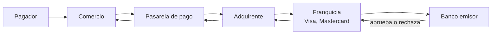
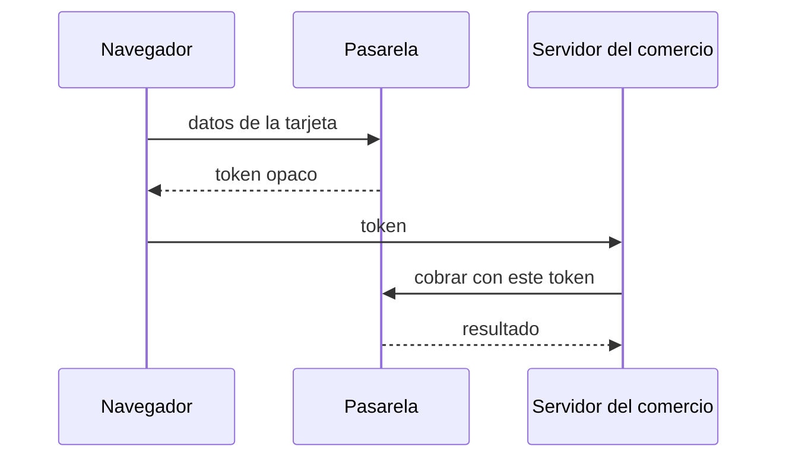

# ¿Qué es una pasarela de pago?

Este documento no habla de código. Explica el negocio que hay debajo de todo el proyecto, porque casi todas las decisiones técnicas del SDK son consecuencia de cómo funciona este negocio y no de una preferencia de diseño.

---

## 1. El problema, en una frase

Un comercio quiere recibir dinero por internet. El dinero está en la cuenta o la tarjeta de otra persona, en otro banco. Nadie le va a dar al comercio acceso directo a esa cuenta, y con razón. Hace falta un intermediario que sepa hablar con los bancos, que esté autorizado para hacerlo y que asuma la parte regulada del problema.

Ese intermediario es la pasarela de pago.

---

## 2. Quién es quién en un pago con tarjeta

Un cobro que desde afuera se ve como "le di clic a pagar y salió aprobado" involucra cinco actores. Entender esta cadena explica por qué un pago puede tardar, por qué puede quedar pendiente y por qué a veces el comercio recibe un rechazo sin saber la razón.

- **El pagador** es quien pone el dinero. Es el único actor que ve la interfaz del comercio.
- **El comercio** vende algo y quiere cobrarlo. Es quien escribe el código que consume el SDK.
- **La pasarela de pago** recibe la solicitud del comercio, la traduce al formato que entiende la red financiera, la enruta y devuelve el resultado. Es la única pieza con la que el comercio habla directamente.
- **El adquirente** es la entidad financiera que procesa el cobro del lado del comercio y, eventualmente, le deposita el dinero. En Colombia, varios de estos proveedores actúan a la vez como pasarela y como recaudador agregado, lo cual simplifica el registro del comercio pero también significa que el dinero pasa por sus manos antes de llegar a la cuenta del comercio.
- **La franquicia y el banco emisor** son la red de la tarjeta y el banco del pagador. El emisor es quien realmente decide si aprueba, y es quien conoce el saldo. La pasarela nunca sabe por qué un emisor rechazó: recibe un código y lo transmite.

**La consecuencia práctica para quien integra:** la respuesta de un cobro no es una operación local que se resuelve en milisegundos, es el eco de una cadena de sistemas ajenos. Por eso un cobro puede quedar en `PENDING` y resolverse después, y por eso reintentar a ciegas un cobro que dio timeout es peligroso: el timeout puede ser del último tramo, con el dinero ya debitado.

---

## 3. Qué hace una pasarela, y qué no

**Lo que hace:**

- **Captura y tokeniza los datos sensibles.** Recibe el número de tarjeta en su propio formulario o su propia librería de navegador, y le devuelve al comercio un token: una cadena opaca que representa esa tarjeta sin serlo.
- **Enruta y autoriza.** Habla con el adquirente y la red, y devuelve un resultado.
- **Notifica de forma asíncrona.** Cuando el resultado cambia después (una transferencia que el pagador autorizó en su banco veinte minutos más tarde, un contracargo), avisa por webhook.
- **Ofrece un entorno de pruebas.** Un sandbox con llaves de prueba y datos ficticios, que es donde se desarrolla.
- **Da herramientas de conciliación.** Un panel y una API para consultar qué pasó con cada pago.

**Lo que no hace, y suele sorprender:**

- **No exime al comercio de PCI DSS si el comercio toca la tarjeta.** El alcance de la norma lo determina por dónde pasan los datos, no con quién se integra. Si el número de tarjeta llega al servidor del comercio, ese servidor entra en alcance, aunque después se lo mande a una pasarela certificada. Ese es exactamente el motivo por el cual este SDK **no acepta números de tarjeta**, solo tokens.
- **No hace que un pago aprobado sea definitivo.** Un cobro con tarjeta puede revertirse semanas después por un contracargo. "Aprobado" significa que el emisor autorizó, no que el dinero sea inamovible.
- **No unifica nada entre pasarelas.** Cada una define sus propios nombres de campo, su formato de monto, su vocabulario de estados y su algoritmo de firma. Esa falta de unificación es, literalmente, el problema que este proyecto ataca.

---

## 4. El ecosistema colombiano

Colombia no es un mercado de tarjeta únicamente. Una parte importante del comercio electrónico se paga debitando directamente una cuenta bancaria, y eso cambia la forma del flujo.

| Método | Qué es | Forma del flujo |
|---|---|---|
| **Tarjeta** de crédito o débito | Lo habitual, con franquicias internacionales | Tokenización en el navegador y cobro desde el servidor |
| **PSE** | Débito de cuenta bancaria a través de ACH Colombia. El pagador escoge su banco y autoriza en el portal del propio banco | Redirección obligatoria y resultado asíncrono |
| **Nequi**, **Daviplata** | Billeteras digitales, muy difundidas | Redirección o notificación push al teléfono |
| **Botón Bancolombia**, **Bancolombia QR** | Productos propios del banco más grande del país | Redirección |
| **Puntos Colombia**, **BNPL** | Programas de puntos y compra a plazos | Redirección |
| **Efectivo** | El pagador imprime un recibo y paga en un punto físico | Asíncrono, con horas o días de diferencia |

**PSE es el que más condiciona el diseño de un SDK**, por tres razones que valen para las cuatro pasarelas:

1. **Obliga a redirigir.** El pago no se resuelve en la respuesta de la llamada: hay que mandar al pagador al portal de su banco. Un método que devuelva "la transacción" no alcanza para expresar eso, y por eso el resultado de crear un pago en este SDK es una unión de dos casos y no un objeto único.
2. **Necesita una lista de bancos viva.** El pagador tiene que escoger su banco **antes** de que el pago exista, de una lista que cada pasarela publica y que cambia. Por eso el SDK expone `getPseBanks()`.
3. **El código de banco no es portable.** El mismo Bancolombia es `1` en el sandbox de Wompi, `1007` en Mercado Pago y `co_pse_bancolombia_bank` en Rapyd. Es el único dato del contrato que no se puede reutilizar al cambiar de pasarela, y el SDK lo trata como una cadena opaca en vez de inventar un catálogo propio que habría que mantener al día con cuatro proveedores.

El alcance de este proyecto son **tarjeta y PSE** en las cuatro pasarelas. Los demás métodos quedaron fuera de forma explícita, no por olvido: el detalle está en el punto 49 del [architecture-log](../architecture/architecture-log.md).

---

## 5. Los tres flujos que hay que saber implementar

Casi cualquier integración de pagos es una combinación de estos tres.

### Flujo A — Tarjeta tokenizada, servidor a servidor

Lo esencial: **el número de tarjeta nunca pasa por el servidor del comercio**. La tokenización ocurre entre el navegador del pagador y la pasarela, con la llave pública. El servidor solo maneja un token y la llave privada.

### Flujo B — Redirección

El comercio crea el pago, la pasarela devuelve una URL, el comercio manda al pagador ahí y el pagador vuelve a una URL de retorno. Es obligatorio en PSE, y también aparece con tarjeta cuando hay autenticación 3D Secure o cuando la pasarela cobra en su propia página alojada.

Tiene una trampa que cuesta caro descubrir en producción: **volver a la URL de retorno no significa que el pago esté aprobado.** El pagador puede cerrar la pestaña, puede volver sin haber pagado, o el banco puede tardar. La URL de retorno es una señal de la interfaz, no del resultado. El resultado se obtiene por webhook o consultando.

### Flujo C — Notificación asíncrona y conciliación

La pasarela llama a un endpoint del comercio cuando algo cambia. El comercio tiene que:

1. **Verificar la firma** de esa notificación, porque cualquiera puede hacer un POST a una URL pública.
2. **Comprobar que no sea vieja**, para que nadie pueda reenviar una notificación legítima capturada antes.
3. **Actualizar el estado de la orden**, y a veces consultar a la pasarela para saber el estado real, porque hay notificaciones que solo dicen "algo cambió" sin decir qué.

Ese último caso no es hipotético: el webhook de Wompi trae el pago completo, y el de Mercado Pago solo trae un identificador. Con la misma interfaz, el comercio necesita dos comportamientos distintos, y resolverlo sin que el comercio se entere es parte de lo que hace el SDK.

---

## 6. Cómo se suele implementar, paso a paso

Así es el camino que recorre cualquiera que integre una pasarela por primera vez, con o sin SDK:

1. **Registrar el comercio** y obtener llaves de sandbox. Suelen ser dos: una pública para el navegador y una privada para el servidor.
2. **Encontrar los datos de prueba.** Qué tarjeta aprueba, qué tarjeta rechaza, qué documento es válido, qué banco de prueba usar en PSE. Esto está disperso en la documentación de cada proveedor, y reunirlo es un trabajo real: es el tercer componente de este proyecto, en [testing-data](../testing-data/).
3. **Montar la tokenización en el frontend** con la librería de la pasarela.
4. **Cobrar desde el backend** con el token y la llave privada.
5. **Traducir el resultado** al vocabulario del propio comercio, porque el de la pasarela no sirve para la lógica de negocio.
6. **Montar el endpoint de webhook**, verificar firma y conciliar.
7. **Manejar los fallos**: distinguir un rechazo del emisor (definitivo, no se reintenta) de una caída de red (transitorio, se reintenta).
8. **Repetir todo** si se agrega una segunda pasarela. Este paso es el que el proyecto quiere eliminar.

Los pasos 5, 6 y 7 son los que más se subestiman. Son también los que más código propio del comercio consumen, y por eso el plan de evaluación de la Fase 5 exige que el prototipo de control los implemente: comparar un SDK completo contra una integración que solo hace el paso 4 inflaría artificialmente la diferencia.

---

## 7. Qué sigue

Ya está claro el negocio. Lo que falta son los conceptos técnicos que aparecen en cualquier integración y que hay que tener claros antes de leer código: tokenización, firmas, webhooks, idempotencia y representación del dinero. Están en [2-conceptos-tecnicos.md](2-conceptos-tecnicos.md).
