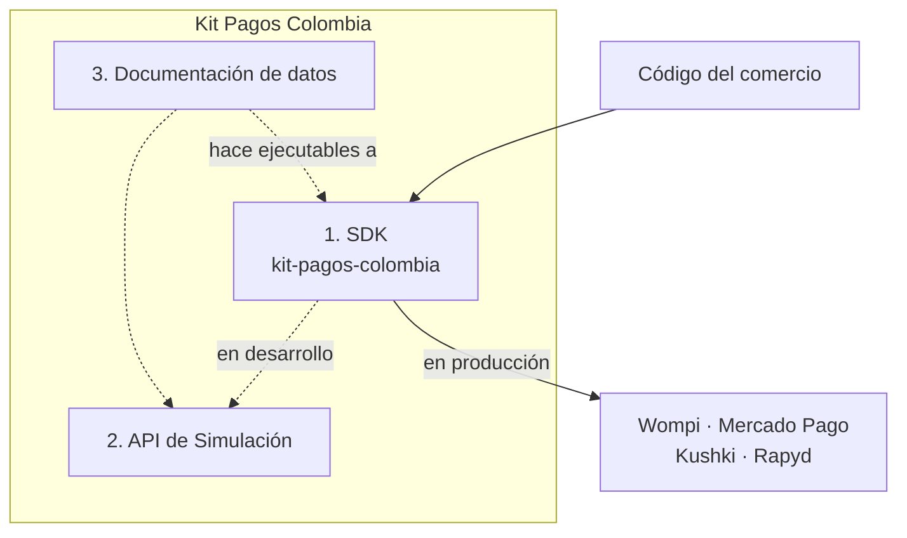

# Por qué existe Kit Pagos Colombia

Los tres documentos anteriores describieron el problema. Este describe la propuesta: qué cuesta hoy integrar pasarelas de pago en Colombia, qué hace Kit Pagos al respecto y —con la misma claridad— qué **no** resuelve.

---

## 1. El problema, con los números del proyecto

Un comercio colombiano que quiera cobrar por internet tiene que elegir una pasarela. Y elegirla significa, hoy, atarse a ella:

- **Cada pasarela tiene su propio contrato.** No solo nombres de campo distintos: formas de flujo distintas. Cobrar con tarjeta cuesta una llamada HTTP en Mercado Pago, dos en Wompi y en Rapyd termina en una redirección. Consultar un estado es una ruta en Wompi, dos en Mercado Pago y hasta tres tanteos en Kushki. Está detallado en [3-las-cuatro-pasarelas.md](3-las-cuatro-pasarelas.md).
- **Cada pasarela firma distinto.** Cuatro algoritmos para el mismo propósito: SHA-256 con el secreto embebido, HMAC hexadecimal sobre un manifiesto de formato fijo, HMAC sobre el cuerpo más un identificador, y HMAC en base64 sobre un texto hexadecimal. Los cuatro son fáciles de implementar mal, y una verificación mal hecha no falla: **acepta notificaciones falsas**.
- **Cada pasarela nombra los estados a su manera.** El mismo desenlace se llama `APPROVED`, `approved`, `APPROVAL` y `CLO`. El último significa "cerrado" y no "pagado".
- **La documentación oficial no es suficiente.** Cada trampa documentada en este proyecto se descubrió ejecutando código contra el sandbox, y varias contradicen lo que el proveedor tiene escrito.

El resultado es **vendor lock-in**: cambiar de pasarela no es cambiar una configuración, es reescribir la integración. Y eso importa porque las razones para cambiar son reales y frecuentes: una pasarela sube su comisión, otra deja de soportar un método, una tercera cambia de dueño. Eso último no es hipotético en este proyecto: la cuarta pasarela era PayU, PayU fue adquirida en 2025, y hubo que reemplazarla por Rapyd. Un comercio con la integración clavada a PayU habría tenido que rehacer el trabajo; el SDK tuvo que escribir un adaptador nuevo sin tocar el dominio.

---

## 2. Cómo se ve una integración sin SDK

Para una sola pasarela, el comercio tiene que escribir:

| Qué | Por qué es más trabajo de lo que parece |
|---|---|
| El cliente HTTP con su autenticación | Rapyd exige firmar cada petición con `salt`, `timestamp` y HMAC; Kushki usa un header distinto según sea la llave pública o la privada |
| La construcción del cuerpo de cada operación | Kushki pide un objeto con desglose de IVA; Mercado Pago pide dirección IP, teléfono con indicativo separado y dirección del pagador |
| El manejo del monto | Wompi pide centavos; las otras tres, pesos. Y hacerlo con `number` rompe en casos legítimos: validar dos decimales con `value * 100` rechaza `1.15` y `19.99` |
| La traducción de estados | Cada pasarela tiene su vocabulario, y uno de ellos tiene dos vocabularios según el método |
| La verificación del webhook | El algoritmo de esa pasarela, la comparación en tiempo constante, la ventana anti-replay, la normalización del timestamp y el cuerpo crudo sin reserializar |
| La clasificación de errores | Qué es transitorio y qué es definitivo, qué se reintenta y qué no, y no reintentar nunca un cobro |
| El manejo de la redirección | Para PSE siempre, y para tarjeta cuando aparece 3DS |

Y para una segunda pasarela, **todo eso otra vez**, porque casi nada se reutiliza: el cliente HTTP cambia porque la autenticación cambia, el cuerpo cambia, los estados cambian, la firma cambia.

Hay una parte que cuesta todavía más y que no se ve en la tabla: **averiguar qué datos de prueba usar.** Qué tarjeta aprueba, qué tarjeta declina, qué documento es válido, qué banco de prueba existe, qué escenario fuerza un rechazo. Eso está disperso en la documentación de cada proveedor, a veces incompleto y a veces desactualizado, y es trabajo puro de investigación antes de escribir la primera línea útil.

---

## 3. Qué es Kit Pagos: tres componentes

La propuesta no es una librería. Son tres piezas, y cada una responde a una parte distinta del problema de arriba.

### Componente 1 — El SDK

Una sola API para las cuatro pasarelas, con arquitectura hexagonal. El comercio escribe cuatro llamadas —`createPayment()`, `getPaymentStatus()`, `getPseBanks()`, `validateWebhook()`— y el SDK resuelve todo lo de la tabla anterior por dentro.

Lo que cambia concretamente:

- **Un solo modelo de dominio.** `Amount`, `Currency`, `Payer`, `Transaction`, `PaymentStatus`. El código de negocio del comercio se escribe una vez, contra esos tipos, y no contra el formato de nadie.
- **Cambiar de pasarela es cambiar un valor de configuración.** `gateway: Gateway.WOMPI` por `gateway: Gateway.KUSHKI`. El resto del código del comercio no se toca, y eso está demostrado con un ejemplo ejecutable que cobra el mismo pago por las cuatro y verifica que los resultados coincidan.
- **La criptografía está escrita una vez y probada.** Las cuatro verificaciones de firma viven en el SDK, con comparación en tiempo constante y ventana anti-replay, y con vectores de prueba calculados de forma independiente para que una prueba no pueda pasar solo porque el código coincide consigo mismo.
- **El tipo de retorno obliga a manejar la redirección.** `createPayment()` devuelve una unión de dos casos, `TRANSACTION` o `REDIRECT_REQUIRED`, y el compilador no deja leer la transacción sin haber distinguido el caso. Con un campo opcional, olvidarse compilaría.

### Componente 2 — La API de Simulación

Un servidor que imita a las cuatro pasarelas. No existe porque sea cómodo: existe porque **los sandboxes reales no permiten ejercitar los flujos completos**, y eso está medido:

- El sandbox de Wompi publica la URL de redirección de PSE en el mismo instante en que resuelve el pago, así que no hay ventana en la que redirigir tenga sentido.
- La Orders API de Mercado Pago, que es la única con PSE, responde `401` con credenciales de prueba.
- Kushki no registra los cobros síncronos en la ruta de consulta que publica para tarjeta.

Además, un sandbox real **declina cuando quiere**, así que no sirve para pruebas automatizadas que afirmen un desenlace. El simulador es determinista, no necesita credenciales y corre en CI.

### Componente 3 — La documentación de datos

Las tarjetas, bancos, documentos y escenarios de cada pasarela, reunidos y con su nivel de evidencia declarado: qué se midió contra el sandbox real y en qué fecha, y qué viene solo de la documentación oficial.

**Es el componente que vuelve ejecutables a los otros dos.** Sin él, el SDK es una API que no se puede probar y el simulador es un servidor que no se sabe con qué llamar. Y es, además, el que más trabajo manual reemplaza: reunir esos datos es investigación, no programación, y es exactamente el trabajo que cada comercio tiene que hacer de cero hoy.

Está en [docs/testing-data/](../testing-data/).

---

## 4. Qué no resuelve

Esta sección es tan importante como la anterior. Un SDK que promete más de lo que puede cumplir falla justo cuando el comercio ya no tiene margen.

**Los códigos de banco de PSE no son portables.** El mismo Bancolombia es `1` en el sandbox de Wompi, `1007` en Mercado Pago y `co_pse_bancolombia_bank` en Rapyd. El SDK los pasa como cadenas opacas y **no** mantiene un catálogo propio de equivalencias, porque ese catálogo habría que sincronizarlo con cuatro proveedores que lo cambian sin avisar, y un catálogo desactualizado es peor que no tenerlo: manda al pagador al banco equivocado. Un comercio que cambie de pasarela tiene que volver a pedir la lista con `getPseBanks()`, y eso el SDK sí lo hace igual en las cuatro.

**Los tokens de tarjeta tampoco son portables.** Los emite cada pasarela y solo valen en ella. La tokenización sigue viviendo en el frontend, con la librería del proveedor, y el SDK no la toca: si la tocara, metería al comercio en el alcance de PCI DSS, que es justo lo que hay que evitar.

**Los datos que exige cada pasarela varían, y el SDK no los puede inventar.** Mercado Pago exige dirección IP del pagador, teléfono con indicativo separado y dirección para PSE; Wompi no. El SDK unifica el modelo, pero si la pasarela pide un dato, ese dato tiene que existir. Lo que hace es fallar temprano y con un mensaje claro —`INVALID_REQUEST` listando qué falta— en lugar de mandar una petición incompleta y traducir un error remoto ambiguo.

**Las diferencias de flujo no desaparecen, se hacen explícitas.** Cobrar con tarjeta en Rapyd devuelve una redirección; en Mercado Pago, una transacción resuelta. El SDK no puede eliminar esa diferencia sin mentir. Lo que hace es forzar al comercio a manejar los dos casos siempre, con un tipo que no se puede ignorar.

**No cubre todos los métodos de pago.** Tarjeta y PSE en las cuatro pasarelas. Nequi, Daviplata, botón Bancolombia, efectivo y los demás quedan fuera del alcance, declarado y no por olvido.

**Y las cifras de mejora todavía no están.** Este documento afirma que integrar con el SDK cuesta menos trabajo, pero la medición formal es el experimento de la Fase 5: dos prototipos funcionalmente idénticos, uno con SDK y otro con integración directa, comparados con seis variables medibles. Hasta que ese experimento corra, lo que hay son argumentos y no evidencia. El diseño está en [prototypes-evaluation-plan.md](../project-management/prototypes-evaluation-plan.md), y la comparación cualitativa —lo que sí se puede afirmar hoy— en [5-comparacion-con-integracion-directa.md](../03-sdk/5-comparacion-con-integracion-directa.md).

---

## 5. Qué sigue

Ya está claro el qué y el por qué. Lo que viene es el cómo: [02-arquitectura](../02-arquitectura/) explica la arquitectura hexagonal que hace posible que cambiar de pasarela sea cambiar una línea, y [03-sdk](../03-sdk/) recorre el código.
