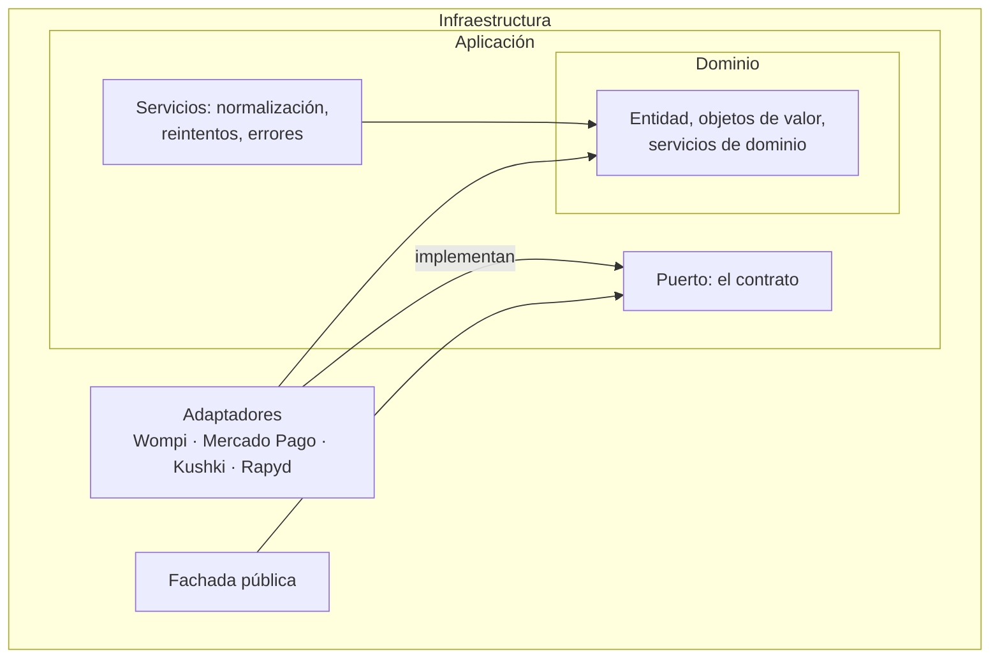

# Arquitectura hexagonal: los fundamentos

Este documento explica la arquitectura desde cero, con vocabulario de arquitectura de software y sin mirar el código todavía. Explica qué es la arquitectura hexagonal, qué patrones de diseño usa el proyecto y por qué encajan en este problema.

El documento siguiente, [2-hexagonal-en-kit-pagos.md](2-hexagonal-en-kit-pagos.md), toma cada afirmación de acá y la verifica contra el código real, con los comandos para comprobarla. La división es deliberada: la teoría envejece despacio y el código envejece rápido, así que están separados.

---

## 1. El problema que la arquitectura tiene que resolver

Antes de justificar una arquitectura hay que tener claro el problema que la motiva.

Kit Pagos Colombia existe porque las cuatro pasarelas del proyecto exponen contratos completamente distintos: autenticación distinta, formato de solicitud distinto, nombres de estado distintos para el mismo resultado de negocio —Kushki llama `APPROVAL` a lo que las demás llaman `APPROVED`, y Rapyd lo llama `CLO`— y mecanismos de firma distintos: SHA-256 en Wompi, HMAC-SHA256 hexadecimal en Mercado Pago y Kushki, HMAC-SHA256 en base64 en Rapyd.

Un comercio que integrara las cuatro sin ninguna abstracción escribiría cuatro veces la misma lógica de negocio —crear un pago, consultar su estado, validar un webhook—, cada vez adaptada a las particularidades de un proveedor. Y si mañana cambia de proveedor principal o agrega un quinto, ese cambio se propaga por todo su código.

Este es exactamente el tipo de problema que la arquitectura hexagonal fue diseñada para resolver: **aislar la lógica de negocio de los detalles técnicos externos, que cambian con mucha más frecuencia que las reglas de negocio.**

Y no es un riesgo teórico. La cuarta pasarela del proyecto era PayU; Rapyd adquirió su operación latinoamericana en 2025, y el registro de comercio nuevo para Colombia dejó de dar acceso a la API clásica de PayU. El proyecto tuvo que reemplazar una pasarela entera. Lo que costó fue escribir un adaptador; el dominio no se tocó. Para un comercio con la integración clavada a PayU, habría costado reescribir la integración. El detalle está en la sección C del [architecture-log](../architecture/architecture-log.md).

---

## 2. Arquitectura hexagonal (puertos y adaptadores)

La arquitectura hexagonal, propuesta por Alistair Cockburn, organiza el sistema en capas concéntricas con una **regla de dependencia estricta**: las capas externas pueden conocer a las internas, pero las internas nunca conocen a las externas.

**El dominio** es el centro. Contiene las reglas de negocio puras: qué es una transacción, qué significa que esté aprobada, qué forma tiene un monto válido. El dominio no sabe que existen HTTP, JSON, Wompi ni Rapyd. Si mañana se reemplazara el servidor del simulador, o Wompi dejara de existir como empresa, ni una línea del dominio tendría que cambiar.

**La aplicación** es la capa intermedia. Define los **puertos** —las interfaces abstractas por las que el núcleo se comunica con el mundo exterior— y los **servicios** que orquestan casos de uso completos. Un puerto no sabe quién lo va a implementar: solo declara qué operaciones existen y con qué forma de entrada y salida.

**La infraestructura** es la capa externa. Contiene las implementaciones concretas de los puertos, llamadas **adaptadores**, que sí conocen los detalles de un proveedor. Acá viven los cuatro adaptadores de pasarela y la fachada pública del SDK.

La regla de dependencia se resume en una frase: **el dominio no importa nada de la aplicación ni de la infraestructura; la aplicación no importa nada de la infraestructura; la infraestructura importa de ambas.** Es lo que hace que agregar una quinta pasarela sea "escribir un adaptador nuevo" y no "modificar el núcleo".

Y es una regla que se puede **verificar mecánicamente**, no solo afirmar. Basta buscar importaciones de infraestructura dentro del dominio y comprobar que no hay ninguna. Los dos comandos exactos están en el documento siguiente.

---

## 3. Diseño táctico de DDD

Dentro del dominio, el proyecto usa un subconjunto reducido y preciso de los patrones tácticos de *Domain-Driven Design*, evitando la complejidad de un modelo grande cuando el problema no la necesita.

**Entidad.** Tiene identidad propia: dos instancias con los mismos datos siguen siendo cosas distintas si representan cosas distintas en el negocio. `Transaction` es la **única** entidad del dominio, porque es el único concepto que necesita distinguirse por identidad a lo largo del tiempo, incluso cuando su estado cambia de `PENDING` a `APPROVED` tras un webhook.

**Objeto de valor.** No tiene identidad: dos instancias con los mismos datos son intercambiables. El monto, la divisa, la referencia de la orden, los datos del pagador, el identificador nativo, la razón de rechazo y el evento de webhook son objetos de valor. Se comparan por contenido y son **inmutables por diseño**: ninguno expone un método que modifique su propio estado.

La inmutabilidad no es purismo. Un objeto de valor que valida en el constructor y después no se puede modificar tiene una propiedad muy concreta: **si existe, es válido**. Nunca hace falta revalidar, y no hay forma de que un monto pase de válido a inválido a mitad de camino.

**Enum de dominio.** Los catálogos cerrados de valores válidos —estado de transacción, pasarela, categoría de rechazo, código de error— no son entidades ni objetos de valor: son conjuntos finitos sin comportamiento propio, que existen para tipar con seguridad conceptos que de otro modo serían cadenas sueltas con riesgo de error de tipeo.

**Servicio de dominio.** Cuando una operación de negocio no pertenece naturalmente a ninguna entidad ni objeto de valor, se modela como un servicio sin estado propio. La verificación de firmas de webhook es el ejemplo: no es responsabilidad de la transacción ni de ningún objeto de valor, así que vive como servicio independiente.

**Excepción de dominio.** Una única excepción tipada es la forma en que el dominio comunica un fallo hacia afuera. En lugar de dejar que los errores nativos de `fetch` o de cualquier librería HTTP se propaguen sin control hacia quien consume el SDK, todo error se envuelve con un código tipado, la pasarela de origen y el payload original preservado para depurar.

Con una delimitación importante: **un rechazo no es un error.** Que el banco emisor declinara la tarjeta es una respuesta exitosa del sistema con un desenlace negativo de negocio, y llega como una transacción en estado `DECLINED`. Las excepciones quedan para los fallos técnicos. Mezclar las dos cosas obligaría al comercio a envolver cada cobro en un bloque de captura para manejar algo que no es excepcional en absoluto.

---

## 4. Los tres patrones GoF que se usan

Sobre la base hexagonal y de DDD, el proyecto usa tres patrones del catálogo *Gang of Four*, cada uno resolviendo un problema puntual.

**Fachada (Facade).** Oculta la complejidad de un subsistema detrás de una interfaz simple. La clase pública del SDK es su fachada: quien la consume nunca instancia un adaptador, nunca conoce la factoría, nunca maneja reintentos a mano. Ve cuatro métodos —crear un pago, consultar un estado, listar bancos de PSE, validar un webhook— y nada más.

**Factoría (Factory).** Centraliza la creación de objetos cuando esa lógica depende de una condición en tiempo de ejecución. La factoría del proyecto recibe el valor de pasarela configurado y devuelve el adaptador correspondiente, para que no haya un `switch` repartido por varios archivos. Tiene un efecto secundario valioso: **es el único lugar que hay que tocar para agregar una pasarela**, y por lo tanto el único lugar donde se puede olvidar de agregarla. Eso es preferible a que el olvido pueda ocurrir en cuatro archivos distintos.

**Adaptador (Adapter).** Traduce una interfaz existente hacia la que el cliente espera, y le da nombre a media arquitectura. Cada adaptador de pasarela traduce el contrato abstracto del puerto hacia las llamadas HTTP reales, la autenticación y el formato de cuerpo de su proveedor.

Hay un cuarto patrón que aparece sin haber sido buscado: los **normalizadores** y los **manejadores de webhook** están organizados como una familia de implementaciones intercambiables detrás de una interfaz común, con un despachador que elige según la pasarela. Es el patrón *Strategy*, y llegó por una razón medible: cuando toda la normalización vivía en un solo método con un `switch` gigante, ese método tenía 360 líneas y la métrica de complejidad no lo detectaba. Dividirlo en una implementación por pasarela bajó la complejidad de cada pieza y, sobre todo, hizo que las piezas se pudieran probar por separado. Está en el punto 34 del architecture-log.

---

## 5. Inversión de dependencias: el porqué técnico de todo lo anterior

Todo lo descrito arriba es, en el fondo, una aplicación disciplinada del **principio de inversión de dependencias**, la "D" de SOLID: los módulos de alto nivel —el dominio, que contiene las reglas de negocio más importantes— no deben depender de los módulos de bajo nivel —los detalles de cómo Wompi firma un webhook—; ambos deben depender de abstracciones.

Es este principio, y no un framework ni una librería, el que hace posible que el normalizador de respuestas trate a Wompi y a Kushki exactamente igual a pesar de que usen vocabularios de estado distintos.

Y tiene un beneficio muy concreto en las pruebas. Como el adaptador depende de una abstracción y no de un cliente HTTP específico, se puede probar sustituyendo esa abstracción, sin red y sin credenciales. Por eso el SDK tiene 35 archivos de pruebas unitarias que corren en segundos y no necesitan internet.

---

## 6. Por qué esta arquitectura y no capas tradicionales

La alternativa obvia era una arquitectura en capas clásica: presentación, negocio, datos. Se descartó por una razón puntual.

En una arquitectura en capas, la capa de negocio depende de la de datos: el flujo de dependencias va hacia abajo, hacia los detalles. Eso significa que el conocimiento sobre cómo se comunica el sistema con el exterior se filtra hacia el centro. Aplicado a este problema, el modelo de transacción terminaría con campos que existen porque Wompi los devuelve, y el vocabulario de estados terminaría pareciéndose al de la primera pasarela que se integró.

La arquitectura hexagonal invierte esa dependencia: los detalles apuntan hacia el centro, y el centro no sabe de ellos. **Para este proyecto la diferencia es el criterio de éxito entero**, porque la tesis que sostiene es que cambiar de pasarela puede ser una decisión de configuración. Si el dominio supiera de pasarelas, esa afirmación sería falsa por construcción.

La decisión está registrada como DA-01 en [layers-and-components.md](layers-and-components.md).

---

## 7. Qué sigue

La teoría está completa. Ahora conviene verificarla: [2-hexagonal-en-kit-pagos.md](2-hexagonal-en-kit-pagos.md) muestra dónde está cada capa en el código real, con fragmentos actuales y con los comandos para comprobar que la regla de dependencia se cumple de verdad.
