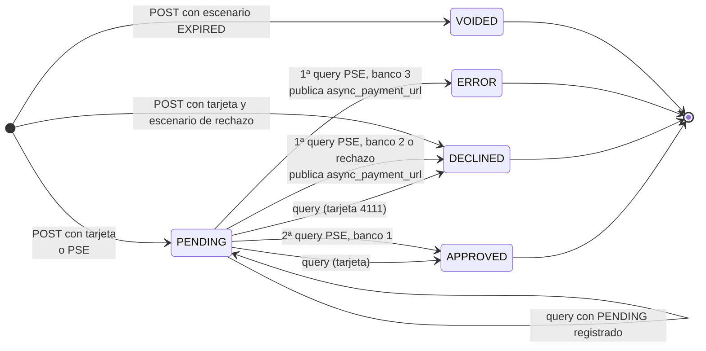
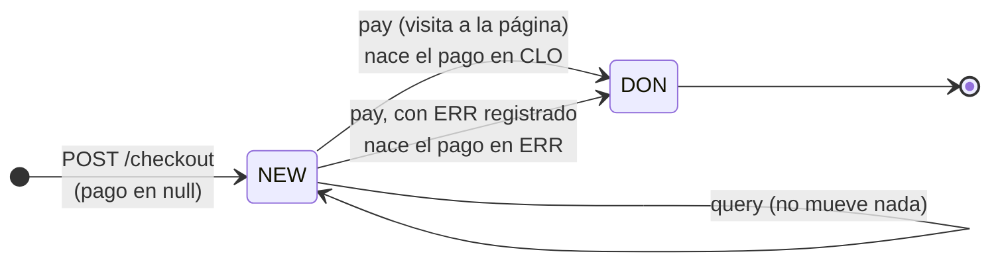
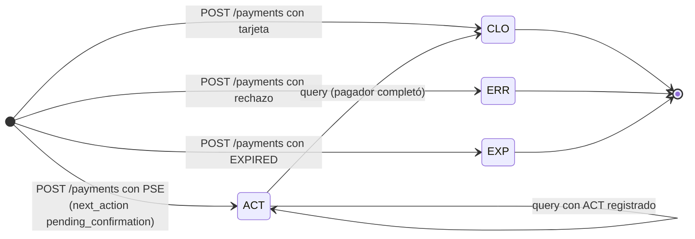
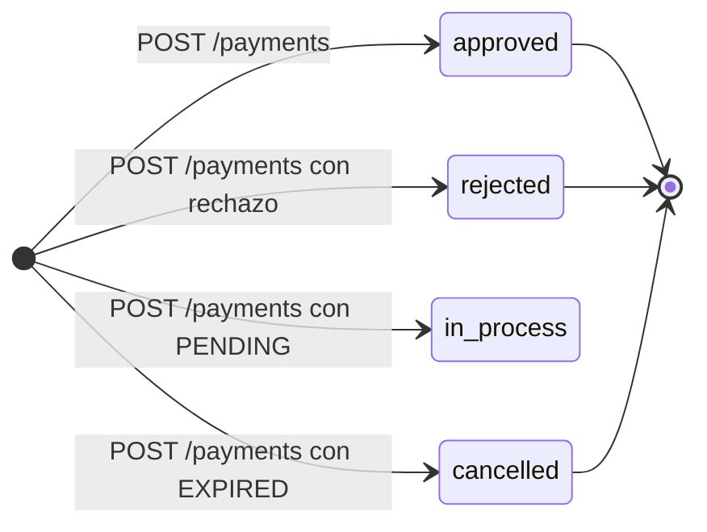
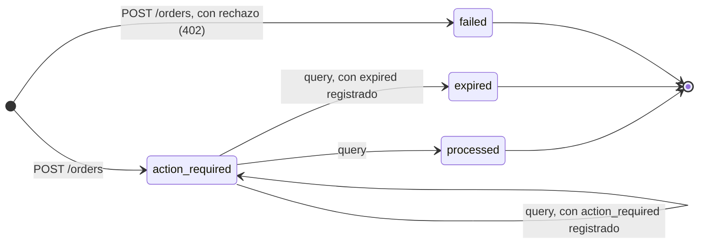
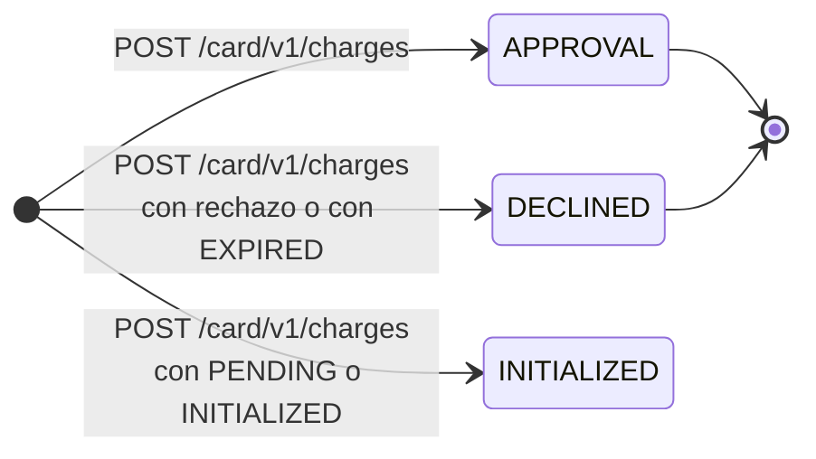
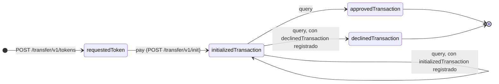

# La API de Simulación: el segundo componente

Un servidor Fastify que imita a las cuatro pasarelas. Este documento explica por qué existe, qué expone, hasta dónde llega su fidelidad y qué le falta para estar completo.

---

## 1. Por qué existe

La respuesta corta es que **los sandboxes reales no permiten ejercitar los flujos completos**. No es una suposición; está medido, y cada caso está registrado en el [architecture-log](../architecture/architecture-log.md):

| Lo que se midió | Consecuencia |
|---|---|
| El sandbox de Wompi publica la URL de redirección de PSE **en el mismo instante** en que resuelve el pago (punto 43) | No existe ninguna ventana de tiempo en la que redirigir tenga sentido. El flujo de PSE de Wompi no se puede ejercitar contra su sandbox |
| La Orders API de Mercado Pago, la única con PSE, responde `401` con credenciales de prueba y exige token de producción (punto 45) | El PSE de Mercado Pago no se puede probar en sandbox en absoluto |
| Kushki no registra los cobros síncronos de tarjeta en la ruta de consulta que publica: responde `CAS004 "No existe la transacción"` (punto 54) | El ciclo de vida completo de un cobro con tarjeta en Kushki no se puede mostrar contra su sandbox |

Y hay una razón más, que aplica a los cuatro: **un sandbox real declina cuando quiere.** Por eso las 18 pruebas de contrato del proyecto no afirman `APPROVED`, solo que la petición fue aceptada y la respuesta tiene la forma esperada. Una prueba automatizada que necesite un desenlace concreto no puede depender de un servicio de un tercero.

El simulador resuelve las dos cosas: es **determinista**, así que una prueba puede afirmar un resultado, y **no necesita credenciales**, así que corre en CI y cualquiera lo puede levantar recién clonado el repositorio.

---

## 2. Cómo está construido

```text
simulator-api/src/
├── server.ts                 pone a escuchar el puerto
├── app.ts                    construye la instancia de Fastify, hooks y registra las rutas
├── auth/
│   ├── CredentialResolver.ts resolución híbrida de credenciales (headers > env)
│   ├── targetEnvironment.ts  clasifica la URL base: simulador, sandbox o producción
│   └── authHook.ts           hook onRequest de autenticación Bearer en tiempo constante
├── services/
│   └── KitPagosProvider.ts   ciclo de vida e instanciación del SDK (workspace)
├── logger/
│   └── redactSerializer.ts   redacción estricta de credenciales en logs de Pino
├── kit-pagos-api/            capa REST propia bajo /v1/api
│   ├── index.ts              plugin del módulo: CORS y registro de rutas
│   ├── gateway-param.ts      parseo compartido del identificador de pasarela
│   ├── gateway-client.ts     SDK por petición, con la regla de credenciales y su advertencia
│   ├── routes/gateways.ts    GET /v1/api/gateways
│   ├── routes/payments.ts    POST /v1/api/payments y GET /v1/api/payments/:id
│   ├── routes/pse-banks.ts   GET /v1/api/pse-banks
│   ├── routes/webhooks.ts    POST /v1/api/webhooks/:gateway, con cuerpo crudo
│   └── errors/               traducción de KitPagosError a HTTP
├── routes/
│   ├── health.ts             GET /health
│   ├── wompi.ts              5 rutas
│   ├── mercadopago.ts        6 rutas
│   ├── rapyd.ts              7 rutas
│   ├── kushki.ts             6 rutas
│   └── webhooks.ts           POST /v1/sim/webhooks/trigger
├── gateways/
│   ├── wompi/                GatewayMockFactory.ts + types.ts
│   ├── mercadopago/          GatewayMockFactory.ts + types.ts
│   ├── rapyd/                GatewayMockFactory.ts + types.ts
│   └── kushki/               GatewayMockFactory.ts + types.ts
├── scenarios/
│   ├── ScenarioEngine.ts     construye la transacción de Wompi según el escenario
│   ├── scenarioFromRequest.ts precedencia, montos reservados y su normalización a pesos
│   ├── invalidCredential.ts  marcas de credencial inválida
│   └── technicalFailure.ts   fallas técnicas de creación, de consulta y de lista de bancos
├── webhooks/
│   ├── SignatureGenerator.ts cuerpo nativo y firma de cada webhook saliente
│   ├── signatures.ts         las cuatro fórmulas de firma
│   ├── webhookDispatch.ts    envío al destino configurado
│   └── autoEmission.ts       emisión automática, apagada por omisión
└── store/
    ├── TransactionStore.ts   memoria de las transacciones creadas
    └── CardTokenOutcomes.ts  desenlace derivado de cada token de tarjeta
```

**`app.ts` está separado de `server.ts` a propósito.** `buildApp()` construye la instancia de Fastify sin ponerla a escuchar, y `server.ts` es lo único que llama a `listen()`. Así las suites de prueba usan `app.inject()` sobre la misma aplicación que corre en producción, sin abrir un socket. La diferencia práctica es que las pruebas no pueden quedarse colgadas esperando la red ni chocar por el puerto ocupado.

**Capa de autenticación y resolución de credenciales (`src/auth/`):**
- `CredentialResolver`: Implementa la resolución híbrida. Primero inspecciona las cabeceras `x-gateway-public-key`, `x-gateway-private-key` (e `integrity-secret`). Si no están presentes, recurre al perfil de sandbox del `.env` del servidor. Por seguridad estricta, `webhookSecret` **nunca** se acepta desde el cliente HTTP para evitar invalidar la verificación criptográfica. Si faltan credenciales, lanza `MissingCredentialsError` (HTTP 401).
- `targetEnvironment`: Resuelve el ambiente destino a partir de la cabecera `x-kit-pagos-environment` (por defecto `simulator` si no se envía; valores desconocidos responden HTTP 400 `INVALID_REQUEST`). La API resuelve la URL de destino desde un **catálogo cerrado** embebido en el SDK por pasarela y ambiente (Issue #123, Punto 80). El cliente nunca suministra URLs de pasarela, previniendo vectores de SSRF con fuga de credenciales. La regla de credenciales se aplica sobre el ambiente declarado:

  | Ambiente Declarado (`x-kit-pagos-environment`) | Sin credenciales propias completas |
  |---|---|
  | `simulator` (omisión segura) | Usa el perfil del servidor conectándose a `SIMULATOR_SDK_BASE_URL` o, si no está definida, al propio proceso (`http://localhost:<PORT>/v1/sim/<pasarela>`), sin advertencias |
  | `sandbox` | Usa el perfil del servidor conectándose al sandbox oficial del catálogo cerrado y lo advierte en la cabecera `x-kit-pagos-warning` y en el campo `warnings` del cuerpo JSON (`SERVER_SANDBOX_CREDENTIALS_USED`), también en respuestas de error |
  | `production` | Lanza `ClientCredentialsRequiredError` (HTTP 401) sin llamar a la red, detallando las cabeceras `x-gateway-*` requeridas |

  Mercado Pago comparte host (`api.mercadopago.com/v1`) para prueba y producción, determinando el ambiente exclusivamente por las credenciales suministradas. La verificación de webhooks no pasa por esta regla, porque no llama a la pasarela (puntos 66 y 80). Al arrancar, el log registra la resolución dinámica por pasarela y la URL del simulador.
- `authHook`: Hook `onRequest` que protege los endpoints REST mediante token Bearer (`API_AUTH_TOKEN`). Realiza comparaciones en tiempo constante (`crypto.timingSafeEqual`) para mitigar ataques de temporización. Si `API_AUTH_TOKEN` no está configurado, opera en modo desarrollo abierto con advertencia en logs. Rutas públicas como `/health` y los endpoints mock `/v1/sim/*` están exentos por prefijo, con una excepción: `/v1/sim/webhooks` exige el token cuando está configurado, porque el trigger devuelve un webhook firmado con los secretos del servidor (sección 4.2). La exención se decide sobre la ruta que Fastify encontró y no sobre la URL recibida, para que una variante codificada o con `..` no llegue al trigger sin token. El preflight de CORS (`OPTIONS` con `Access-Control-Request-Method`) también pasa sin token, porque el navegador nunca le agrega `Authorization`.

**El módulo REST propio (`src/kit-pagos-api/`):** se registra en `buildApp()` con el prefijo `/v1/api` y queda separado de `src/routes/` y `src/gateways/`, porque `/v1/sim` finge ser un tercero y `/v1/api` expone lo propio. No reimplementa reglas del SDK: traduce HTTP a llamadas de la fachada `KitPagos`.
- `GET /v1/api/gateways` devuelve las pasarelas que soporta el SDK, tomadas de su enum `Gateway`. Sirve como prueba de vida del montaje, sin depender de credenciales.
- `POST /v1/api/payments` expone `createPayment`. Recibe `gateway`, `amount` (como string decimal estricto para proteger la escala exacta en HMAC y cálculos), `currency`, `orderReference`, `payer` y opcionales como `paymentMethod`, `returnUrlConfig`, `taxBreakdown` e `ipAddress`. Discrimina la respuesta HTTP 201 mediante `outcome: "TRANSACTION"` (junto a `rawStatus` y la transacción normalizada) o `outcome: "REDIRECT_REQUIRED"` (con `redirectUrl`, `gatewayTransactionId` y `rawStatus`). Las cuatro pasarelas funcionan por el mismo endpoint sin condicionales por pasarela. Además:
  - **Campos que no se pueden interpretar.** Un opcional que viene mal formado responde 400 en vez de descartarse: `paymentMethod` sin `type`, `installments` que no es un entero, un `payerKind` distinto de `NATURAL` o `LEGAL`, o un `taxBreakdown` incompleto o con `rate` numérico. Descartado, el cobro saldría con el valor por omisión; en Kushki, sin desglose, el monto completo se cobra como exento de IVA.
  - **Credenciales.** Resuelve el cliente con `gatewayClientFor()`, así que aplica la regla del punto 69: contra producción nunca usa las credenciales del servidor.
  - **Monto de la respuesta.** Es el que reporta la pasarela, con los decimales de su divisa según ISO 4217: `"75000.00"` en las cuatro pasarelas, aunque Mercado Pago y Kushki lo reporten como número (punto 72).
  - El razonamiento está en los puntos 65 y 71.
- `GET /v1/api/payments/:id?gateway=<pasarela>` consulta el estado de una transacción con `getPaymentStatus()`. La pasarela viaja en el query y es obligatoria: el SDK usa una pasarela por instancia, y deducirla del `TransactionStore` acoplaría la REST al simulador y no funcionaría contra pasarelas reales. La respuesta 200 lleva `{ gateway, transaction }`, donde `transaction` es la misma serialización del POST: `status` normalizado y `rawStatus` nativo, además de `gatewayTransactionId`, `orderReference`, `amount`, `currency` y `payer`. Un id inexistente responde 404 con `RESOURCE_NOT_FOUND` en Wompi y Mercado Pago. Rapyd responde `400` a un pago o a una página de pago que no existe (`ERROR_GET_PAYMENT`, `ERROR_GET_HOSTED_PAGE_PAYMENT`), y el SDK traduce ese 400 a `INVALID_REQUEST`, igual que lo hará contra la pasarela real. En Kushki depende de la longitud: contra el simulador, el 5 de octubre de 2026, un id inexistente de 32 caracteres respondió `400 UNSUPPORTED_OPERATION` y uno de 18 respondió `404 RESOURCE_NOT_FOUND`. Una operación que la pasarela no soporta —consultar una tarjeta en Kushki— responde 400 con `UNSUPPORTED_OPERATION` sin disfrazarlo de 404. Sin reintentos propios: `getPaymentStatus()` ya va envuelto en `RetryHandler` dentro del SDK.
- `GET /v1/api/pse-banks` lista los bancos habilitados para PSE con `getPseBanks()`. Responde `{ pseBanks: [{ gateway, banks }] }`, con cada banco como `{ code, name }` y `achCode` solo cuando existe (los bancos ficticios de los sandboxes de Wompi y Kushki no lo tienen). Cada `code` solo sirve en su pasarela, por eso el agrupamiento lleva el `gateway` de origen. `?gateway=<pasarela>` acota la consulta a una y devuelve la misma forma con un solo elemento. Sin cache: cada petición vuelve a consultar las pasarelas, porque la lista cambia. Falla rápido: si una pasarela no responde, el 4xx/5xx de su error va a la respuesta en vez de una lista parcial.
  - **El parámetro es obligatorio cuando la petición trae credenciales propias.** `x-gateway-public-key` y `x-gateway-private-key` son el par de llaves, sin el nombre de la pasarela, así que una petición que las trae solo puede estar dirigida a una y mandarlas a las otras tres sería filtrarlas —incluida la privada— a tres proveedores. Sin el parámetro la lista las cuatro solo es válida para quien usa las credenciales del servidor. Con las cabeceras y sin `?gateway=` la respuesta es 400 pidiendo la pasarela; con un valor que no es una pasarela es 400 con el mismo cuerpo de `POST /v1/api/payments`, que tampoco repite lo que recibió. Contra producción esto además arregla la ruta: antes la regla del punto 69 caía recién adentro del bucle, sobre la primera pasarela, así que respondía 401 siempre y no había forma de listar bancos. Resuelve el cliente con `gatewayClientFor()`, como las otras dos rutas.
- Un `KitPagosError` lanzado en cualquier ruta se traduce al código HTTP de su `KitPagosErrorCode` (400, 401, 404, 429, 502, 504 o 500), con un cuerpo `{ code, message }` y nada más: el `originalPayload` con el cuerpo crudo de la pasarela no sale de la API.
- `@fastify/cors` se registra dentro del módulo, así que solo `/v1/api` responde cabeceras CORS; las rutas de simulación siguen iguales. El detalle de las decisiones está en los puntos 64 y 65 del `architecture-log.md`.
- `POST /v1/api/webhooks/:gateway` verifica una notificación con `validateWebhook()` y devuelve la pasarela y el estado normalizado:
  - **Cuerpo crudo.** Recibe el cuerpo como la cadena exacta que llegó, gracias a un parser propio que solo aplica a esa ruta; las firmas de Kushki y Rapyd se calculan sobre esos bytes.
  - **Credenciales.** Las toma solo del perfil del servidor y exige un `webhookSecret` configurado; ignora cualquier cabecera `x-gateway-*`.
  - **Rechazos.** Todo rechazo (firma falsa, cuerpo malformado, marca de tiempo vencida, secreto sin configurar) responde el mismo 401.
  - **Ventana de tolerancia.** Se configura con `WEBHOOK_TOLERANCE_SECONDS`.
  - **Rapyd** exige además `RAPYD_WEBHOOK_URL`, la URL registrada en su panel; una cabecera `x-webhook-url` se ignora.
  - **Contrato de reenvío.** La ruta exige el Bearer de `/v1/api`, así que la pasarela no apunta a ella: el comercio recibe el webhook y lo reenvía. Tiene que reenviar el cuerpo byte a byte, las cabeceras originales de la pasarela y el query string, porque Mercado Pago firma el `data.id` que viaja en la URL.
  - El razonamiento está en los puntos 66 y 67.

**Capa de servicio SDK (`src/services/`):**
- `KitPagosProvider`: Administra las instancias de `KitPagos` (consumido desde el workspace local `file:../sdk`, alineado con la política de detección temprana de rupturas de CI del punto 62). Para credenciales del servidor, mantiene un caché singleton por pasarela. Para credenciales inyectadas por el cliente en cabeceras HTTP, crea instancias al vuelo aisladas por petición, garantizando que no exista fuga ni contaminación cruzada entre clientes concurrentes. Expone dos accesos: `resolveClient()` aplica la regla de `targetEnvironment` para las operaciones que llaman a la pasarela, y `getWebhookVerifier()` usa siempre el perfil del servidor. Las rutas que llaman a la pasarela pasan por `gatewayClientFor()` en `src/kit-pagos-api/gateway-client.ts`, que además deja la advertencia en la respuesta: la de cobro (issue #102), la de consulta de estado y la de bancos (issue #103) ya lo hacen.

**Seguridad en observabilidad (`src/logger/`):**
- `redactSerializer`: Redactor para Fastify/Pino que reemplaza por `"[REDACTED]"` cualquier cabecera sensible (`authorization`, `x-gateway-*`), impidiendo que secretos o API keys aparezcan en texto claro en consolas o servicios de agregación de logs.

**Una factoría de mocks por pasarela**, con sus tipos al lado. Cada una construye las respuestas con la forma nativa de su pasarela: Wompi envuelve todo en `data` y usa `amount_in_cents`; Mercado Pago pone el pago en la raíz y el monto en pesos; y así.

**Los almacenes guardan en memoria, y eso es deliberado.** Reiniciar el servidor limpia el estado, que es exactamente lo que se quiere de un simulador: cada corrida arranca desde cero, sin arrastrar transacciones de una prueba anterior.

Son **un almacén por pasarela y por recurso**, en `src/store/GatewayStores.ts`, y cada uno declara el tipo que guarda. Con el almacén único el tipo era `unknown`, así que cada lectura terminaba en algo como `findById(id) as WompiTransaction | undefined`: una conversión que el compilador no verificaba, y por eso un cobro de Rapyd consultado por la ruta de Wompi pasaba la prueba de tipos. Rapyd tiene dos porque el checkout y el pago son recursos distintos con identificadores distintos —el checkout nace con el pago en `null`— y el SDK también los distingue por prefijo para elegir la ruta de consulta.

`resetSimulatorState()` los limpia todos, junto con las marcas de escenario y los destinos registrados. Es lo que usan las pruebas para no depender del orden en que corren.

**Las factorías solo construyen.** No guardan, no mueven estados y no leen cabeceras. Que una respuesta exista en el almacén es responsabilidad de la ruta, y que un cobro pase de un estado a otro es responsabilidad de la tabla de transiciones. Antes cada factoría recibía el almacén por el constructor y decidía además cómo avanzaba un cobro al consultarlo, de modo que las reglas del flujo de Wompi estaban en tres sitios —la tabla, un método de la factoría y una función del router— y dos de ellos ya discrepaban.

---

## 3. Las rutas

26 endpoints, contados contra `src/routes/*.ts`: 24 que imitan a las pasarelas, el trigger de webhooks y `/health`. Los 24 de pasarela viven bajo `/v1/sim/<pasarela>/` y **replican la forma de la ruta nativa**, para que apuntar el SDK al simulador sea cambiar `baseUrl` y nada más. Las cinco rutas de `/v1/api` (sección 2) son aparte y no entran en esta cuenta.

| Pasarela | Rutas |
|---|---|
| **Wompi** (5) | `POST /transactions`, `GET /transactions/:id`, `GET /merchants/:publicKey`, `GET /pse/financial_institutions`, `POST /tokens/cards` |
| **Mercado Pago** (6) | `POST /payments`, `GET /payments/:id`, `POST /orders`, `GET /orders/:id`, `GET /payment_methods`, `POST /card_tokens` |
| **Rapyd** (7) | `POST /payments`, `GET /payments/:paymentId`, `POST /checkout`, `GET /checkout/:checkoutId`, `GET /checkout/:checkoutId/pagar`, `POST /customers`, `GET /payment_methods/country` |
| **Kushki** (6) | `POST /card/v1/charges`, `GET /charges/:ticketNumber`, `GET /transfer/v1/bankList`, `POST /transfer/v1/tokens`, `POST /transfer/v1/init`, `GET /transfer/v1/status/:token` |
| **Webhooks** (1) | `POST /v1/sim/webhooks/trigger` (sección 4.2) |
| **Salud** (1) | `GET /health` |

`POST /tokens/cards` de Wompi y `POST /card_tokens` de Mercado Pago son las rutas de tokenización que llama `KitPagosBrowser` con el ambiente `simulator`. Son también el único lugar donde el simulador ve los datos de la tarjeta, y por eso es ahí donde se leen los datos de prueba de las dos pasarelas (sección 4).

La asimetría en el número de rutas no es descuido: es el reflejo directo de que cada pasarela necesita una cantidad distinta de llamadas para el mismo flujo. Rapyd tiene siete porque su tarjeta va por checkout alojado y su PSE necesita crear un cliente primero.

`GET /checkout/:checkoutId/pagar` es la única ruta que **no** existe en ninguna pasarela real: es el botón que simula al pagador completando el pago en la página alojada de Rapyd. Sin ella no habría forma de avanzar un checkout desde una prueba automatizada.

---

## 4. Cómo se elige el escenario

Las rutas de creación leen dos cabeceras equivalentes, **`x-simulator-scenario`** y **`x-simulate-scenario`**, y por defecto el escenario es `APPROVED`. La idea es que la misma petición produzca desenlaces distintos según lo que la prueba necesite.

Las dos cabeceras existen porque la primera se eligió tarde. La que usaba el SDK al principio era `x-simulate-scenario`, y el simulador solo aceptaba esa; cuando el proyecto normalizó el nombre en el resto de componentes, el simulador quedó con la otra y nada lo detectó hasta que las pruebas lo notaron. Ninguna de las dos está deprecada: reconocer ambas evita que un cliente que use la otra reciba un `APPROVED` silencioso, que es el peor resultado posible para una prueba.

La cabecera sirve a quien llama a `/v1/sim` directamente, como las suites del simulador. El SDK no la envía, así que un comercio que integra con el SDK no tiene cómo agregarla. Por eso, desde el issue #122, el escenario también se elige con lo que el comercio sí controla: los datos de prueba de cada pasarela, el monto y la credencial (punto 83 del `architecture-log.md`). Las tablas de esta sección describen el código de `src/scenarios/` y de cada ruta; la columna de evidencia dice qué está medido contra la pasarela real y qué es convención del simulador.

### El orden de precedencia

`resolveScenario()` (`src/scenarios/scenarioFromRequest.ts`) y `invalidCredentialRequested()` (`src/scenarios/invalidCredential.ts`) aplican este orden:

1. **La cabecera de escenario**, si viene. Con cabecera, solo `INVALID_CREDENTIALS` pide la respuesta de credencial inválida, aunque la llave lleve una marca. Así, las pruebas que ya usaban la cabecera no cambian de resultado.
2. **Una marca en la credencial.** Va antes que los datos de prueba y que el monto porque esos dos se leen del cuerpo, y la pasarela rechaza la llave antes de interpretar el cobro.
3. **El dato de prueba de la pasarela**, el mismo que usa su sandbox real. Va antes que el monto porque es lo que haría el sandbox: una tarjeta que declina declina con cualquier monto.
4. **Un monto reservado**, que es una convención propia del simulador.
5. **`APPROVED`**, si no hay nada de lo anterior.

Lo que no figura en las tablas de abajo se comporta como antes del issue #122: una tarjeta de Wompi distinta de la `4111`, un titular de Mercado Pago fuera de la tabla o un documento de Kushki que no está en ella dejan decidir al monto y, sin monto reservado, aprueban.

Frente a las validaciones del cuerpo, el orden no es uno solo: cada ruta sigue lo medido en su pasarela. Wompi valida el cuerpo antes que la llave (con cuerpo `{}` y una llave inexistente respondió `422`, no `401`; `docs/testing-data/wompi.md`, sección 1.3), y Kushki tarjeta valida la llave antes (`K004` antes que `K001`; `docs/testing-data/kushki.md`, sección 1.2). En Mercado Pago la ruta revisa la llave de idempotencia, después la credencial y después el cuerpo; en Rapyd, la credencial antes que todo lo demás. En esas dos el orden frente al cuerpo no se midió.

### Los datos de prueba de cada pasarela

| Pasarela y método | Dato que decide | Desenlace en el simulador | Evidencia |
|---|---|---|---|
| Wompi, tarjeta | El número tokenizado en `POST /tokens/cards`: `4111 1111 1111 1111` | Nace `PENDING` y la primera consulta la resuelve `DECLINED`, con `status_message: "La transacción fue rechazada (Sandbox)"` | Medido el 6 de octubre de 2026 (`docs/testing-data/wompi.md`, sección 1.3) |
| Wompi, PSE | El banco: `1`, `2` o `3` | `APPROVED`, `DECLINED` o `ERROR` (sección 4.1) | Medido (`docs/testing-data/wompi.md`, sección 3) |
| Mercado Pago, tarjeta | El nombre del titular en `POST /card_tokens` | `APRO` aprueba; `CONT` queda `in_process` con `pending_contingency`; `OTHE`, `CALL`, `FUND`, `SECU`, `EXPI` y `FORM` se rechazan con `cc_rejected_other_reason`, `cc_rejected_call_for_authorize`, `cc_rejected_insufficient_amount`, `cc_rejected_bad_filled_security_code`, `cc_rejected_bad_filled_date` y `cc_rejected_bad_filled_other` | Documentación de Mercado Pago, sin confirmar en la cuenta de prueba: el 6 de octubre de 2026, `APRO`, `OTHE` y `CONT` dieron los tres `rejected` con `cc_rejected_high_risk` (`docs/testing-data/mercado-pago.md`, sección 1.2). El simulador sigue la tabla oficial por decisión del proyecto |
| Kushki, PSE | El `documentNumber` del pagador en `POST /transfer/v1/tokens`: `123456789`, `999999990` o `100000002` | Aprobada, pendiente (se queda en `initializedTransaction`) o declinada | Documentación del sandbox (`docs/testing-data/kushki.md`, sección 5.4). Lo medido el 18 de septiembre de 2026 llega solo hasta `initializedTransaction` |
| Kushki tarjeta, Rapyd tarjeta y PSE, Mercado Pago PSE | Ninguno llega al simulador: Kushki.js tokeniza en el navegador, y en Rapyd y en el PSE de Mercado Pago decide la página del banco o de la pasarela | Se usan los montos reservados | — |

El simulador recuerda, por token, el desenlace que deriva de la tarjeta (`src/store/CardTokenOutcomes.ts`), y el cobro con ese token lo aplica. **Guarda el desenlace, nunca el número ni el nombre del titular**: el token existe para que el número no viva en ningún servidor del comercio (puntos 77 y 78), y un simulador que lo guardara enseñaría lo contrario.

### Los montos reservados

Son una convención del simulador, sin equivalente en ninguna pasarela. Están en pesos enteros, porque el PSE de Mercado Pago no admite centavos, y cada ruta normaliza su monto antes de buscarlo: los centavos de Wompi (`amount_in_cents`), el decimal de Mercado Pago y de Rapyd, y la suma del desglose de Kushki. Un monto con centavos distintos de cero no es un monto reservado. Se reconocen al crear un cobro con tarjeta o con PSE en las cuatro pasarelas, y la falla elegida se guarda con la transacción.

La columna del SDK es lo que reporta `kit-pagos-colombia` 0.3.0, que es la versión que usa `/v1/api` hoy (`simulator-api/package.json` pide `^0.3.0`), comprobado en `test/scenario-through-sdk.test.ts`.

| Monto (COP) | Escenario | Lo que responde el simulador | Con el SDK 0.3.0 |
|---|---|---|---|
| 10 100 | `DECLINED` | El rechazo nativo de la pasarela | `DECLINED` en las tarjetas de Wompi, Mercado Pago y Kushki y, al consultar, en los PSE de Rapyd y Kushki. Rapyd tarjeta y Wompi PSE devuelven una redirección (la de Wompi, con `rawStatus: "DECLINED"`). El PSE de Mercado Pago responde el `402` nativo, que llega como `UNKNOWN_ERROR` |
| 10 101 | `PENDING` | El pendiente nativo | `PENDING`, al crear o al consultar |
| 10 102 | `EXPIRED` | La expiración nativa | `VOIDED` en las tarjetas de Wompi y Mercado Pago; `EXPIRED`, al consultar, en los PSE de Mercado Pago y Rapyd |
| 10 409 | `DUPLICATE_PAYMENT` | El primer cobro se crea; el segundo con la misma referencia (en Kushki tarjeta, el mismo token) recibe el `409` nativo | `UNKNOWN_ERROR` en el segundo |
| 10 429 | `RATE_LIMIT` | `429` | `RATE_LIMIT_EXCEEDED` |
| 10 500, 10 502, 10 503 | `SERVER_ERROR`, `BAD_GATEWAY`, `SERVICE_UNAVAILABLE` | `500`, `502`, `503` con el cuerpo nativo | `GATEWAY_SERVER_ERROR` |
| 10 504 | `TIMEOUT` | `504` inmediato | `GATEWAY_SERVER_ERROR` |
| 10 001 | `NETWORK_ERROR` | Cierra el socket | `CONNECTION_FAILED` |
| 10 002 | `FLAPPING` | Dos `503` y, al tercer intento con la misma referencia (en Kushki tarjeta, el mismo token), crea el cobro | `GATEWAY_SERVER_ERROR`: `createPayment()` no reintenta (punto 35) |
| 10 003 | `SLOW` | Espera `SIMULATOR_SLOW_RESPONSE_MS` (35 000 ms por omisión) y responde el `504` nativo | `GATEWAY_SERVER_ERROR`: el 0.3.0 no tiene límite por petición, así que espera el `504` |
| 10 004 | `MALFORMED_JSON` | `200` con un cuerpo que no es JSON | `MALFORMED_RESPONSE` |
| 10 005 | `MALFORMED_BODY` | `200` con la forma nativa sin los campos que el normalizador necesita | `MALFORMED_RESPONSE`; en el PSE de Wompi, `RESOURCE_NOT_FOUND`, porque el sondeo de la URL pide `/transactions/undefined` |
| 10 006 | `HTML_ERROR` | `502` con `text/html`, como la página de un proxy | Un `TypeError: Body is unusable` sin tipar, que `/v1/api` responde como `500` sin `code` |

Las combinaciones de ruta y monto que responden `501` están al final de esta sección.

Los montos de la consulta hacen que la creación salga bien y que falle el `GET` de estado, que es la operación que el SDK sí reintenta:

| Monto (COP) | Lo que responde la consulta | Con el SDK 0.3.0 |
|---|---|---|
| 10 602 | `503` en las dos primeras consultas y la transacción en la tercera. El contador vuelve a cero al recuperarse, así que cada `getPaymentStatus()` muestra su propio reintento | `getPaymentStatus()` reintenta y termina con la transacción |
| 10 600 | `500` en cada consulta | `GATEWAY_SERVER_ERROR` después de los reintentos |
| 10 604 | `SLOW` en cada consulta | `GATEWAY_SERVER_ERROR`, por el `504` que llega al final de la espera |

La primera consulta de un PSE de Wompi no falla aunque el monto lo pida: es la que hace el propio SDK dentro de `createPayment()` para obtener la URL del banco, y fallarla haría fallar la creación.

**Con el SDK 0.4.0 de esta rama cambian varias filas.** Tiene un límite por petición, `timeoutMs`, de 30 000 ms por omisión, menor que la espera de `SLOW`; un servidor que no responde dentro del límite da `GATEWAY_TIMEOUT` (`sdk/src/infrastructure/facade/KitPagos.timeout.test.ts`). Un `502` con cuerpo HTML da `GATEWAY_SERVER_ERROR` con el texto en `originalPayload` (`KitPagos.http-errors.test.ts`). Y un fallo transitorio que persiste en todos los intentos da `MAX_RETRIES_EXCEEDED`, con el último error en `cause` (`RetryHandler.ts`). Esas pruebas corren contra un servidor HTTP propio, no contra el simulador; el recorrido contra el simulador es `examples/simulate-scenarios.ts` (sección 9).

En la fila del 10 100 cambian dos casos:

- **El PSE de Wompi** ya no devuelve una redirección: un estado final que llega con la URL sale como el cobro normalizado, `DECLINED` (`sdk/src/infrastructure/adapters/wompi-pse.ts`).
- **El `402` del PSE de Mercado Pago** sale como un cobro `DECLINED`, con el id de la orden que trae `data`, y la consulta de esa orden también da `DECLINED` (`mercadopago-pse.ts` y `native-status.ts`). Un `402` sin la orden en `data` sigue llegando como `UNKNOWN_ERROR`.

El `409` del 10 409 llega como `INVALID_REQUEST` (`ErrorHandler.ts`).

### Las marcas en la credencial

Una credencial que contiene `invalid`, `inexistente` o `not_found`, sin distinguir mayúsculas, recibe la respuesta de credencial inválida que se midió en su pasarela. La cabecera `INVALID_CREDENTIALS` produce lo mismo con una llave cualquiera. Las respuestas son las medidas el 6 de octubre de 2026:

| Pasarela | Lo que responde el simulador | Fuente |
|---|---|---|
| Wompi | `POST /transactions`: `401 INVALID_ACCESS_TOKEN "Llave no válida"`. `GET /merchants/{llave}`: `404 NOT_FOUND_ERROR`, con la marca leída de la ruta. `GET /transactions/:id`: `403` solo si la llave es privada (`prv_…`); con la pública responde `200`. `GET /pse/financial_institutions`: `200`, sin mirar la marca. `POST /tokens/cards`: `404 MERCHANT_NOT_FOUND` | `docs/testing-data/wompi.md`, sección 1.3 |
| Mercado Pago | `POST /payments`: `401 "user not found"`. `GET /payments/:id`, `POST /orders` y `GET /orders/:id`: `401 "invalid access token"`. `GET /payment_methods`: `401 invalid_token` con el sobre `message`/`error`/`status`/`cause` | `docs/testing-data/mercado-pago.md`, sección 1.2 |
| Kushki | Transferencias (`bankList`, `tokens`, `init`, `status`): `403` de AWS API Gateway, con `Message` en mayúscula y sin `code`. Tarjeta: `400 K004 "ID de comercio o credencial no válido"`, revisado antes que el cuerpo | `docs/testing-data/kushki.md`, sección 1.2 |
| Rapyd | Todas las rutas de su API, salvo la página `/pagar` del simulador: `401 UNAUTHENTICATED_API_CALL`, con un `operation_id` nuevo en cada respuesta. `POST /payments` y `POST /customers` no se midieron y reciben el mismo cuerpo | `docs/testing-data/rapyd.md`, sección 1, «Credenciales inválidas» |

Que la llave lleve la marca en el texto es una convención del simulador: el sandbox real no tiene una llave de prueba que se rechace. Wompi responde la llave inexistente solo en las rutas que crean algo, así que un cobro de Wompi con la marca muere en `GET /merchants/{llave}`, que es la primera llamada del SDK. El SDK 0.3.0 reporta ese `404` como `RESOURCE_NOT_FOUND` y el `K004` de Kushki como `INVALID_REQUEST`; el 0.4.0 los reclasifica a `INVALID_CREDENTIALS` (`reclassifyWompiMerchantLookupError` en `wompi-pse.ts` y `reclassifyKushkiCredentialError` en `kushki-charge.ts`).

La lista de bancos de PSE no tiene monto ni datos de prueba, así que se controla también con la credencial. Con `sim_flapping` responde `503` dos veces y después la lista, y `getPseBanks()` termina bien; con `sim_server_error` responde `500` siempre. Las dos son convención del simulador (`bankListFailure()` en `technicalFailure.ts`).

### Lo que todavía responde 501

`ScenarioEngine.execute()` construye la transacción de Wompi según el escenario. Las otras tres pasarelas resuelven el escenario en su propio router.

```87:113:simulator-api/src/scenarios/ScenarioEngine.ts
    switch (normalized) {
      // `PENDING` construye lo mismo que el aprobado porque en Wompi los dos nacen
      // pendientes. La diferencia la pone el destino que registra la ruta, no la creación.
      case "APPROVED":
      case "APPROVAL":
      case "PENDING":
      case "PENDING_THEN_DECLINED":
        if (requestBody.payment_method?.type === "PSE") {
          return this.wompiMockFactory.buildPendingPseResponse(requestBody);
        }
        return this.wompiMockFactory.buildApprovedResponse(requestBody);

      // Un PSE nace `PENDING` sin URL pase lo que pase (medido el 18 de septiembre de 2026);
      // el rechazo lo registra la ruta y lo cierra la primera consulta, con la URL.
      case "DECLINED":
      case "REJECTED":
        if (requestBody.payment_method?.type === "PSE") {
          return this.wompiMockFactory.buildPendingPseResponse(requestBody);
        }
        return this.wompiMockFactory.buildDeclinedResponse(requestBody);

      case "EXPIRED":
        return this.wompiMockFactory.buildExpiredResponse(requestBody);

      default:
        throw new UnsupportedScenarioError(scenario);
    }
```

**Cualquier otro escenario lanza `UnsupportedScenarioError`, que el router traduce a un HTTP 501 Not Implemented.** Las otras tres pasarelas siguen la misma regla en cada ruta que crea un cobro: una falla técnica sale por `technicalFailure()`, un desenlace declarado por su destino, y cualquier otro escenario responde `501` sin guardar nada. El `501` sale igual si el escenario lo pidió la cabecera o un monto reservado. Estas combinaciones siguen en `501` porque no hay evidencia de cómo las responde la pasarela real:

| Ruta | Escenario | Por qué |
|---|---|---|
| Rapyd tarjeta, `POST /checkout` | `PENDING` por cabecera, `EXPIRED` (10 102), `DUPLICATE_PAYMENT` (10 409) | Un checkout pendiente es el que nadie visitó, y con el monto 10 101 se queda en `NEW`, que está medido. De una página vencida no hay medición |
| Rapyd, `POST /payments` con tarjeta | `PENDING` | Ese pago nace cerrado |
| Mercado Pago PSE, `POST /orders` | `DUPLICATE_PAYMENT` (10 409) | El `409` de pagos no está medido para la Orders API |
| Kushki PSE, `POST /transfer/v1/tokens` | `EXPIRED` (10 102), `DUPLICATE_PAYMENT` (10 409) | `expiredTransaction` «solo aplica a México» (`docs/testing-data/kushki.md`, sección 5.4), y no hay medición de un duplicado en Transfer In |

El `init` de la transferencia de Kushki aplica los escenarios de negocio de la cabecera, que reemplazan el que quedó al pedir el token. Antes del issue #122 los ignoraba. Los que la transferencia no sabe producir —`EXPIRED`, `FLAPPING`, `DUPLICATE_PAYMENT`— responden `501` sin moverla de `requestedToken`. En el `init`, el monto y el documento no eligen escenario: esos ya decidieron al pedir el token.

Ese 501 es una decisión, no una omisión: **es mucho mejor que un `APPROVED` falso.** Si el motor respondiera "aprobado" a una petición que pidió `REJECTED`, una prueba de manejo de rechazos pasaría sin haber probado nada, y el defecto aparecería en producción. Un 501 hace ruido de inmediato.

PSE tiene un caso aparte y correcto: no depende del escenario pedido sino del método de pago, porque un pago de PSE queda `PENDING` esperando al pagador incluso en el camino feliz. En Wompi, un PSE con rechazo también nace `PENDING` y sin URL, y la primera consulta lo cierra (sección 4.1).

### El escenario se fija al crear, y las consultas no lo aceptan

Esta es la regla que gobierna el comportamiento del componente (issue #124), y conviene decirla con sus dos mitades porque las dos importan:

1. **El escenario de negocio se aplica en la creación.** El cobro nace con el estado que pidió la prueba.
2. **Las consultas no leen un escenario de negocio.** Responden el estado que ya tiene el registro. Lo único que una consulta aplica es la falla técnica que la creación registró con un monto de consulta (10 600, 10 602 o 10 604), guardada con la pasarela, el recurso y el identificador del cobro; y la respuesta de credencial inválida, en las consultas donde está medida (tabla de las marcas en la credencial).

Si una consulta aceptara el escenario, el mismo cobro sería aprobado y declinado según quién preguntara, y no habría forma de conciliar. El caso extremo que motivó el issue era Kushki.

**`declinedTransaction` de Kushki no se alcanzaba desde la creación.** Las dos rutas que crean la transferencia (token e `init`) ignoraban la cabecera: un `DECLINED` pedía un PSE, recibía `201` y la consulta sin cabecera respondía `approvedTransaction`. Solo se llegaba a `declinedTransaction` enviando el escenario en la consulta, que es el defecto 2.

Cuando el desenlace solo se conoce después —al volver del banco, al llenar la página de pago o cuando la pasarela termina de procesar—, la creación registra el destino y la transición lo aplica. Lo hacen cinco rutas de creación, y el `init` de Kushki cuando trae cabecera:

| Ruta | Escenario | Destino registrado |
|---|---|---|
| Wompi, `POST /transactions` | `PENDING` | `PENDING`: la transacción no resuelve |
| Wompi, `POST /transactions` | `DECLINED` con PSE, o la tarjeta `4111` | `DECLINED`: la primera consulta lo cierra |
| Rapyd, `POST /payments` con PSE | `PENDING` | `ACT`: el pago no se cierra |
| Rapyd, `POST /checkout` | `DECLINED` | `ERR`: el pago que nace en la visita está declinado |
| Mercado Pago, `POST /orders` | `EXPIRED` o `PENDING` | `expired`, o `action_required`: la orden no sale de la espera |
| Kushki, `POST /transfer/v1/tokens` | `DECLINED` o `PENDING`, también por documento o monto | `declinedTransaction`, o `initializedTransaction` |
| Kushki, `POST /transfer/v1/init` con cabecera | `APPROVED`, `DECLINED` o `PENDING` | El que corresponda; reemplaza el del token |

Esa información vive en `src/state/scenarioTarget.ts`, **fuera del registro**, para que el payload que devuelve el simulador siga siendo exactamente el nativo: agregar un campo propio sería mentir sobre la respuesta de la pasarela. Cada tabla que acepta destinos registrados declara cuáles, y `scenarioTargetFor()` lanza un error si el destino registrado no está en ella: caer al destino por defecto convertiría un escenario mal traducido en un cobro aprobado. Los destinos también se borran con `resetSimulatorState()`.

Un pendiente se registra con el mismo estado del que sale la transición. La tabla resuelve entonces que el cobro termina donde estaba, devuelve el mismo registro y la ruta no guarda nada.

### Las fallas técnicas no crean ni mutan estado

Un `TIMEOUT`, un `NETWORK_ERROR` o un `SERVER_ERROR` se resuelven **antes** de construir nada, y devuelven el error nativo de la pasarela sin tocar ningún almacén. Un error de transporte no es un cobro en estado de error: si el solicitante reintenta después de un `504`, tiene que poder hacerlo y no chocar con un registro fantasma. Lo cumplen las ocho rutas que crean o inician un cobro, incluidas la página de pago de Rapyd y la orden de Mercado Pago, que antes no tenían la cadena de fallas técnicas: un `TIMEOUT` creaba y guardaba el cobro.

**La consulta sí puede fallar, pero solo si la creación lo pidió.** Una consulta real puede vencer por tiempo o responder un 5xx, y por eso `getPaymentStatus()` del SDK reintenta. Desde el issue #122, la creación con un monto de consulta (10 600, 10 602 o 10 604) registra la falla, y la consulta la aplica sin tocar el registro. La cabecera de escenario de la consulta se sigue ignorando: la falla es del cobro, no de quien pregunta.

---

## 4.1 Los cuatro flujos como máquinas de estados

Cada pasarela tiene sus estados en una tabla declarativa, en `src/state/`. Ninguna ruta decide un estado: la tabla dice qué transición existe, cuándo aplica y a dónde lleva, y la ruta guarda lo que se movió. Los estados son los **nativos** de cada pasarela, no un vocabulario común inventado, y cada diagrama nombra solo los que la tabla declara.

Los diagramas están para leer el flujo de un vistazo; el detalle de por qué existe cada transición, y qué está medido y qué no, está en el encabezado de cada tabla.

### Wompi: tarjeta y PSE

Wompi es asíncrono en los dos métodos, y de maneras distintas. La tarjeta nace `PENDING` y el simulador la resuelve en la primera consulta; contra el sandbox resolvió sola, en unos cientos de milisegundos el 19 de septiembre de 2026 y entre 1,2 y 2,8 s en tres transacciones el 6 de octubre (`docs/testing-data/wompi.md`, sección 1.1). La tarjeta `4111 1111 1111 1111` termina `DECLINED` con `status_message: "La transacción fue rechazada (Sandbox)"`, y la `4242` termina `APPROVED` sin `status_message` (medido el 6 de octubre, sección 1.3).

El banco de prueba elegido decide el desenlace del PSE, con los mismos códigos que expone su sandbox: el `1` aprueba, el `2` declina y el `3`, «Banco que simula un error», termina `ERROR`. Medido de nuevo el 6 de octubre de 2026 sobre cinco transacciones y unas 90 consultas, **ninguna consulta mostró `PENDING` con la URL del banco**: la URL, el desenlace y el `status_message` llegaron siempre juntos (`docs/testing-data/wompi.md`, sección 3). El simulador lo reproduce así para el rechazo y el error: la primera consulta publica la URL y cierra, con `"Transacción RECHAZADA en Sandbox"` o `"Transacción con ERROR en Sandbox"`. Vale igual si el rechazo lo pidió el banco `2`, la cabecera o el monto 10 100.



El PSE aprobado necesita dos consultas y la tarjeta solo una. Lo medido es que el aprobado también publica la URL y resuelve en la misma consulta; separarlos es una decisión del simulador (nivel 3, punto 43) que deja una ventana para ejercitar la redirección, la que el pagador necesita en el flujo real antes de que haya desenlace. Esa es también la diferencia con Rapyd, donde la página de pago sí es del simulador y por eso su visita puede representarse (siguiente diagrama).

Que el rechazo llegue con la URL tiene una consecuencia para el comercio: un SDK que se detiene en cuanto ve la URL, sin mirar el estado, entrega una redirección hacia un pago ya rechazado (`docs/testing-data/wompi.md`, sección 3). Con el SDK 0.3.0, `POST /v1/api/payments` con el PSE de Wompi y el monto 10 100 responde `REDIRECT_REQUIRED` con `rawStatus: "DECLINED"` (`test/scenario-through-sdk.test.ts`). El simulador no lo esconde: es un hallazgo del SDK.

Con el escenario `PENDING`, la transacción no resuelve: la tarjeta se queda `PENDING`, y el PSE publica la URL y después se queda `PENDING`. Es una decisión del simulador (nivel 3): el sandbox no tiene un banco ni una tarjeta que dejen el cobro pendiente.

### Rapyd: el checkout

El checkout es un recurso de un solo paso: nace cuando el comercio pide una página de pago y pasa a `DON` cuando alguien la visita y la llena. El sandbox real nunca lo hace solo —se midió que un checkout creado y no visitado se queda en `NEW` indefinidamente—, así que en el simulador lo dispara la visita a la URL de redirección, que es el equivalente de que el pagador llene el formulario.



Que el movimiento lo disponga `pay` y no `query` es lo que evita el defecto que el issue reporta en las otras tres pasarelas: un comercio que consultara dos veces vería aparecer un pago que nadie hizo.

El checkout termina en `DON` también cuando el pago se declina: la página se usó. Lo que cambia es el pago que nace, que lleva `ERR`, `paid: false` y el `failure_code` de un rechazo de tarjeta (`ERROR_PROCESSING_CARD - [51]`), para que el SDK lo normalice como rechazo tanto en la consulta del checkout como en la del pago. Es una decisión del simulador (nivel 3): no se midió qué hace el sandbox con una página cuyo pago se declina. `PENDING` y `EXPIRED` responden `501`: un checkout pendiente es el que nadie visitó, y para uno vencido no hay medición.

### Rapyd: el pago



Los tres estados finales del pago —`CLO`, `ERR` y `EXP`— no tienen transición de salida: un pago creado como declinado se consulta como declinado, con su monto y su referencia. Un PSE creado con `PENDING` se queda en `ACT` (decisión del simulador, nivel 3); con tarjeta, `PENDING` responde `501`, porque ese pago nace cerrado.

### Mercado Pago: el pago con tarjeta



La tabla de pagos está vacía: ninguna consulta mueve un pago con tarjeta. `in_process` no es final, pero lo que lo saca de ahí es la revisión de Mercado Pago, que puede acreditarlo o no, y una transición hacia `approved` afirmaría un desenlace sin fuente. El `status_detail` del pendiente, `pending_review_manual`, es una respuesta medida de la cuenta de prueba (`docs/testing-data/mercado-pago.md`, línea 70); el `status` `in_process` sale de la [tabla oficial de resultados de pago](https://www.mercadopago.com.co/developers/en/docs/checkout-api-payments/response-handling/collection-results). No hay un pago aprobado medido: el `approved` del simulador también sale de la documentación oficial.

### Mercado Pago: la orden de PSE

PSE no se cobra por la Payments API sino por esta: contra la API real, el mismo pago con el banco en `transaction_details.financial_institution` devuelve `424` pase lo que pase.



Una orden rechazada nace en `failed` y no se mueve. `POST /orders` responde `402` con el sobre `errors[]`, cuyo `details` nombra el pago fallido, y con la orden entera en `data`: la orden en `failed / failed` y su pago en `failed / processing_error`, sin URL de redirección. La consulta posterior responde `200` con la orden en el mismo estado, sin el sobre y sin la llave `payer`. Todo eso está medido contra la API real el 7 de octubre de 2026 (`docs/testing-data/mercado-pago.md`, «El `402` de una orden de PSE que falla»). Los demás desenlaces de la orden son de nivel 3: con el token `APP_USR-` la orden se crea y entrega la redirección al banco (punto 45), pero ningún desenlace posterior está medido en `docs/testing-data/mercado-pago.md`.

`expired` es la traducción de `EXPIRED` para órdenes, y la hace el router porque es quien conoce el vocabulario de la pasarela. La tabla de estados de la orden de Checkout API ([Order status](https://www.mercadopago.com.co/developers/en/docs/checkout-api-orders/payment-management/status/order-status), consultada el 5 de octubre de 2026) tiene `expired` y `canceled` como estados distintos. Sin esa traducción, `EXPIRED` se aceptaba con `201` y la consulta respondía `processed`: un cobro caducado reportado como cobrado. `PENDING` registra `action_required`, y la orden sigue esperando, con su URL de redirección, en cada consulta.

Al salir de `action_required`, la tabla pone el `status_detail` que la misma página empareja con el destino (`processed | accredited`, `expired | expired`) y quita la URL de redirección.

`pending` para el pago, y `processing` y `created` para la orden, son estados de la pasarela que están en los tipos y no en las tablas: ninguna ruta los produce, y no hay fuente de cómo salen de ellos.

### Kushki: el cobro con tarjeta

Kushki responde `200` —o `201` al crear— incluso cuando el cobro está declinado: la decisión vive en el cuerpo, en `details.transactionStatus`. Un adaptador que decidiera mirando `response.ok` reportaría todos los rechazos como aprobados, y ese es justo el comportamiento que el simulador tiene que reproducir.



La tabla de cobros con tarjeta está vacía. `EXPIRED` no tiene estado propio: nace `DECLINED` con `responseText: "Transacción expirada"`. `INITIALIZED` no tiene salida: un cobro creado pendiente se consulta pendiente, y no hay fuente de cómo termina (ni siquiera de que exista para tarjeta, según `types.ts`).

### Kushki: el Transfer In

Transfer In son tres llamadas reales —`bankList`, el token y `init`— y una consulta, y el simulador respeta ese orden, que es lo que permite ejercitar el flujo de punta a punta.



`initializedTransaction` es el estado real entre el `init` y la primera consulta: la respuesta medida del `init` no trae campo de estado, así que ese estado no se ve por la API y queda anotado en la tabla en vez de inventarse una segunda consulta que la pasarela real tampoco tiene.

`declinedTransaction` sí se ve desde la creación, y antes no: el token y el `init` ignoraban el escenario, y solo se llegaba enviándolo en la consulta. El destino registrado en el paso del token es lo que lo hace alcanzable.

`EXPIRED` responde `501` al pedir el token, y no se guarda nada. `expiredTransaction` existe en la referencia de Kushki, pero «solo aplica a México» (`docs/testing-data/kushki.md`, línea 369). Antes `EXPIRED` no registraba destino y la transferencia terminaba `approvedTransaction`.

Una consulta de estado o un `init` con un identificador desconocido responde lo que midió Kushki UAT el 5 de octubre de 2026, y lo que decide es la longitud. Un identificador de 32 caracteres que no existe da `400 T004 "No existe la transacción"`; uno de otra longitud, como el ticket de tarjeta de 18, da `400 T001 "Cuerpo de la petición inválido."`. En el `init`, Kushki valida el cuerpo antes que la existencia. En la consulta, el SDK traduce los dos códigos a `INVALID_REQUEST` y pasa a la ruta de tarjeta; el `init` no tiene ruta alternativa.

---

## 4.2 Los webhooks salientes

`POST /v1/sim/webhooks/trigger` arma el webhook nativo de una transacción que el simulador tiene, lo firma y lo envía al comercio. Es el requisito RF-12 y el bloque 1 del issue #130, implementado dentro del issue #122 (punto 83 del `architecture-log.md`). El código está en `src/routes/webhooks.ts` y `src/webhooks/`.

**La petición** lleva `{ "gateway": "<pasarela>", "transactionId": "<id nativo>" }` y nada más. Cualquier otra clave, como `url` o `targetUrl`, responde `400`, y `transactionId` tiene que ser un identificador nativo: letras, dígitos, `_` y `-`, hasta 128 caracteres. Antes de firmar, la transacción avanza como en una consulta y queda guardada, así que la tarjeta `4111` de Wompi se notifica `DECLINED` sin que nadie haga un `GET`, y una transferencia de Kushki iniciada se cierra antes de notificarse. El checkout de Rapyd no avanza aquí, porque lo mueve la visita del pagador.

**La firma** la calcula `SignatureGenerator` con los secretos del perfil del servidor, los mismos que usa `POST /v1/api/webhooks/:gateway` para verificar, y nunca con datos de la petición. Cada pasarela tiene su fórmula documentada:

| Pasarela | Firma | Cabeceras |
|---|---|---|
| Wompi | SHA-256 de los valores de `signature.properties`, el `timestamp` y el secreto de eventos | `x-event-checksum`, también en `signature.checksum` |
| Mercado Pago | HMAC-SHA256 hexadecimal del manifiesto `id:<data.id>;request-id:<x-request-id>;ts:<ts>;`; el `data.id` viaja en el query | `x-signature: ts=…,v1=…` y `x-request-id` |
| Kushki | HMAC-SHA256 hexadecimal de `<cuerpo>.<x-kushki-id>` | `x-kushki-id` y `x-kushki-signature` |
| Rapyd | Base64 del HMAC-SHA256 hexadecimal de la URL registrada, `salt`, `timestamp`, `access_key`, secreto y cuerpo; la URL es `RAPYD_WEBHOOK_URL` | `salt`, `timestamp` y `signature` |

**El destino** sale solo de `SIMULATOR_WEBHOOK_TARGET_URL`, que admite el marcador `{gateway}` para separar las pasarelas en un mismo receptor. El issue #130 pedía que el trigger recibiera la URL destino, y se descartó: un destino elegido por quien llama convierte al simulador en un proxy hacia cualquier host (SSRF). Un destino que no es `http` o `https`, o que lleva usuario y clave, detiene el arranque. El envío no sigue redirecciones (`redirect: "manual"`), corta a los `SIMULATOR_WEBHOOK_TIMEOUT_MS` (5 000 ms por omisión) y no lee ni devuelve el cuerpo del receptor.

**El token.** Con `API_AUTH_TOKEN` configurado, el trigger exige `Authorization: Bearer <token>` y responde el mismo `401` que `/v1/api`, mientras el resto de `/v1/sim` sigue exento. Sin el token configurado opera abierto, en modo de desarrollo local, igual que `/v1/api`. El trigger es la excepción porque su respuesta trae el webhook firmado: abierto, cualquiera obtendría firmas hechas con los secretos del servidor. Por la misma razón, el perfil del servidor no debe tener secretos de webhook que también use un comercio real.

**Las respuestas:**

| HTTP | Código | Cuándo |
|---|---|---|
| `200` | — | Se entregó: `{ delivered: true, receiverStatus, webhook }` |
| `409` | `WEBHOOK_TARGET_NOT_CONFIGURED` | No hay destino configurado. No se envía nada, y la respuesta trae el webhook firmado para reenviarlo a mano |
| `409` | `WEBHOOK_SECRET_NOT_CONFIGURED` | El perfil del servidor no tiene secreto de webhook para esa pasarela, o Rapyd no tiene `RAPYD_WEBHOOK_URL` |
| `409` | `WEBHOOK_EVENT_NOT_DOCUMENTED` | La pasarela no documenta el cuerpo de ese evento (abajo) |
| `502` | `WEBHOOK_DELIVERY_FAILED` | El destino no respondió a tiempo o rechazó la conexión; trae el webhook |
| `404` | `RESOURCE_NOT_FOUND` | El simulador no tiene esa transacción en esa pasarela |
| `400` | `INVALID_REQUEST` | El cuerpo no es válido o la pasarela no existe |

**Lo que no se emite.** Un evento sin cuerpo documentado responde `409 WEBHOOK_EVENT_NOT_DOCUMENTED` en vez de inventar un cuerpo: una transferencia de Kushki que no se inició o que no terminó aprobada ni rechazada, un cobro de Kushki todavía `INITIALIZED`, una orden de Mercado Pago que no está `processed` (el ejemplo documentado es `order.processed`), un checkout de Rapyd sin pago, y un pago de Rapyd fuera de los tres eventos consultados (`PAYMENT_COMPLETED` para `CLO` pagado, `PAYMENT_FAILED` para `ERR` y `PAYMENT_EXPIRED` para `EXP`).

El log del envío registra la pasarela, la transacción y el estado HTTP del receptor; no registra firmas ni cabeceras.

### La emisión automática, apagada por omisión

Con `SIMULATOR_WEBHOOK_AUTO=true` **y** un destino configurado, el simulador emite un webhook en cada transición que cambia el estado de un cobro, escuchando `onStatusChange` de `StateMachine`. Con `SIMULATOR_WEBHOOK_AUTO=true` y sin destino queda apagada, y lo advierte en el log. El envío sale sin esperar: la respuesta de la pasarela no depende del webhook, y una entrega fallida solo se registra. Un evento sin cuerpo documentado se omite con una advertencia, y el trigger no dispara la emisión automática, porque envía su propio webhook.

El simulador no tiene reloj: las transiciones las dispara una consulta o la visita a la página de pago, así que el webhook automático sale en ese momento y no por el paso del tiempo.

Esta emisión revisa la decisión DA-03 de [layers-and-components.md](layers-and-components.md), que eligió el disparo manual. El disparo manual sigue siendo el comportamiento por omisión; la emisión automática existe porque el flujo real notifica solo, sin que el comercio lo pida, como en la tarjeta `4111` de Wompi que termina `DECLINED`. Se engancha en las máquinas de estado y no en cada ruta, que habría significado siete puntos de llamada (punto 83).

### Sin vectores publicados

Ninguna de las cuatro pasarelas publica un vector completo, con entradas, secreto y firma resultante. Las pruebas de `test/webhook-signatures.test.ts` comprueban la fórmula documentada y rotulan el resultado como calculado, no publicado. En Wompi, la cadena del ejemplo oficial se reproduce, pero el checksum que publica la documentación no. La compatibilidad real se comprueba con el verificador del SDK instalado: `test/webhook-trigger.test.ts` envía el webhook firmado a `POST /v1/api/webhooks/:gateway` y espera que lo acepte.

---

## 5. Los límites de fidelidad, declarados

Un simulador que no declare en qué se aparta de la realidad es una trampa. Estos son los apartamientos conocidos:

**El mock de Rapyd no verifica la firma HMAC de las peticiones entrantes.** Rapyd real rechaza cualquier petición mal firmada. Contra el simulador, un adaptador con la firma rota funciona igual, así que la corrección de esa firma **solo** la garantizan las pruebas unitarias con vectores independientes y las pruebas de contrato.

**`GET /charges/:ticketNumber` de Kushki no existe en Kushki real.** Se midió que responde `403` para cualquier identificador, igual que una ruta inventada. El simulador la implementa porque es la que permite mostrar el ciclo de vida completo de un cobro con tarjeta en un ejemplo ejecutable. Contra Kushki real, ese estado llega por webhook.

**El simulador no exige la firma de integridad de Wompi.** Wompi real responde `422 "Firma de integridad requerida no enviada"`. Ese defecto vivió en el SDK sin que nadie lo notara justamente porque el simulador no la pedía (punto 44).

**El simulador no exigía `X-Idempotency-Key` en Mercado Pago.** Mercado Pago real responde `400`, y el SDK no la enviaba sin que el simulador lo notara (punto 48). Hoy el mock la exige en `POST /payments` y `POST /orders`, con el mensaje distinto que da cada API (`src/routes/mercadopago.ts`).

Estos cuatro casos tienen una lección común, y es probablemente la más importante del proyecto: **el simulador solo es tan fiel como lo que se midió.** En un momento el mock afirmaba que las cuatro pasarelas cobraban con tarjeta servidor a servidor, y al medir resultó que ninguna lo hacía como el mock decía (punto 50). Por eso el proyecto tiene **además** pruebas de contrato contra los sandboxes reales: son las que detectan cuándo el simulador se volvió optimista.

La convención de escenarios del issue #122 agrega sus propios apartamientos, también declarados:

- **Los montos reservados y las marcas en la credencial son una convención del simulador.** No son datos de prueba de ninguna pasarela; el simulador los usa porque son lo que el SDK ya envía, sin cambiar su API (punto 83).
- **Los titulares de prueba de Mercado Pago siguen la documentación, no la cuenta.** El simulador aplica la tabla oficial (`APRO`, `OTHE`, `CONT`…). Medido el 6 de octubre de 2026, la cuenta de prueba rechazó los tres titulares probados con `cc_rejected_high_risk` (`docs/testing-data/mercado-pago.md`, sección 1.2).
- **Wompi documenta que cualquier otra tarjeta termina `ERROR`, y el simulador la aprueba.** Solo la `4111` cambia el desenlace. La nota de `ERROR` es documentación oficial sin medir (`docs/testing-data/wompi.md`, sección 1).
- **Kushki documenta que cualquier otro documento termina `Failed`, y el simulador no lo imita**, para no cambiar los cobros que ya usan otros documentos (`src/routes/kushki.ts`). Solo `123456789`, `999999990` y `100000002` eligen el desenlace.
- **El PSE aprobado de Wompi necesita dos consultas**, aunque el sandbox publica la URL y el desenlace juntos (sección 4.1). La URL del banco que publica el simulador conserva la forma medida, `<host>/v1/sim/wompi/pse/redirect?ticket_id=<id sin guiones>` (`docs/testing-data/wompi.md`, sección 3), con el host de la petición que creó la transacción. Esa ruta responde una página HTML mínima que avisa que la redirección es simulada; no es la de Wompi ni la de un banco, y no mueve la transacción. Detrás de un proxy que termina el TLS, como Render, el origen se fija con `SIMULATOR_PUBLIC_ORIGIN` (sección 8); sin esa variable, la URL tomaría el `http://` interno de la petición.
- **El `permalink` de los términos de Wompi apunta a una página del simulador**, `GET /v1/sim/wompi/terms`, que dice que no son los términos de Wompi. Qué devuelve el `permalink` real no está medido. La URL del checkout de Rapyd y ese `permalink` usan también el host de la petición.
- **Los webhooks omiten lo que el simulador no conoce.** El `user_id` y el `application_id` de Mercado Pago y el `merchant_id` de Kushki no van en el cuerpo. En Kushki, `ticket_number` lleva el ticket y `transaction_id` un identificador de 18 dígitos derivado de él: la [documentación del webhook](https://docs.kushki.com/co/notifications/one-time-payments/webhook-card/) (consultada el 7 de octubre de 2026) los trae como campos distintos, pero el valor de `transaction_id` es invención del simulador (`src/webhooks/SignatureGenerator.ts`). La transferencia de Kushki sigue la [página de su webhook](https://docs.kushki.com/co/notifications/one-time-payments/webhook-transfer-in/) (consultada el 7 de octubre de 2026): `token`, `ticketNumber` y el estado en `status`, sin `transaction_id`. El simulador solo la emite aprobada o rechazada, y omite lo que no conoce, como `publicMerchantId` y `bankurl`. La aprobada lleva un `ticketNumber` derivado del token, porque la transferencia medida no trae ticket, y el mismo `trazabilityCode` que entregó el `init`. La rechazada no lo lleva, como el ejemplo declinado de la página, y trae `responseCode` y `responseText` con los valores de ese ejemplo (`T003`, «Monto inválido»), sin medir. Las firmas siguen la fórmula documentada, sin un vector publicado que las confirme (sección 4.2).

---

## 6. Estado de los requisitos del componente

El primer entregable de la Iteración 3 asigna cuatro partes a la API de Simulación:

1. **Los escenarios de fallo:** rechazo, fondos insuficientes, timeout y error de red, para las cuatro pasarelas y no solo para Wompi (requisito RF-10). Implementados en el issue #122 con la convención de la sección 4, alcanzable desde el SDK sin cabeceras (punto 83). Quedan fuera las combinaciones que responden `501`, y los resultados que dependen del SDK 0.4.0 —`GATEWAY_TIMEOUT`, `MAX_RETRIES_EXCEEDED` y la página HTML tipada— todavía no se ven a través de `/v1/api`, que usa el 0.3.0 publicado.
2. **Que el motor reciba la pasarela como parámetro** en vez de asumir Wompi.
3. **El despliegue en la nube (completado):** desplegado oficialmente en Render como Web Service en [`https://kit-pagos-colombia.onrender.com`](https://kit-pagos-colombia.onrender.com). La infraestructura está codificada en `render.yaml` (Blueprint / IaC) en la raíz del repositorio, configurada para compilar e iniciar Fastify sobre Node 20 en el puerto dinámico de Render (`10000`), con healthcheck nativo en `/health` y hook de despliegue automatizado (`RENDER_DEPLOY_HOOK_URL`). El servicio consume el paquete oficial publicado en npm (`kit-pagos-colombia@^0.3.0`, según `simulator-api/package.json`), asegurando que la simulación opere como un consumidor real desacoplado del árbol local del monorepo (punto 79 del `architecture-log.md`).
4. **La colección Postman versionada:** pospuesta de mutuo acuerdo para consolidarse una vez se cierren los endpoints y escenarios de fallo restantes de la Iteración 3, evitando mantener especificaciones desfasadas mientras la superficie REST evoluciona.

**El punto 1 bloqueaba a los prototipos**, y por eso el orden dentro de la iteración no es libre. Una de las seis variables que mide el experimento de la Fase 5 es si el prototipo distingue un rechazo de negocio de un fallo técnico y reintenta solo el segundo. Contra un simulador que solo sabía aprobar, eso no se podía implementar ni medir; con la convención de la sección 4, un prototipo provoca esos casos con el monto o la credencial, sin código propio de prueba. La secuencia sigue siendo **escenarios → prototipos → métricas**.

---

## 7. La decisión abierta: simular o conectarse

Hay una pregunta sin resolver sobre el futuro de este componente, y está registrada como **punto 59** del [architecture-log](../architecture/architecture-log.md), que es donde viven las decisiones abiertas del proyecto. Resumen de las tres opciones:

**A. Seguir replicando el comportamiento medido** (lo que hay hoy). Determinista, sin credenciales, sirve en CI, y es el único lugar donde ciertos flujos se pueden ejercitar. Su límite es que la fidelidad llega hasta donde llegó la medición.

**B. Proxiar directo al sandbox de cada pasarela.** Da comportamiento y firmas reales. El costo es concreto: exige credenciales reales en el despliegue, deja de ser determinista, saca al simulador de CI, y **no** desbloquea los flujos que el sandbox tampoco puede completar, porque el PSE necesita una persona autorizando en el portal del banco.

**C. Híbrido:** el mock por defecto, con un modo de paso directo por pasarela.

Y un dato que conviene tener antes de decidir: **el SDK ya habla con los sandboxes reales sin pasar por el simulador.** El campo `baseUrl` admite un mapa por pasarela desde el punto 57, y las 18 pruebas de contrato lo hacen hoy. Si lo que se busca es que los prototipos corran contra comportamiento real, se apunta `baseUrl` al sandbox y listo.

Eso reformula la pregunta: no es "¿cómo hacemos el simulador más real?" sino **"¿qué gana el simulador siendo proxy que no se consiga apuntando el SDK al sandbox?"**, que es bastante más fácil de responder.

---

## 8. Cómo se levanta

### Entorno local

```bash
cd simulator-api && npm install && npm run dev
# Escucha en http://localhost:3000
curl http://localhost:3000/health
```

Las suites de prueba (38 suites con 970 pruebas en total, contadas el 7 de octubre de 2026 sobre la rama del issue #122 antes de su commit) corren con `npm test` y no necesitan que el servidor esté levantado, porque usan `app.inject()`.

Las variables que cambian el comportamiento de la convención de escenarios y de los webhooks:

| Variable | Por omisión | Qué hace | De dónde se lee |
|---|---|---|---|
| `SIMULATOR_SLOW_RESPONSE_MS` | `35000` | Cuánto espera `SLOW` (montos 10 003 y 10 604) antes del `504`. Un valor que no es entero positivo cae al de omisión | Del `.env` de la raíz y del entorno (gana el entorno), en cada petición |
| `SIMULATOR_PUBLIC_ORIGIN` | Sin valor | El origen público (`protocolo://host`) de las URL que el simulador entrega: la del banco del PSE de Wompi, la del checkout de Rapyd y el `permalink` de los términos de Wompi. Sin él, salen del protocolo y el `Host` de cada petición. En Render es `https://kit-pagos-colombia.onrender.com` (`render.yaml`). Un valor con ruta, credenciales u otro protocolo detiene el arranque | Del `.env` de la raíz y del entorno, al arrancar |
| `SIMULATOR_WEBHOOK_TARGET_URL` | Sin valor | El único destino de los webhooks; admite `{gateway}`. Sin él no sale ningún webhook | Del `.env` de la raíz y del entorno, al arrancar |
| `SIMULATOR_WEBHOOK_AUTO` | Apagada | Con `true` y un destino, emite un webhook en cada cambio de estado | Ídem |
| `SIMULATOR_WEBHOOK_TIMEOUT_MS` | `5000` | Cuánto espera el envío de un webhook | Ídem |
| `API_AUTH_TOKEN` (o `SIMULATOR_API_AUTH_TOKEN`) | Sin valor | Protege `/v1/api` y el trigger de webhooks. Sin él, los dos quedan abiertos y el arranque lo advierte | Ídem |

En el `.env` y en el entorno, gana el entorno.

### Entorno desplegado en Render

El servicio productivo en la nube está disponible en:
`https://kit-pagos-colombia.onrender.com`

- **Healthcheck público:**
  ```bash
  curl -i https://kit-pagos-colombia.onrender.com/health
  # HTTP/1.1 200 OK -> {"status":"ok"}
  ```
- **Prueba de vida de la capa REST (`/v1/api/gateways`):**
  ```bash
  curl -i https://kit-pagos-colombia.onrender.com/v1/api/gateways
  # Devuelve el catálogo de pasarelas del SDK: ["WOMPI","RAPYD","MERCADOPAGO","KUSHKI"]
  ```
- **Rutas de simulación:** expuestas bajo `https://kit-pagos-colombia.onrender.com/v1/sim/<pasarela>/...` replicando los contratos nativos. Para usar el simulador remoto en una aplicación o prototipo, configure en el SDK:
  ```typescript
  baseUrl: "https://kit-pagos-colombia.onrender.com/v1/sim"
  ```

---

## 9. Qué sigue

- El detalle de qué HTTP manda cada adaptador contra estas rutas: [03-sdk/3-las-pasarelas-por-dentro.md](../03-sdk/3-las-pasarelas-por-dentro.md).
- Los datos de prueba que se usan contra este simulador: [testing-data](../testing-data/).
- La especificación oficial de componentes: [layers-and-components.md](layers-and-components.md).
- El ejemplo que recorre la convención de escenarios con el SDK: `examples/simulate-scenarios.ts`, descrito en la sección 6b de [examples/README.md](../../examples/README.md).
- Por qué la convención va en el monto y la credencial, y no en una cabecera: el punto 83 del [architecture-log](../architecture/architecture-log.md).
