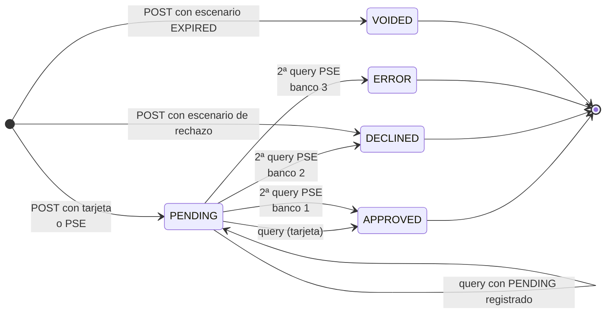
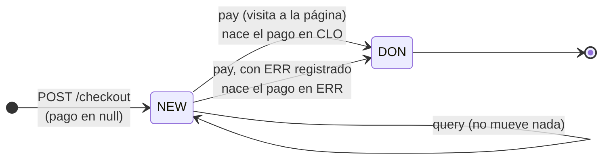
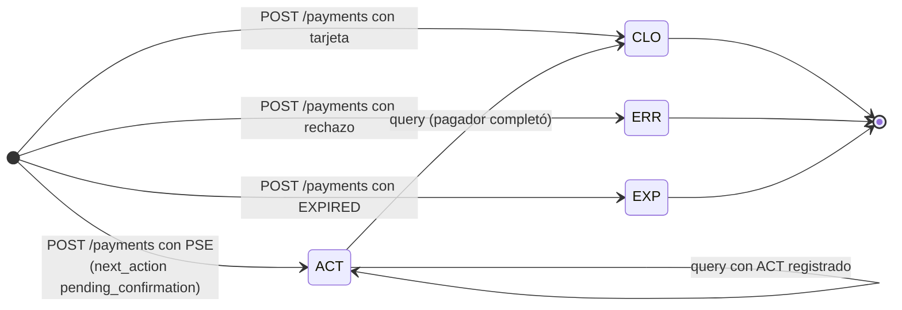
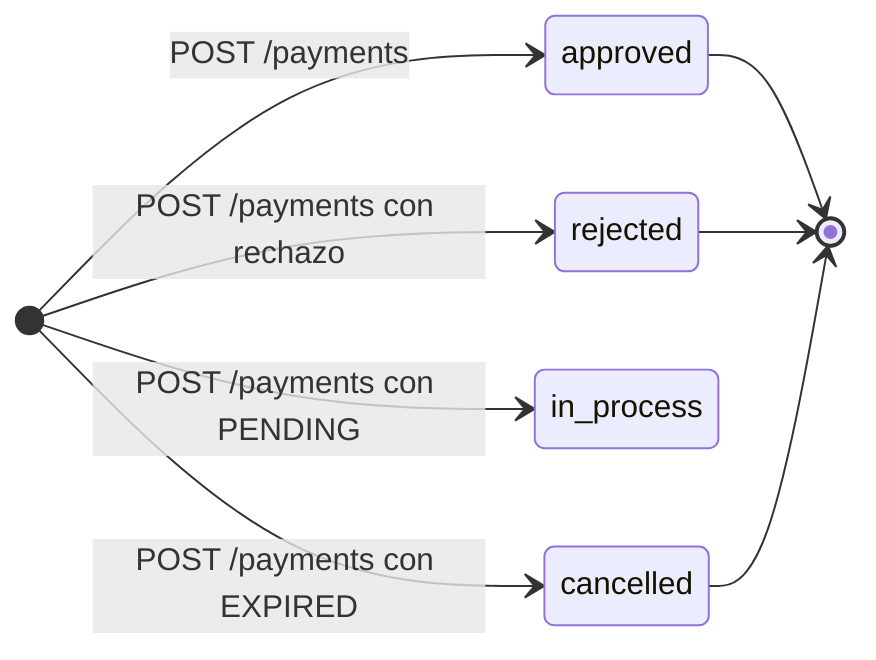
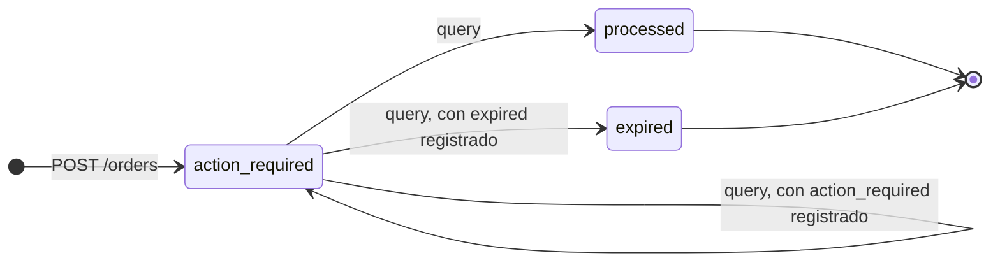
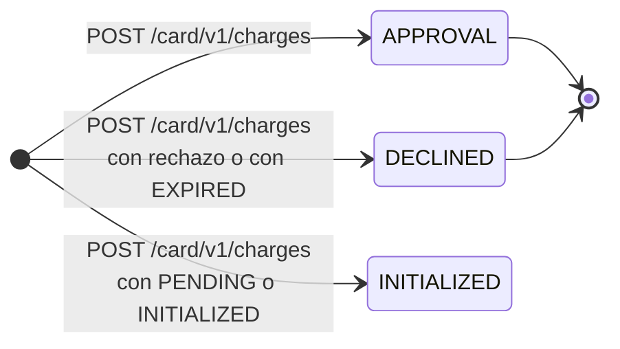
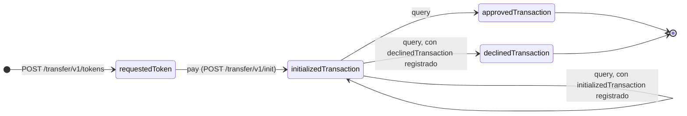

# La API de Simulación: el segundo componente

Un servidor Fastify que imita a las cuatro pasarelas. Este documento explica por qué existe, qué expone, hasta dónde llega su fidelidad y qué le falta para estar completo.

---

## 1. Por qué existe

La respuesta corta es que **los sandboxes reales no permiten ejercitar los flujos completos**. No es una suposición; está medido, y cada caso está registrado en el [architecture-log](../architecture/architecture-log.md):

| Lo que se midió | Consecuencia |
|---|---|
| El sandbox de Wompi publica la URL de redirección de PSE **en el mismo instante** en que resuelve el pago (punto 43) | No existe ninguna ventana de tiempo en la que redirigir tenga sentido. El flujo de PSE de Wompi no se puede ejercitar contra su sandbox |
| La Orders API de Mercado Pago, la única con PSE, responde `401` con credenciales de prueba y exige token de producción (punto 45) | El PSE de Mercado Pago no se puede probar en sandbox en absoluto |
| Kushki no registra los cobros síncronos de tarjeta en la ruta de consulta que publica: responde `CAS004 "No existe la transacción"` (punto 54) | El ciclo de vida completo de un cobro con tarjeta en Kushki no se puede mostrar contra su sandbox |

Y hay una razón más, que aplica a los cuatro: **un sandbox real declina cuando quiere.** Por eso las 18 pruebas de contrato del proyecto no afirman `APPROVED`, solo que la petición fue aceptada y la respuesta tiene la forma esperada. Una prueba automatizada que necesite un desenlace concreto no puede depender de un servicio de un tercero.

El simulador resuelve las dos cosas: es **determinista**, así que una prueba puede afirmar un resultado, y **no necesita credenciales**, así que corre en CI y cualquiera lo puede levantar recién clonado el repositorio.

---

## 2. Cómo está construido

```text
simulator-api/src/
├── server.ts                 pone a escuchar el puerto
├── app.ts                    construye la instancia de Fastify, hooks y registra las rutas
├── auth/
│   ├── CredentialResolver.ts resolución híbrida de credenciales (headers > env)
│   ├── targetEnvironment.ts  clasifica la URL base: simulador, sandbox o producción
│   └── authHook.ts           hook onRequest de autenticación Bearer en tiempo constante
├── services/
│   └── KitPagosProvider.ts   ciclo de vida e instanciación del SDK (workspace)
├── logger/
│   └── redactSerializer.ts   redacción estricta de credenciales en logs de Pino
├── kit-pagos-api/            capa REST propia bajo /v1/api
│   ├── index.ts              plugin del módulo: CORS y registro de rutas
│   ├── gateway-param.ts      parseo compartido del identificador de pasarela
│   ├── gateway-client.ts     SDK por petición, con la regla de credenciales y su advertencia
│   ├── routes/gateways.ts    GET /v1/api/gateways
│   ├── routes/payments.ts    POST /v1/api/payments y GET /v1/api/payments/:id
│   ├── routes/pse-banks.ts   GET /v1/api/pse-banks
│   ├── routes/webhooks.ts    POST /v1/api/webhooks/:gateway, con cuerpo crudo
│   └── errors/               traducción de KitPagosError a HTTP
├── routes/
│   ├── health.ts             GET /health
│   ├── wompi.ts              4 rutas
│   ├── mercadopago.ts        5 rutas
│   ├── rapyd.ts              7 rutas
│   └── kushki.ts             6 rutas
├── gateways/
│   ├── wompi/                GatewayMockFactory.ts + types.ts
│   ├── mercadopago/          GatewayMockFactory.ts + types.ts
│   ├── rapyd/                GatewayMockFactory.ts + types.ts
│   └── kushki/               GatewayMockFactory.ts + types.ts
├── scenarios/
│   └── ScenarioEngine.ts     decide qué desenlace producir
└── store/
    └── TransactionStore.ts   memoria de las transacciones creadas
```

**`app.ts` está separado de `server.ts` a propósito.** `buildApp()` construye la instancia de Fastify sin ponerla a escuchar, y `server.ts` es lo único que llama a `listen()`. Así las suites de prueba usan `app.inject()` sobre la misma aplicación que corre en producción, sin abrir un socket. La diferencia práctica es que las pruebas no pueden quedarse colgadas esperando la red ni chocar por el puerto ocupado.

**Capa de autenticación y resolución de credenciales (`src/auth/`):**
- `CredentialResolver`: Implementa la resolución híbrida. Primero inspecciona las cabeceras `x-gateway-public-key`, `x-gateway-private-key` (e `integrity-secret`). Si no están presentes, recurre al perfil de sandbox del `.env` del servidor. Por seguridad estricta, `webhookSecret` **nunca** se acepta desde el cliente HTTP para evitar invalidar la verificación criptográfica. Si faltan credenciales, lanza `MissingCredentialsError` (HTTP 401).
- `targetEnvironment`: Resuelve el ambiente destino a partir de la cabecera `x-kit-pagos-environment` (por defecto `simulator` si no se envía; valores desconocidos responden HTTP 400 `INVALID_REQUEST`). La API resuelve la URL de destino desde un **catálogo cerrado** embebido en el SDK por pasarela y ambiente (Issue #123, Punto 80). El cliente nunca suministra URLs de pasarela, previniendo vectores de SSRF con fuga de credenciales. La regla de credenciales se aplica sobre el ambiente declarado:

  | Ambiente Declarado (`x-kit-pagos-environment`) | Sin credenciales propias completas |
  |---|---|
  | `simulator` (omisión segura) | Usa el perfil del servidor conectándose a `SIMULATOR_SDK_BASE_URL` o, si no está definida, al propio proceso (`http://localhost:<PORT>/v1/sim/<pasarela>`), sin advertencias |
  | `sandbox` | Usa el perfil del servidor conectándose al sandbox oficial del catálogo cerrado y lo advierte en la cabecera `x-kit-pagos-warning` y en el campo `warnings` del cuerpo JSON (`SERVER_SANDBOX_CREDENTIALS_USED`), también en respuestas de error |
  | `production` | Lanza `ClientCredentialsRequiredError` (HTTP 401) sin llamar a la red, detallando las cabeceras `x-gateway-*` requeridas |

  Mercado Pago comparte host (`api.mercadopago.com/v1`) para prueba y producción, determinando el ambiente exclusivamente por las credenciales suministradas. La verificación de webhooks no pasa por esta regla, porque no llama a la pasarela (puntos 66 y 80). Al arrancar, el log registra la resolución dinámica por pasarela y la URL del simulador.
- `authHook`: Hook `onRequest` que protege los endpoints REST mediante token Bearer (`API_AUTH_TOKEN`). Realiza comparaciones en tiempo constante (`crypto.timingSafeEqual`) para mitigar ataques de temporización. Si `API_AUTH_TOKEN` no está configurado, opera en modo desarrollo abierto con advertencia en logs. Rutas públicas como `/health` y los endpoints mock `/v1/sim/*` están exentos por prefijo. El preflight de CORS (`OPTIONS` con `Access-Control-Request-Method`) también pasa sin token, porque el navegador nunca le agrega `Authorization`.

**El módulo REST propio (`src/kit-pagos-api/`):** se registra en `buildApp()` con el prefijo `/v1/api` y queda separado de `src/routes/` y `src/gateways/`, porque `/v1/sim` finge ser un tercero y `/v1/api` expone lo propio. No reimplementa reglas del SDK: traduce HTTP a llamadas de la fachada `KitPagos`.
- `GET /v1/api/gateways` devuelve las pasarelas que soporta el SDK, tomadas de su enum `Gateway`. Sirve como prueba de vida del montaje, sin depender de credenciales.
- `POST /v1/api/payments` expone `createPayment`. Recibe `gateway`, `amount` (como string decimal estricto para proteger la escala exacta en HMAC y cálculos), `currency`, `orderReference`, `payer` y opcionales como `paymentMethod`, `returnUrlConfig`, `taxBreakdown` e `ipAddress`. Discrimina la respuesta HTTP 201 mediante `outcome: "TRANSACTION"` (junto a `rawStatus` y la transacción normalizada) o `outcome: "REDIRECT_REQUIRED"` (con `redirectUrl`, `gatewayTransactionId` y `rawStatus`). Las cuatro pasarelas funcionan por el mismo endpoint sin condicionales por pasarela. Además:
  - **Campos que no se pueden interpretar.** Un opcional que viene mal formado responde 400 en vez de descartarse: `paymentMethod` sin `type`, `installments` que no es un entero, un `payerKind` distinto de `NATURAL` o `LEGAL`, o un `taxBreakdown` incompleto o con `rate` numérico. Descartado, el cobro saldría con el valor por omisión; en Kushki, sin desglose, el monto completo se cobra como exento de IVA.
  - **Credenciales.** Resuelve el cliente con `gatewayClientFor()`, así que aplica la regla del punto 69: contra producción nunca usa las credenciales del servidor.
  - **Monto de la respuesta.** Es el que reporta la pasarela, con los decimales de su divisa según ISO 4217: `"75000.00"` en las cuatro pasarelas, aunque Mercado Pago y Kushki lo reporten como número (punto 72).
  - El razonamiento está en los puntos 65 y 71.
- `GET /v1/api/payments/:id?gateway=<pasarela>` consulta el estado de una transacción con `getPaymentStatus()`. La pasarela viaja en el query y es obligatoria: el SDK usa una pasarela por instancia, y deducirla del `TransactionStore` acoplaría la REST al simulador y no funcionaría contra pasarelas reales. La respuesta 200 lleva `{ gateway, transaction }`, donde `transaction` es la misma serialización del POST: `status` normalizado y `rawStatus` nativo, además de `gatewayTransactionId`, `orderReference`, `amount`, `currency` y `payer`. Un id inexistente responde 404 con `RESOURCE_NOT_FOUND` en Wompi y Mercado Pago. Rapyd responde `400` a un pago o a una página de pago que no existe (`ERROR_GET_PAYMENT`, `ERROR_GET_HOSTED_PAGE_PAYMENT`), y el SDK traduce ese 400 a `INVALID_REQUEST`, igual que lo hará contra la pasarela real. En Kushki depende de la longitud: contra el simulador, el 5 de octubre de 2026, un id inexistente de 32 caracteres respondió `400 UNSUPPORTED_OPERATION` y uno de 18 respondió `404 RESOURCE_NOT_FOUND`. Una operación que la pasarela no soporta —consultar una tarjeta en Kushki— responde 400 con `UNSUPPORTED_OPERATION` sin disfrazarlo de 404. Sin reintentos propios: `getPaymentStatus()` ya va envuelto en `RetryHandler` dentro del SDK.
- `GET /v1/api/pse-banks` lista los bancos habilitados para PSE con `getPseBanks()`. Responde `{ pseBanks: [{ gateway, banks }] }`, con cada banco como `{ code, name }` y `achCode` solo cuando existe (los bancos ficticios de los sandboxes de Wompi y Kushki no lo tienen). Cada `code` solo sirve en su pasarela, por eso el agrupamiento lleva el `gateway` de origen. `?gateway=<pasarela>` acota la consulta a una y devuelve la misma forma con un solo elemento. Sin cache: cada petición vuelve a consultar las pasarelas, porque la lista cambia. Falla rápido: si una pasarela no responde, el 4xx/5xx de su error va a la respuesta en vez de una lista parcial.
  - **El parámetro es obligatorio cuando la petición trae credenciales propias.** `x-gateway-public-key` y `x-gateway-private-key` son el par de llaves, sin el nombre de la pasarela, así que una petición que las trae solo puede estar dirigida a una y mandarlas a las otras tres sería filtrarlas —incluida la privada— a tres proveedores. Sin el parámetro la lista las cuatro solo es válida para quien usa las credenciales del servidor. Con las cabeceras y sin `?gateway=` la respuesta es 400 pidiendo la pasarela; con un valor que no es una pasarela es 400 con el mismo cuerpo de `POST /v1/api/payments`, que tampoco repite lo que recibió. Contra producción esto además arregla la ruta: antes la regla del punto 69 caía recién adentro del bucle, sobre la primera pasarela, así que respondía 401 siempre y no había forma de listar bancos. Resuelve el cliente con `gatewayClientFor()`, como las otras dos rutas.
- Un `KitPagosError` lanzado en cualquier ruta se traduce al código HTTP de su `KitPagosErrorCode` (400, 401, 404, 429, 502, 504 o 500), con un cuerpo `{ code, message }` y nada más: el `originalPayload` con el cuerpo crudo de la pasarela no sale de la API.
- `@fastify/cors` se registra dentro del módulo, así que solo `/v1/api` responde cabeceras CORS; las rutas de simulación siguen iguales. El detalle de las decisiones está en los puntos 64 y 65 del `architecture-log.md`.
- `POST /v1/api/webhooks/:gateway` verifica una notificación con `validateWebhook()` y devuelve la pasarela y el estado normalizado:
  - **Cuerpo crudo.** Recibe el cuerpo como la cadena exacta que llegó, gracias a un parser propio que solo aplica a esa ruta; las firmas de Kushki y Rapyd se calculan sobre esos bytes.
  - **Credenciales.** Las toma solo del perfil del servidor y exige un `webhookSecret` configurado; ignora cualquier cabecera `x-gateway-*`.
  - **Rechazos.** Todo rechazo (firma falsa, cuerpo malformado, marca de tiempo vencida, secreto sin configurar) responde el mismo 401.
  - **Ventana de tolerancia.** Se configura con `WEBHOOK_TOLERANCE_SECONDS`.
  - **Rapyd** exige además `RAPYD_WEBHOOK_URL`, la URL registrada en su panel; una cabecera `x-webhook-url` se ignora.
  - **Contrato de reenvío.** La ruta exige el Bearer de `/v1/api`, así que la pasarela no apunta a ella: el comercio recibe el webhook y lo reenvía. Tiene que reenviar el cuerpo byte a byte, las cabeceras originales de la pasarela y el query string, porque Mercado Pago firma el `data.id` que viaja en la URL.
  - El razonamiento está en los puntos 66 y 67.

**Capa de servicio SDK (`src/services/`):**
- `KitPagosProvider`: Administra las instancias de `KitPagos` (consumido desde el workspace local `file:../sdk`, alineado con la política de detección temprana de rupturas de CI del punto 62). Para credenciales del servidor, mantiene un caché singleton por pasarela. Para credenciales inyectadas por el cliente en cabeceras HTTP, crea instancias al vuelo aisladas por petición, garantizando que no exista fuga ni contaminación cruzada entre clientes concurrentes. Expone dos accesos: `resolveClient()` aplica la regla de `targetEnvironment` para las operaciones que llaman a la pasarela, y `getWebhookVerifier()` usa siempre el perfil del servidor. Las rutas que llaman a la pasarela pasan por `gatewayClientFor()` en `src/kit-pagos-api/gateway-client.ts`, que además deja la advertencia en la respuesta: la de cobro (issue #102), la de consulta de estado y la de bancos (issue #103) ya lo hacen.

**Seguridad en observabilidad (`src/logger/`):**
- `redactSerializer`: Redactor para Fastify/Pino que reemplaza por `"[REDACTED]"` cualquier cabecera sensible (`authorization`, `x-gateway-*`), impidiendo que secretos o API keys aparezcan en texto claro en consolas o servicios de agregación de logs.

**Una factoría de mocks por pasarela**, con sus tipos al lado. Cada una construye las respuestas con la forma nativa de su pasarela: Wompi envuelve todo en `data` y usa `amount_in_cents`; Mercado Pago pone el pago en la raíz y el monto en pesos; y así.

**Los almacenes guardan en memoria, y eso es deliberado.** Reiniciar el servidor limpia el estado, que es exactamente lo que se quiere de un simulador: cada corrida arranca desde cero, sin arrastrar transacciones de una prueba anterior.

Son **un almacén por pasarela y por recurso**, en `src/store/GatewayStores.ts`, y cada uno declara el tipo que guarda. Con el almacén único el tipo era `unknown`, así que cada lectura terminaba en algo como `findById(id) as WompiTransaction | undefined`: una conversión que el compilador no verificaba, y por eso un cobro de Rapyd consultado por la ruta de Wompi pasaba la prueba de tipos. Rapyd tiene dos porque el checkout y el pago son recursos distintos con identificadores distintos —el checkout nace con el pago en `null`— y el SDK también los distingue por prefijo para elegir la ruta de consulta.

`resetSimulatorState()` los limpia todos, junto con las marcas de escenario y los destinos registrados. Es lo que usan las pruebas para no depender del orden en que corren.

**Las factorías solo construyen.** No guardan, no mueven estados y no leen cabeceras. Que una respuesta exista en el almacén es responsabilidad de la ruta, y que un cobro pase de un estado a otro es responsabilidad de la tabla de transiciones. Antes cada factoría recibía el almacén por el constructor y decidía además cómo avanzaba un cobro al consultarlo, de modo que las reglas del flujo de Wompi estaban en tres sitios —la tabla, un método de la factoría y una función del router— y dos de ellos ya discrepaban.

---

## 3. Las rutas

23 endpoints. Todas viven bajo `/v1/sim/<pasarela>/` y **replican la forma de la ruta nativa**, para que apuntar el SDK al simulador sea cambiar `baseUrl` y nada más.

| Pasarela | Rutas |
|---|---|
| **Wompi** (4) | `POST /transactions`, `GET /transactions/:id`, `GET /merchants/:publicKey`, `GET /pse/financial_institutions` |
| **Mercado Pago** (5) | `POST /payments`, `GET /payments/:id`, `POST /orders`, `GET /orders/:id`, `GET /payment_methods` |
| **Rapyd** (7) | `POST /payments`, `GET /payments/:paymentId`, `POST /checkout`, `GET /checkout/:checkoutId`, `GET /checkout/:checkoutId/pagar`, `POST /customers`, `GET /payment_methods/country` |
| **Kushki** (6) | `POST /card/v1/charges`, `GET /charges/:ticketNumber`, `GET /transfer/v1/bankList`, `POST /transfer/v1/tokens`, `POST /transfer/v1/init`, `GET /transfer/v1/status/:token` |
| **Salud** (1) | `GET /health` |

La asimetría en el número de rutas no es descuido: es el reflejo directo de que cada pasarela necesita una cantidad distinta de llamadas para el mismo flujo. Rapyd tiene siete porque su tarjeta va por checkout alojado y su PSE necesita crear un cliente primero.

`GET /checkout/:checkoutId/pagar` es la única ruta que **no** existe en ninguna pasarela real: es el botón que simula al pagador completando el pago en la página alojada de Rapyd. Sin ella no habría forma de avanzar un checkout desde una prueba automatizada.

---

## 4. Los headers de escenario

Las rutas de creación leen dos cabeceras equivalentes, **`x-simulator-scenario`** y **`x-simulate-scenario`**, y por defecto el escenario es `APPROVED`. La idea es que la misma petición produzca desenlaces distintos según lo que la prueba necesite.

Las dos cabeceras existen porque la primera se eligió tarde. La que usaba el SDK al principio era `x-simulate-scenario`, y el simulador solo aceptaba esa; cuando el proyecto normalizó el nombre en el resto de componentes, el simulador quedó con la otra y nada lo detectó hasta que las pruebas lo notaron. Ninguna de las dos está deprecada: reconocer ambas evita que un cliente que use la otra reciba un `APPROVED` silencioso, que es el peor resultado posible para una prueba.

### El motor de Wompi, y lo que no sabe producir

`ScenarioEngine.execute()` es el que construye la transacción de Wompi según el escenario. Las otras tres pasarelas resuelven el escenario en su propio router.

```90:110:simulator-api/src/scenarios/ScenarioEngine.ts
    switch (normalized) {
      // `PENDING` construye lo mismo que el aprobado porque en Wompi los dos nacen
      // pendientes. La diferencia la pone el destino que registra la ruta, no la creación.
      case "APPROVED":
      case "APPROVAL":
      case "PENDING":
        if (requestBody.payment_method?.type === "PSE") {
          return this.wompiMockFactory.buildPendingPseResponse(requestBody);
        }
        return this.wompiMockFactory.buildApprovedResponse(requestBody);

      case "DECLINED":
      case "REJECTED":
        return this.wompiMockFactory.buildDeclinedResponse(requestBody);

      case "EXPIRED":
        return this.wompiMockFactory.buildExpiredResponse(requestBody);

      default:
        throw new UnsupportedScenarioError(scenario);
    }
```

**Cualquier otro escenario lanza `UnsupportedScenarioError`, que el router traduce a un HTTP 501 Not Implemented.** Las otras tres pasarelas siguen la misma regla en cada ruta que crea un cobro: una falla técnica sale por `technicalFailure()`, un desenlace declarado por su destino, y cualquier otro escenario responde `501` sin guardar nada. La excepción es el `init` de la transferencia de Kushki: atiende las fallas técnicas e ignora los escenarios de negocio, porque el desenlace ya lo fijó la petición del token.

Ese 501 es una decisión, no una omisión: **es mucho mejor que un `APPROVED` falso.** Si el motor respondiera "aprobado" a una petición que pidió `REJECTED`, una prueba de manejo de rechazos pasaría sin haber probado nada, y el defecto aparecería en producción. Un 501 hace ruido de inmediato.

PSE tiene un caso aparte y correcto: no depende del escenario pedido sino del método de pago, porque un pago de PSE queda `PENDING` esperando al pagador incluso en el camino feliz.

### El escenario se fija al crear, y las consultas no lo aceptan

Esta es la regla que gobierna el comportamiento del componente (issue #124), y conviene decirla con sus dos mitades porque las dos importan:

1. **El escenario de negocio se aplica en la creación.** El cobro nace con el estado que pidió la prueba.
2. **Las consultas no leen el escenario.** Responden el estado que ya tiene el registro.

Si una consulta aceptara el escenario, el mismo cobro sería aprobado y declinado según quién preguntara, y no habría forma de conciliar. El caso extremo que motivó el issue era Kushki.

**`declinedTransaction` de Kushki no se alcanzaba desde la creación.** Las dos rutas que crean la transferencia (token e `init`) ignoraban la cabecera: un `DECLINED` pedía un PSE, recibía `201` y la consulta sin cabecera respondía `approvedTransaction`. Solo se llegaba a `declinedTransaction` enviando el escenario en la consulta, que es el defecto 2.

Cuando el desenlace solo se conoce después —al volver del banco, al llenar la página de pago o cuando la pasarela termina de procesar—, la creación registra el destino y la transición lo aplica. Lo hacen cinco rutas de creación:

| Ruta | Escenario | Destino registrado |
|---|---|---|
| Wompi, `POST /transactions` | `PENDING` | `PENDING`: la transacción no resuelve |
| Rapyd, `POST /payments` con PSE | `PENDING` | `ACT`: el pago no se cierra |
| Rapyd, `POST /checkout` | `DECLINED` | `ERR`: el pago que nace en la visita está declinado |
| Mercado Pago, `POST /orders` | `EXPIRED` o `PENDING` | `expired`, o `action_required`: la orden no sale de la espera |
| Kushki, `POST /transfer/v1/tokens` | `DECLINED` o `PENDING` | `declinedTransaction`, o `initializedTransaction` |

Esa información vive en `src/state/scenarioTarget.ts`, **fuera del registro**, para que el payload que devuelve el simulador siga siendo exactamente el nativo: agregar un campo propio sería mentir sobre la respuesta de la pasarela. Cada tabla que acepta destinos registrados declara cuáles, y `scenarioTargetFor()` lanza un error si el destino registrado no está en ella: caer al destino por defecto convertiría un escenario mal traducido en un cobro aprobado. Los destinos también se borran con `resetSimulatorState()`.

Un pendiente se registra con el mismo estado del que sale la transición. La tabla resuelve entonces que el cobro termina donde estaba, devuelve el mismo registro y la ruta no guarda nada.

### Las fallas técnicas no crean ni mutan estado

Un `TIMEOUT`, un `NETWORK_ERROR` o un `SERVER_ERROR` se resuelven **antes** de construir nada, y devuelven el error nativo de la pasarela sin tocar ningún almacén. Un error de transporte no es un cobro en estado de error: si el solicitante reintenta después de un `504`, tiene que poder hacerlo y no chocar con un registro fantasma. Lo cumplen las ocho rutas que crean o inician un cobro, incluidas la página de pago de Rapyd y la orden de Mercado Pago, que antes no tenían la cadena de fallas técnicas: un `TIMEOUT` creaba y guardaba el cobro.

**Limitación actual, pendiente del #122:** una consulta de cobro no puede fallar por escenario técnico. La cabecera de escenario de la consulta se ignora, y el escenario de la creación no se guarda para aplicarlo a la consulta. Una consulta real sí puede vencer por tiempo, y por eso `getPaymentStatus()` del SDK reintenta; el simulador todavía no permite ejercitar ese camino.

---

## 4.1 Los cuatro flujos como máquinas de estados

Cada pasarela tiene sus estados en una tabla declarativa, en `src/state/`. Ninguna ruta decide un estado: la tabla dice qué transición existe, cuándo aplica y a dónde lleva, y la ruta guarda lo que se movió. Los estados son los **nativos** de cada pasarela, no un vocabulario común inventado, y cada diagrama nombra solo los que la tabla declara.

Los diagramas están para leer el flujo de un vistazo; el detalle de por qué existe cada transición, y qué está medido y qué no, está en el encabezado de cada tabla.

### Wompi: tarjeta y PSE

Wompi es asíncrono en los dos métodos, y de maneras distintas: la tarjeta nace `PENDING` y resuelve sola en unos 600 ms; el PSE publica la URL del banco en una consulta y resuelve en la siguiente. El banco de prueba elegido decide el desenlace del PSE, con los mismos códigos que expone su sandbox. Los tres están medidos: el banco `1` aprueba y el `2` declina (punto 43), y el `3`, «Banco que simula un error», termina `ERROR` con `status_message: "Transacción con ERROR en Sandbox"` (medido el 5 de octubre de 2026, `docs/testing-data/wompi.md`).



El PSE necesita dos consultas y tarjeta solo una. El sandbox publica la URL del banco y resuelve en la misma consulta (punto 43), así que el orden no se puede observar allí; separarlos en dos consultas es una decisión del simulador que reproduce el orden del flujo real, en el que el pagador necesita la URL antes de que haya desenlace. Esa es también la diferencia con Rapyd, donde la página de pago sí es del simulador y por eso su visita puede representarse (siguiente diagrama).

Con el escenario `PENDING`, la transacción no resuelve: la tarjeta se queda `PENDING`, y el PSE publica la URL y después se queda `PENDING`. Es una decisión del simulador (nivel 3): el sandbox no tiene un banco ni una tarjeta que dejen el cobro pendiente.

### Rapyd: el checkout

El checkout es un recurso de un solo paso: nace cuando el comercio pide una página de pago y pasa a `DON` cuando alguien la visita y la llena. El sandbox real nunca lo hace solo —se midió que un checkout creado y no visitado se queda en `NEW` indefinidamente—, así que en el simulador lo dispara la visita a la URL de redirección, que es el equivalente de que el pagador llene el formulario.



Que el movimiento lo disponga `pay` y no `query` es lo que evita el defecto que el issue reporta en las otras tres pasarelas: un comercio que consultara dos veces vería aparecer un pago que nadie hizo.

El checkout termina en `DON` también cuando el pago se declina: la página se usó. Lo que cambia es el pago que nace, que lleva `ERR`, `paid: false` y el `failure_code` de un rechazo de tarjeta (`ERROR_PROCESSING_CARD - [51]`), para que el SDK lo normalice como rechazo tanto en la consulta del checkout como en la del pago. Es una decisión del simulador (nivel 3): no se midió qué hace el sandbox con una página cuyo pago se declina. `PENDING` y `EXPIRED` responden `501`: un checkout pendiente es el que nadie visitó, y para uno vencido no hay medición.

### Rapyd: el pago



Los tres estados finales del pago —`CLO`, `ERR` y `EXP`— no tienen transición de salida: un pago creado como declinado se consulta como declinado, con su monto y su referencia. Un PSE creado con `PENDING` se queda en `ACT` (decisión del simulador, nivel 3); con tarjeta, `PENDING` responde `501`, porque ese pago nace cerrado.

### Mercado Pago: el pago con tarjeta



La tabla de pagos está vacía: ninguna consulta mueve un pago con tarjeta. `in_process` no es final, pero lo que lo saca de ahí es la revisión de Mercado Pago, que puede acreditarlo o no, y una transición hacia `approved` afirmaría un desenlace sin fuente. El `status_detail` del pendiente, `pending_review_manual`, es una respuesta medida de la cuenta de prueba (`docs/testing-data/mercado-pago.md`, línea 70); el `status` `in_process` sale de la [tabla oficial de resultados de pago](https://www.mercadopago.com.co/developers/en/docs/checkout-api-payments/response-handling/collection-results). No hay un pago aprobado medido: el `approved` del simulador también sale de la documentación oficial.

### Mercado Pago: la orden de PSE

PSE no se cobra por la Payments API sino por esta: contra la API real, el mismo pago con el banco en `transaction_details.financial_institution` devuelve `424` pase lo que pase.



Una orden rechazada no aparece en el diagrama porque no nace: `POST /orders` con rechazo responde `402` con la orden entera en `failed`, sin registro que consultar. Los desenlaces de la orden son de nivel 3: con el token `APP_USR-` la orden se crea y entrega la redirección al banco (punto 45), pero ningún desenlace posterior está medido en `docs/testing-data/mercado-pago.md`.

`expired` es la traducción de `EXPIRED` para órdenes, y la hace el router porque es quien conoce el vocabulario de la pasarela. La tabla de estados de la orden de Checkout API ([Order status](https://www.mercadopago.com.co/developers/en/docs/checkout-api-orders/payment-management/status/order-status), consultada el 5 de octubre de 2026) tiene `expired` y `canceled` como estados distintos. Sin esa traducción, `EXPIRED` se aceptaba con `201` y la consulta respondía `processed`: un cobro caducado reportado como cobrado. `PENDING` registra `action_required`, y la orden sigue esperando, con su URL de redirección, en cada consulta.

Al salir de `action_required`, la tabla pone el `status_detail` que la misma página empareja con el destino (`processed | accredited`, `expired | expired`) y quita la URL de redirección.

`pending` para el pago, y `processing` y `created` para la orden, son estados de la pasarela que están en los tipos y no en las tablas: ninguna ruta los produce, y no hay fuente de cómo salen de ellos.

### Kushki: el cobro con tarjeta

Kushki responde `200` —o `201` al crear— incluso cuando el cobro está declinado: la decisión vive en el cuerpo, en `details.transactionStatus`. Un adaptador que decidiera mirando `response.ok` reportaría todos los rechazos como aprobados, y ese es justo el comportamiento que el simulador tiene que reproducir.



La tabla de cobros con tarjeta está vacía. `EXPIRED` no tiene estado propio: nace `DECLINED` con `responseText: "Transacción expirada"`. `INITIALIZED` no tiene salida: un cobro creado pendiente se consulta pendiente, y no hay fuente de cómo termina (ni siquiera de que exista para tarjeta, según `types.ts`).

### Kushki: el Transfer In

Transfer In son tres llamadas reales —`bankList`, el token y `init`— y una consulta, y el simulador respeta ese orden, que es lo que permite ejercitar el flujo de punta a punta.



`initializedTransaction` es el estado real entre el `init` y la primera consulta: la respuesta medida del `init` no trae campo de estado, así que ese estado no se ve por la API y queda anotado en la tabla en vez de inventarse una segunda consulta que la pasarela real tampoco tiene.

`declinedTransaction` sí se ve desde la creación, y antes no: el token y el `init` ignoraban el escenario, y solo se llegaba enviándolo en la consulta. El destino registrado en el paso del token es lo que lo hace alcanzable.

`EXPIRED` responde `501` al pedir el token, y no se guarda nada. `expiredTransaction` existe en la referencia de Kushki, pero «solo aplica a México» (`docs/testing-data/kushki.md`, línea 369). Antes `EXPIRED` no registraba destino y la transferencia terminaba `approvedTransaction`.

Una consulta de estado o un `init` con un identificador desconocido responde lo que midió Kushki UAT el 5 de octubre de 2026, y lo que decide es la longitud. Un identificador de 32 caracteres que no existe da `400 T004 "No existe la transacción"`; uno de otra longitud, como el ticket de tarjeta de 18, da `400 T001 "Cuerpo de la petición inválido."`. En el `init`, Kushki valida el cuerpo antes que la existencia. En la consulta, el SDK traduce los dos códigos a `INVALID_REQUEST` y pasa a la ruta de tarjeta; el `init` no tiene ruta alternativa.

---

## 5. Los límites de fidelidad, declarados

Un simulador que no declare en qué se aparta de la realidad es una trampa. Estos son los apartamientos conocidos:

**El mock de Rapyd no verifica la firma HMAC de las peticiones entrantes.** Rapyd real rechaza cualquier petición mal firmada. Contra el simulador, un adaptador con la firma rota funciona igual, así que la corrección de esa firma **solo** la garantizan las pruebas unitarias con vectores independientes y las pruebas de contrato.

**`GET /charges/:ticketNumber` de Kushki no existe en Kushki real.** Se midió que responde `403` para cualquier identificador, igual que una ruta inventada. El simulador la implementa porque es la que permite mostrar el ciclo de vida completo de un cobro con tarjeta en un ejemplo ejecutable. Contra Kushki real, ese estado llega por webhook.

**El simulador no exige la firma de integridad de Wompi.** Wompi real responde `422 "Firma de integridad requerida no enviada"`. Ese defecto vivió en el SDK sin que nadie lo notara justamente porque el simulador no la pedía (punto 44).

**El simulador no exige `X-Idempotency-Key` en Mercado Pago.** Mercado Pago real responde `400`. Mismo patrón que el anterior (punto 48).

Estos cuatro casos tienen una lección común, y es probablemente la más importante del proyecto: **el simulador solo es tan fiel como lo que se midió.** En un momento el mock afirmaba que las cuatro pasarelas cobraban con tarjeta servidor a servidor, y al medir resultó que ninguna lo hacía como el mock decía (punto 50). Por eso el proyecto tiene **además** pruebas de contrato contra los sandboxes reales: son las que detectan cuándo el simulador se volvió optimista.

---

## 6. Estado de los requisitos del componente

El primer entregable de la Iteración 3 asigna cuatro partes a la API de Simulación:

1. **Los escenarios de fallo:** rechazo, fondos insuficientes, timeout y error de red, para las cuatro pasarelas y no solo para Wompi (requisito RF-10, en curso vía issue #122).
2. **Que el motor reciba la pasarela como parámetro** en vez de asumir Wompi.
3. **El despliegue en la nube (completado):** desplegado oficialmente en Render como Web Service en [`https://kit-pagos-colombia.onrender.com`](https://kit-pagos-colombia.onrender.com). La infraestructura está codificada en `render.yaml` (Blueprint / IaC) en la raíz del repositorio, configurada para compilar e iniciar Fastify sobre Node 20 en el puerto dinámico de Render (`10000`), con healthcheck nativo en `/health` y hook de despliegue automatizado (`RENDER_DEPLOY_HOOK_URL`). El servicio consume el paquete oficial publicado en npm (`kit-pagos-colombia@^0.2.0`), asegurando que la simulación opere como un consumidor real desacoplado del árbol local del monorepo (punto 79 del `architecture-log.md`).
4. **La colección Postman versionada:** pospuesta de mutuo acuerdo para consolidarse una vez se cierren los endpoints y escenarios de fallo restantes de la Iteración 3, evitando mantener especificaciones desfasadas mientras la superficie REST evoluciona.

**El punto 1 bloquea a los prototipos**, y por eso el orden dentro de la iteración no es libre. Una de las seis variables que mide el experimento de la Fase 5 es si el prototipo distingue un rechazo de negocio de un fallo técnico y reintenta solo el segundo. Contra un simulador que solo sabe aprobar, eso no se puede implementar ni medir. La secuencia forzada es **escenarios → prototipos → métricas**.

---

## 7. La decisión abierta: simular o conectarse

Hay una pregunta sin resolver sobre el futuro de este componente, y está registrada como **punto 59** del [architecture-log](../architecture/architecture-log.md), que es donde viven las decisiones abiertas del proyecto. Resumen de las tres opciones:

**A. Seguir replicando el comportamiento medido** (lo que hay hoy). Determinista, sin credenciales, sirve en CI, y es el único lugar donde ciertos flujos se pueden ejercitar. Su límite es que la fidelidad llega hasta donde llegó la medición.

**B. Proxiar directo al sandbox de cada pasarela.** Da comportamiento y firmas reales. El costo es concreto: exige credenciales reales en el despliegue, deja de ser determinista, saca al simulador de CI, y **no** desbloquea los flujos que el sandbox tampoco puede completar, porque el PSE necesita una persona autorizando en el portal del banco.

**C. Híbrido:** el mock por defecto, con un modo de paso directo por pasarela.

Y un dato que conviene tener antes de decidir: **el SDK ya habla con los sandboxes reales sin pasar por el simulador.** El campo `baseUrl` admite un mapa por pasarela desde el punto 57, y las 18 pruebas de contrato lo hacen hoy. Si lo que se busca es que los prototipos corran contra comportamiento real, se apunta `baseUrl` al sandbox y listo.

Eso reformula la pregunta: no es "¿cómo hacemos el simulador más real?" sino **"¿qué gana el simulador siendo proxy que no se consiga apuntando el SDK al sandbox?"**, que es bastante más fácil de responder.

---

## 8. Cómo se levanta

### Entorno local

```bash
cd simulator-api && npm install && npm run dev
# Escucha en http://localhost:3000
curl http://localhost:3000/health
```

Las suites de prueba (27 suites con 462 pruebas en total, contadas el 5 de octubre de 2026) corren con `npm test` y no necesitan que el servidor esté levantado, porque usan `app.inject()`.

### Entorno desplegado en Render

El servicio productivo en la nube está disponible en:
`https://kit-pagos-colombia.onrender.com`

- **Healthcheck público:**
  ```bash
  curl -i https://kit-pagos-colombia.onrender.com/health
  # HTTP/1.1 200 OK -> {"status":"ok"}
  ```
- **Prueba de vida de la capa REST (`/v1/api/gateways`):**
  ```bash
  curl -i https://kit-pagos-colombia.onrender.com/v1/api/gateways
  # Devuelve el catálogo de pasarelas del SDK: ["WOMPI","RAPYD","MERCADOPAGO","KUSHKI"]
  ```
- **Rutas de simulación:** expuestas bajo `https://kit-pagos-colombia.onrender.com/v1/sim/<pasarela>/...` replicando los contratos nativos. Para usar el simulador remoto en una aplicación o prototipo, configure en el SDK:
  ```typescript
  baseUrl: "https://kit-pagos-colombia.onrender.com/v1/sim"
  ```

---

## 9. Qué sigue

- El detalle de qué HTTP manda cada adaptador contra estas rutas: [03-sdk/3-las-pasarelas-por-dentro.md](../03-sdk/3-las-pasarelas-por-dentro.md).
- Los datos de prueba que se usan contra este simulador: [testing-data](../testing-data/).
- La especificación oficial de componentes: [layers-and-components.md](layers-and-components.md).
