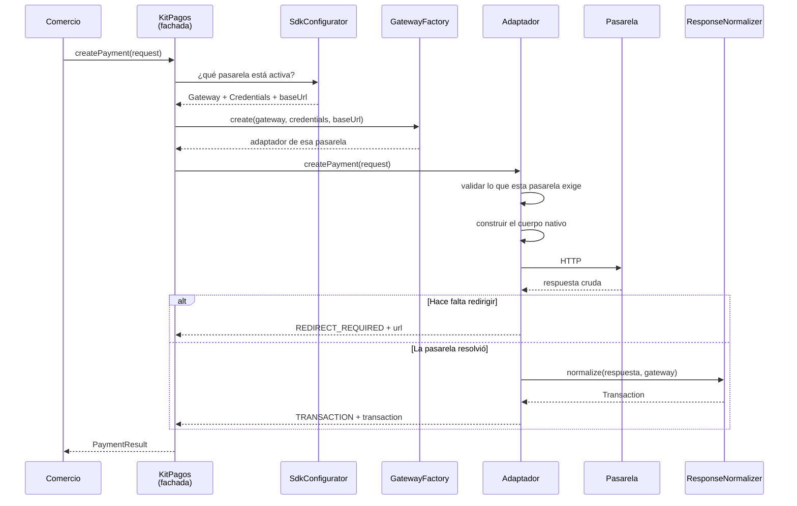
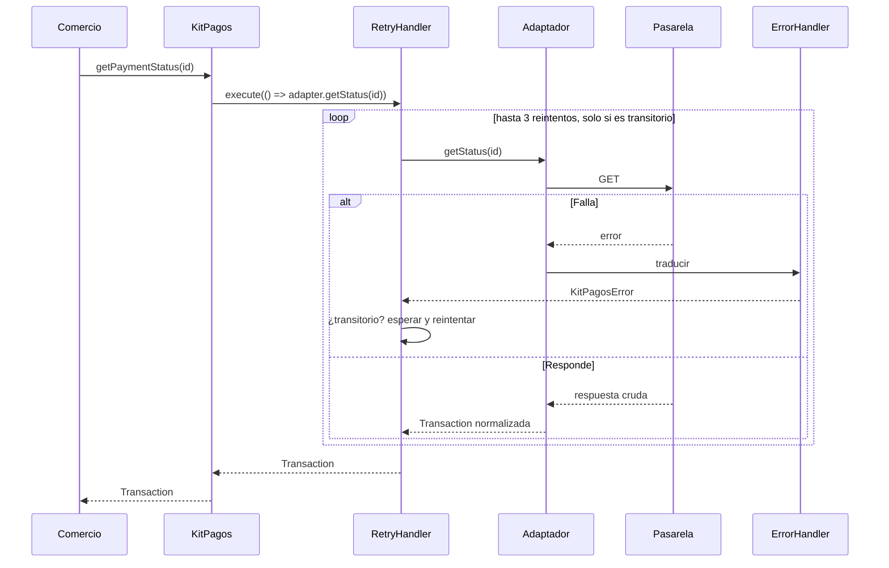
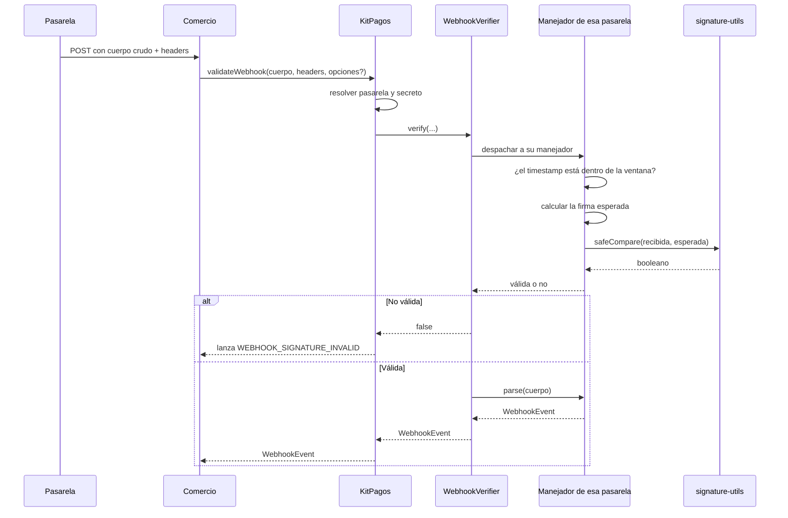

# Recorrido de una llamada

Tres diagramas y tres explicaciones. Qué pasa exactamente, pieza por pieza, cuando el comercio llama a cada uno de los métodos del SDK. Es el mapa que conviene tener antes de leer el código.

---

## 1. `createPayment()` — crear un cobro



### Qué hace cada paso

**La fachada resuelve el adaptador en cada llamada, no en el constructor.** Pregunta al configurador cuál es la pasarela activa, pide sus credenciales y su `baseUrl`, y le pide a la factoría una instancia. Hacerlo por llamada en lugar de una vez tiene una consecuencia útil: reconfigurar el SDK toma efecto de inmediato, sin instancias que queden apuntando a la pasarela anterior.

**El adaptador valida antes de salir a la red.** Cada pasarela exige datos distintos, y el adaptador comprueba los suyos primero. El PSE de Mercado Pago, por ejemplo, exige tipo y número de documento, nombre, apellido, indicativo y número de teléfono separados, dirección IP y URL de retorno; si falta algo, el SDK lanza `INVALID_REQUEST` **listando qué falta**, en lugar de mandar una petición incompleta y traducir después un error remoto ambiguo.

**El adaptador construye el cuerpo nativo.** Acá se paga la deuda de que las cuatro pasarelas sean distintas: Wompi recibe centavos y una firma de integridad, Kushki un objeto con desglose de IVA, Mercado Pago pesos y un header de idempotencia, Rapyd una firma HMAC calculada sobre el cuerpo ya serializado.

**El camino se bifurca según si hace falta redirigir**, y esa bifurcación es el tipo de retorno. No es un detalle: es lo que impide que el comercio se olvide de manejar PSE.

### Lo más importante de este diagrama: no hay `RetryHandler`

```32:35:sdk/src/infrastructure/facade/KitPagos.ts
  async createPayment(request: CreatePaymentRequest): Promise<PaymentResult> {
    const adapter = this.resolveAdapter();
    return adapter.createPayment(request);
  }
```

Comparado con `getPaymentStatus()`, que sí lo tiene, la diferencia son tres líneas y es deliberada.

**Crear un cobro no es idempotente.** Si la petición se va y el SDK recibe un timeout, no hay forma de saber si la pasarela la recibió o no. Reintentar ante timeout es, exactamente, el escenario del doble débito: dos cobros al mismo pagador por la misma orden.

Que **la operación no reintentada sea la única que mueve dinero** no es casualidad, es el criterio. Está en el punto 35 del [architecture-log](../architecture/architecture-log.md), y se puede verificar leyendo estas tres líneas.

---

## 2. `getPaymentStatus()` — consultar un estado



### Por qué acá sí se reintenta

Consultar un estado **es idempotente**: preguntar dos veces da la misma respuesta y no mueve dinero. Y es la operación donde un reintento vale más, porque suele correr desde un trabajo de conciliación donde una falla transitoria significa una orden que queda sin actualizar.

La política, con sus valores por defecto:

| Parámetro | Valor | Nota |
|---|---|---|
| Reintentos | 3 | Configurable con `maxRetries` |
| Espera base | 1000 ms | Se duplica en cada intento |
| Espera máxima | 4000 ms | Tope, para que no crezca indefinidamente |
| Fluctuación | hasta 200 ms | Aleatoria, se suma a la espera |

**Solo se reintenta lo transitorio.** El `RetryHandler` le pregunta al `ErrorHandler` si el error es reintentable: una conexión caída, un timeout, un 5xx o un 429 sí; unas credenciales inválidas o una petición malformada no, porque el resultado va a ser idéntico y reintentar solo gasta tiempo y cupo de la pasarela.

**La fluctuación existe por una razón concreta.** Sin ella, si la pasarela se cae un instante, todos los clientes reintentan sincronizados en el mismo milisegundo y le pegan otra vez al mismo tiempo, justo cuando está intentando recuperarse. Sumar un valor aleatorio los dispersa.

**El reloj se puede sustituir.** El constructor acepta una función `sleep`, y por eso las pruebas verifican la política completa sin esperar de verdad: una suite que comprobara tres reintentos con esperas reales tardaría siete segundos y nadie la correría seguido.

### El caso de Kushki, que parece un bucle y no lo es

El adaptador de Kushki puede hacer hasta tres peticiones **dentro de una sola llamada** a `getStatus()`, porque prueba sus rutas de consulta en orden hasta que una reconozca el identificador. Eso no son reintentos: son tanteos de descubrimiento, y ocurren por debajo del `RetryHandler`. El detalle de por qué está en [3-las-pasarelas-por-dentro.md](3-las-pasarelas-por-dentro.md).

---

## 3. `validateWebhook()` — verificar una notificación



### Los cuatro detalles que importan

**Recibe un `string`, no un objeto.** La firma se calculó sobre los bytes exactos que la pasarela envió. Si el framework del comercio parsea el JSON y el SDK lo reserializa, el orden de las claves o un espacio pueden cambiar y la firma legítima deja de coincidir. Recibir `string` obliga a conservar el cuerpo crudo, y es por eso que la guía de implementación insiste tanto en cómo configurar Express o Fastify para no perderlo.

**El secreto no es la llave de la API:**

```55:57:sdk/src/infrastructure/facade/KitPagos.ts
    const gateway = options?.gateway ?? this.configurator.getActiveGateway();
    const credentials = this.configurator.getCredentials(gateway);
    const secret = credentials.webhookSecret ?? credentials.privateKey;
```

En Wompi, Mercado Pago y Kushki, el secreto de webhooks es un valor distinto que se saca de otra parte del panel; en Rapyd es el mismo. El respaldo a `privateKey` existe por compatibilidad, y tiene un costo que conviene saber: contra webhooks reales de esas tres pasarelas, la verificación va a fallar con un error de firma que parece un ataque y es configuración faltante.

**Se puede pasar una pasarela distinta de la activa.** Ese tercer parámetro resuelve el caso de migración: un comercio que acaba de cambiar a Kushki todavía va a recibir, por días, webhooks de la pasarela anterior por pagos que ya estaban en curso. Sin ese parámetro tendría que instanciar el SDK dos veces o perder esas notificaciones (punto 15).

**La ventana anti-replay es de 300 segundos por defecto**, configurable global o por llamada, y admite `0` para desactivarla. Sin ella, una notificación legítima capturada una vez se puede reenviar indefinidamente y todas las veces va a verificar correctamente.

### Un caso especial: el webhook que no trae el estado

El de Mercado Pago solo trae `{"action": "payment.created", "data": {"id": "..."}}`: no hay monto ni estado. El SDK devuelve un `WebhookEvent` con estado `PENDING` en lugar de fallar, porque la notificación **es** auténtica y lo que falta es el dato. El comercio completa con `getPaymentStatus()`. Es el patrón de conciliación en dos pasos, y el SDK lo hace explícito en vez de esconderlo.

---

## 4. Los errores, de punta a punta

Todo fallo técnico llega como un `KitPagosError` con un código de un catálogo cerrado de doce valores:

| Código | Cuándo aparece | ¿Se reintenta? |
|---|---|---|
| `INVALID_CREDENTIALS` | HTTP 401 o 403, o credenciales no configuradas | No |
| `INVALID_REQUEST` | HTTP 400 o validación local fallida | No |
| `RESOURCE_NOT_FOUND` | HTTP 404 | No |
| `GATEWAY_TIMEOUT` | La petición venció | Sí |
| `CONNECTION_FAILED` | No se pudo establecer la conexión | Sí |
| `RATE_LIMIT_EXCEEDED` | HTTP 429 | Sí |
| `GATEWAY_SERVER_ERROR` | HTTP 5xx | Sí |
| `MALFORMED_RESPONSE` | La respuesta no tiene la forma esperada | No |
| `WEBHOOK_SIGNATURE_INVALID` | La firma no coincide o el timestamp está fuera de ventana | No |
| `UNSUPPORTED_OPERATION` | Un método de pago que esa pasarela no soporta | No |
| `MAX_RETRIES_EXCEEDED` | Se agotaron los reintentos | No |
| `UNKNOWN_ERROR` | Nada de lo anterior | No |

Cada error además conserva la pasarela de origen y el payload original.

**Y una vez más, lo que no está en esta tabla:** un rechazo de la tarjeta no es un error. Llega como una `Transaction` con estado `DECLINED` y una razón de rechazo. Si fuera una excepción, el comercio tendría que envolver cada cobro en un bloque de captura para manejar algo que no es excepcional en absoluto.

---

## 5. Qué sigue

- El detalle de cada clase: [2-clase-por-clase.md](2-clase-por-clase.md).
- El HTTP concreto de cada pasarela: [3-las-pasarelas-por-dentro.md](3-las-pasarelas-por-dentro.md).
- Cómo se integra todo esto desde cero: [4-guia-de-implementacion.md](4-guia-de-implementacion.md).
