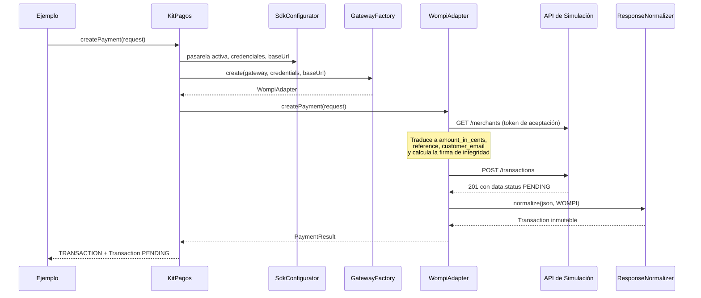

# Recorrido: un pago simulado con Wompi

El primer ejemplo del proyecto, de punta a punta. Es el más comentado de los diez y el mejor punto de entrada para entender qué hace el SDK por dentro.

**Archivo:** [examples/simulate-wompi-payment.ts](../../examples/simulate-wompi-payment.ts) · **Comando:** `npm run simulate:wompi`

---

## Qué demuestra

Cuatro cosas, en este orden:

1. Que la **superficie pública del paquete alcanza** para integrar un pago completo. El ejemplo vive fuera del SDK y lo importa por su nombre (`kit-pagos-colombia`), nunca por rutas relativas hacia `sdk/src`.
2. Que el comercio **escribe vocabulario de dominio** y ningún campo nativo de Wompi.
3. Que **con tarjeta hay que consultar el estado**: el cobro no vuelve resuelto.
4. Que los errores llegan **tipificados** y no como texto.

---

## Cómo correrlo

```bash
cd sdk && npm run build          # el paquete de ejemplos consume dist/
cd simulator-api && npm run dev  # dejarla corriendo en su propia terminal
cd examples && npm install && npm run simulate:wompi
```

---

## Lo que el desarrollador escribe

Configurar el SDK es una decisión: qué pasarela y con qué credenciales.

```ts
const options: SDKOptions = {
  gateway: Gateway.WOMPI,
  credentials: {
    [Gateway.WOMPI]: {
      publicKey: "pub_test_ejemplo_no_real",
      privateKey: "prv_test_ejemplo_no_real",
      integritySecret: "test_integrity_ejemplo_no_real",
    },
  },
  baseUrl: "http://localhost:3000/v1/sim/wompi",
};
```

**`integritySecret` está ahí por un defecto medido.** Wompi real no crea ninguna transacción sin la firma de integridad: responde `422 "Firma de integridad requerida no enviada"`. El SDK lo exige por adelantado, así que un comercio al que le falte recibe un mensaje que nombra el ajuste faltante en lugar de ese 422 (punto 44). Es un valor distinto del secreto de eventos que verifica los webhooks: uno firma lo que sale, el otro valida lo que entra.

Describir el pago usa objetos de valor:

```ts
const request = {
  amount: new Amount("150000.00"),
  currency: new Currency("COP"),
  orderReference: new OrderReference(`ORDER-${Date.now()}`),
  payer: new Payer({ email: "jaime.pavlich@example.com", fullName: "Jaime Pavlich" }),
  paymentMethod: PaymentMethod.card("tok_test_ejemplo_no_real", { installments: 1 }),
};
```

**El monto va como cadena**, y el ejemplo lo explica en su propio comentario: `new Amount("150000.00")` sigue leyéndose como `"150000.00"`, mientras que `150000.00` en JavaScript es indistinguible de `150000`. Importa porque Rapyd calcula su firma sobre el cuerpo serializado.

**No aparece `amount_in_cents` en ninguna parte.** El ejemplo lo imprime a propósito, para mostrar que la conversión a centavos ocurre en la capa de infraestructura y no la escribe el comercio:

```ts
console.log(`  En centavos: ${request.amount.toMinorUnits(request.currency)} (lo que recibe Wompi)`);
```

---

## Qué ocurre por dentro



**La fachada no conoce a `WompiAdapter`:** le pide a la factoría una implementación del puerto y delega. Es lo que permite que cambiar de pasarela sea cambiar el valor de `gateway`.

Las credenciales viajan resueltas desde el configurador hasta el adaptador, que las usa como Bearer token. **El adaptador nunca las lee del entorno por su cuenta**, y eso es deliberado: una librería que lea variables de entorno a espaldas del comercio es una librería que hace cosas que su configuración no declara.

---

## La salida real

Esta es la salida verificada del ejemplo:

```text
  En centavos: 15000000 (lo que recibe Wompi)
  Referencia:  ORDER-1789926029952
  Pagador:     jaime.pavlich@example.com
  Cuotas:      1

Transacción creada:
  ID de la pasarela:   99671995-73bf-4f5f-ae6d-c7194d5b11a1
  Pasarela de origen:  WOMPI
  Estado normalizado:  PENDING
  Estado nativo:       PENDING
  Monto:               150000.00 COP
  Referencia:          ORDER-1789926029952
  Pagador:             jaime.pavlich@example.com
  Aprobada:            false
  Estado final:        false

Consultando el estado de la transacción...
  ID consultado:      99671995-73bf-4f5f-ae6d-c7194d5b11a1
  Estado consultado:  APPROVED
  Aprobada:           true
```

Dos detalles de esa salida que vale la pena mirar: **el monto vuelve como `150000.00`**, con el cero final intacto, que es la razón de que `Amount` sea una cadena; y **el pagador es el que se mandó**, no uno de relleno, que es el defecto de fidelidad de la sección siguiente.

---

## Lo más importante del ejemplo: con tarjeta hay que consultar

Fijate en la secuencia de estados: **la creación devuelve `PENDING`, y la consulta devuelve `APPROVED`.**

Eso no es una limitación del simulador: es lo que Wompi hace de verdad. Medido contra `sandbox.wompi.co`, `POST /transactions` responde `PENDING` con `finalized_at: null`, y la transacción se resuelve unos 600 ms después. **El desenlace de un cobro con tarjeta nunca está en la respuesta de la creación.**

Un comercio que asumiera que el estado de la creación es el final estaría dejando pagos aprobados sin registrar. Por eso el paso 4 del ejemplo no es opcional, y por eso el simulador reproduce ese orden de eventos en lugar de responder `APPROVED` de una vez: si respondiera aprobado, el ejemplo enseñaría a integrar mal.

> **Nota de historial.** Una versión anterior de este documento afirmaba que `getPaymentStatus()` fallaba con `UNSUPPORTED_OPERATION` porque el simulador no implementaba consulta de estado. Eso ya no es cierto: la consulta funciona, y es la que muestra el `APPROVED`.

---

## El manejo de errores, que también se demuestra

El ejemplo envuelve la consulta en un `try/catch` que distingue un caso concreto:

```ts
if (error instanceof KitPagosError && error.code === KitPagosErrorCode.RESOURCE_NOT_FOUND) {
  console.log(`  No se encontró la transacción. Código de error: ${error.code}`);
}
```

Y el manejador de nivel superior traduce el fallo más probable —que el simulador no esté levantado— a una instrucción concreta en lugar de un volcado de pila:

```text
No se pudo conectar con la API de Simulación.
Levantala en otra terminal y volvé a correr el ejemplo:

  cd simulator-api && npm run dev
```

Es el diseño de errores del SDK en miniatura: el comercio compara **códigos de un catálogo cerrado**, no textos de mensaje.

---

## Un detalle de fidelidad que vale la pena conocer

En algún momento se ajustó la respuesta del mock para que devuelva `customer_email`, como hace la API real de Wompi. Antes no lo hacía, y el normalizador caía a un correo de relleno, así que la transacción normalizada mostraba **un pagador que nunca existió**.

Con un solo campo faltante, el ejemplo habría sido engañoso justo en el dato más visible de la demostración. Es un buen recordatorio de que la fidelidad del simulador llega hasta donde llegó la medición, que es el tema de [02-arquitectura/3-api-de-simulacion.md](../02-arquitectura/3-api-de-simulacion.md) §5.

---

## Qué queda fuera de este ejemplo

- **La validación de webhooks.** Está en el README del paquete y en [03-sdk/4-guia-de-implementacion.md](../03-sdk/4-guia-de-implementacion.md).
- **El flujo de PSE**, que es el que ejercita la rama de redirección: `npm run simulate:wompi-pse`.
- **La comparación entre pasarelas:** `npm run simulate:interchangeability`, documentado en [intercambiabilidad.md](intercambiabilidad.md).

---

## Qué sigue

El [índice de los diez ejemplos](README.md).
