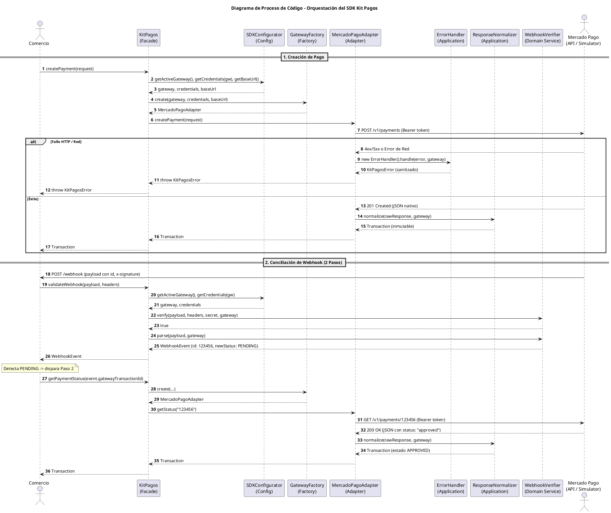

# Registro de arquitectura: decisiones, inconsistencias y pendientes

> **Nota de historial:** este archivo se llamaba `sad-inconsistencies.md`. Se renombró y
> reorganizó porque su contenido creció más allá de lo que ese nombre prometía; ver la nota al
> final del documento para el detalle del cambio. Los números de cada punto (`punto 1`, `punto
> 15`, etc.) **no cambiaron**, para no romper las referencias que ya existen en comentarios de
> código, pruebas y diagramas.

Este documento registra tres tipos de contenido relacionado con la arquitectura del proyecto,
separados en secciones:

- **Sección A:** quién es responsable de corregir cada sección del SAD original (`.docx`), como
  punto de partida para todo lo demás.
- **Sección B:** discrepancias encontradas entre las distintas secciones y diagramas del
  Software Architecture Document (SAD), y entre el SAD y el código del repositorio.
- **Sección C:** decisiones técnicas de investigación tomadas durante el proyecto (principalmente
  la migración de PayU a Rapyd), documentadas con su contexto, alternativas y consecuencias, al
  estilo de un ADR informal.
- **Sección D:** seguimiento de qué diagramas del SAD están obsoletos y cuáles ya se
  regeneraron.
- **Sección E:** deuda de documentación y configuración del repositorio que no corresponde a
  ninguna sección específica del SAD.
- **Sección F:** decisiones sobre las métricas CK (Chidamber & Kemerer) y la deuda de RFC y WMC
  que salió de medirlas bien.
- **Sección G:** referencia técnica sobre los tres temas que atraviesan todo el SDK y que la
  revisión de cierre de iteración necesita poder consultar en un solo lugar: seguridad de firmas
  y hashes, qué cambia exactamente al conmutar de pasarela, y extensibilidad hacia pasarelas
  nuevas. A diferencia de las demás secciones, sus puntos no registran un hallazgo puntual sino
  que documentan el estado del sistema, separando de forma explícita lo que ya está garantizado
  de lo que todavía no.

El SAD en sí (el archivo `.docx` en Google Drive) sigue siendo la fuente única de verdad del
proyecto, pero varios de sus artefactos se redactaron en momentos distintos y no se sincronizaron
entre ellos. Este archivo existe para que esas correcciones no se pierdan y se puedan aplicar
directamente sobre el documento original.

Cada punto indica su estado: **Resuelto** (ya se decidió y se aplicó en el código y en
`layers-and-components.md`) o **Pendiente en el SAD** (la decisión ya se tomó, pero falta
corregir el texto o los diagramas del documento original, algo que este agente no puede editar
directamente porque vive fuera del repositorio).

---

## Sección A — Responsables por sección del SAD (Iteración 0)

Antes de empezar a implementar nada de la primera iteración de código, cada corrección pendiente en el documento original debe quedar asignada a quien redactó esa sección, según la división de trabajo del equipo:

| # | Sección del SAD | Responsable | Correcciones pendientes encontradas en este documento |
|---|---|---|---|
| 1 | Introducción | Joshua | La sección 1.2 ya dice Apache 2.0 correctamente (ver punto 12, que era un error solo en el código). **Punto 15:** en 1.2, cambiar "Wompi, PayU, Mercado Pago y Kushki" por "Wompi, Rapyd, Mercado Pago y Kushki". |
| 2 | Requisitos funcionales | Joan | Punto 14: corregir RF-03 para que use los mismos seis valores que el enum `TransactionStatus` implementado (`APPROVED`, `DECLINED`, `PENDING`, `EXPIRED`, `VOIDED`, `ERROR`), en vez de la lista en español que tiene hoy. RF-04 no requiere ningún cambio de texto. **Punto 15:** ninguna RF nombra "PayU" explícitamente, no requiere corrección por este punto. **Punto 26:** aclarar en RF-04 el retorno de `PENDING` para webhooks de 2 pasos de Mercado Pago. |
| 3 | Modelo de dominio | Henao | Punto 2 (`SdkError` del diagrama de clases), punto 3 (quitar `updateStatus()` del diagrama, es inmutable), punto 6 (agregar `WebhookEvent` a la tabla de conceptos), **y punto 13 (falta por completo el modelo de dominio de la API de Simulación)**. **Punto 15:** en `Domain Class Diagram.png`, el enum `Gateway` lista "WOMPI, PAYU, MERCADOPAGO, KUSHKI"; cambiar "PAYU" por "RAPYD". Esta imagen no tiene fuente PlantUML en el repo, se corrige manualmente con la herramienta original. **Punto 23:** renombrar `SdkError` a `KitPagosError` y `SdkErrorCode` a `KitPagosErrorCode` en `Domain Class Diagram.png` y tabla de conceptos. **Punto 33:** si el `Domain Class Diagram.png` lista miembros privados, actualizar `Amount` (pierde `stripLeadingZeros`, gana `widestScale`) y `TaxBreakdown` (pierde sus cuatro `private static`). **Punto 34:** si el diagrama incluye `WebhookVerifier`, debe mostrar la interfaz `GatewayWebhookHandler` y sus cuatro implementaciones por pasarela en vez de una clase con dos métodos grandes. |
| 4 | Stakeholders | Henao | Ninguna encontrada. |
| 5 | ASR | Joan | Ninguna encontrada. |
| 6 | Restricciones | David | **Punto 15:** revisar si esta sección menciona términos específicos de la API de PayU (`apiLogin`/`apiKey`, MD5) como restricción técnica; de ser así, actualizar a los términos de Rapyd (`access_key`/`secret_key`) o señalar explícitamente que el contrato de Rapyd está pendiente de investigación (ver punto 19 para el detalle de qué sigue pendiente). |
| 7 | Contexto y Alcance | Joshua | **Punto 15:** en 7.1.3, reemplazar el párrafo completo sobre "PayU Latam" (autenticación por body, firma MD5/SHA-256) por uno equivalente sobre Rapyd (autenticación `access_key`/`secret_key`, firma de webhook `Base64(HMAC-SHA256(url_path + salt + timestamp + access_key + secret_key + body_string))`); en 7.2.4, cambiar "Wompi, PayU, Mercado Pago y Kushki" por "Wompi, Rapyd, Mercado Pago y Kushki". |
| 8 | Vista de contenedores | Joshua | Punto 5: en 8.1 y 8.2, cambiar toda mención de "Railway" por "Render" (el diagrama ya quedó corregido en el punto 17, solo falta el texto). **Punto 15:** en 8.1.1, cambiar "Wompi, PayU, Mercado Pago y Kushki" y "Adaptador Wompi, Adaptador PayU, Adaptador Mercado Pago y Adaptador Kushki" por sus equivalentes con Rapyd. **Punto 17:** reemplazar las figuras de `Container Diagram - C4.png` (SDK y API de Simulación) y `Context Diagram - C4.png` (SDK y API de Simulación) por las versiones regeneradas. |
| 9 | Vista de componentes | Joshua | **Punto 15:** en 9.1.3, cambiar los valores del enum `Gateway` de "WOMPI, PAYU, MERCADOPAGO o KUSHKI" a "WOMPI, RAPYD, MERCADOPAGO o KUSHKI"; renombrar el título 9.1.5 y su contenido ("PayU Adapter" → "Rapyd Adapter"); en 9.1.7 y 9.2.4, actualizar la mención "Para PayU, Mercado Pago y Kushki se implementa..." con el algoritmo real de Rapyd; en 9.2.3, renombrar "PayUMockFactory" a "RapydMockFactory". En `Component Diagram - C4.png` **del SDK**, corregir las etiquetas "PayU Adapter", "Traduce a PayU (Body auth, MD5/SHA)" y "PayU API — Latam Sandbox". Esta imagen no tiene fuente PlantUML en el repo, se corrige manualmente. **Punto 17:** reemplazar `Component Diagram - C4.png` **de la API de Simulación** por la versión regenerada (esta sí tiene fuente PlantUML nueva). **Punto 24:** actualizar descripción de `ErrorHandler` con clasificación `ErrorFamily` y sanitización. **Punto 34:** 9.1 describe `ResponseNormalizer`, `WebhookVerifier` y `ErrorHandler` como componentes únicos; el texto debe decir que cada uno despacha en implementaciones por pasarela. El `Component Diagram - C4.png` **ya está regenerado en el repo**, solo falta reemplazar la figura en el documento. **Punto 35:** 9.1.6 describe la política de reintento de `RetryHandler` con retroceso exponencial y jitter, delimitando su aplicación exclusivamente a operaciones idempotentes (`getPaymentStatus`). |
| 10 | Vista de procesos | David | Punto 7 (reemplazar las Figuras 8, 9 y 10 por los diagramas de secuencia regenerados, y corregir el texto de 10.1.1 que menciona `KitPagosFacade`). **Punto 17:** si esta sección también embebe los 4 diagramas de secuencia de la API de Simulación (pago exitoso, pago denegado, error de red, notificación webhook), reemplazarlos por las versiones regeneradas; corrigen contenido técnico obsoleto de PayU, no solo el nombre. **Punto 26:** aclarar la obligatoriedad del paso de consulta en la conciliación en dos pasos (Mercado Pago). **Punto 27:** incorporar el diagrama de proceso detallado a nivel de código (KitPagos → SdkConfigurator → GatewayFactory → Adapter → ErrorHandler / ResponseNormalizer / WebhookVerifier). |
| 11 | Vista física | Joan | Ninguna encontrada (ya quedó correcta con Render). |
| 12 | Modelo de datos | Henao | Ninguna encontrada. |
| 13 | ADR | Joan | Punto 7: la sección 13.1 sí referencia el `Hexagonal architecture class diagram.png` por nombre ("el Diagrama de Clases de la Arquitectura Hexagonal"), confirmado por el propio texto. Reemplazar la imagen embebida por la versión regenerada, y agregarle un número de figura ("Figura N"), ya que hoy es el único diagrama del documento sin ese rótulo, a diferencia del resto de figuras citadas en la sección 13. **Punto 15:** revisar si algún ADR de esta sección documenta el vocabulario nativo de PayU (`state_pol`, la particularidad de que PayU siempre devuelve HTTP 200) y corregirlo o marcarlo como pendiente de la investigación de Rapyd. **Punto 28:** incorporar el apartado conceptual de Arquitectura de Puertos y Adaptadores (Hexagonal) mapeada a Kit Pagos Colombia en ADR-01. **Punto 33:** actualizar el `Hexagonal architecture class diagram.png` tras la extracción de `big-arithmetic.ts`, `minor-units.ts` y `rapyd-signature.ts`, y evaluar si el patrón de módulo de funciones puras como seam sobre dependencias externas merece un ADR propio. **Punto 34:** el `Hexagonal architecture class diagram.png` **ya está regenerado en el repo** (muestra las dos interfaces Strategy y corrige la ubicación de los servicios de aplicación, que estaban dibujados en INFRAESTRUCTURA), solo falta reemplazar la figura en el documento. Queda pendiente **redactar el ADR del patrón Strategy**: el eje de variación del SDK es la pasarela, y se expresa con una implementación por pasarela detrás de una interfaz, no con ramas de un condicional. `methodology.md` §6 **ya quedó actualizado** (§6.1 con las fórmulas explícitas y §6.2 con el criterio de excepciones). **Punto 35:** ADR para la política de resiliencia con exponential backoff + jitter y la no-reintento de operaciones mutativas no idempotentes. |
| 14 | Riesgo técnico | David | Punto 10 (falta framework de pruebas en `simulator-api`, ya resuelto vía issue #6) es un riesgo de calidad que vale la pena registrar ahí, aunque no sea una inconsistencia de redacción. **Punto 15:** registrar la transición de PayU a Rapyd como un riesgo ya materializado (cambio de proveedor externo fuera de control del equipo, que invalidó documentación e implementación ya hecha del algoritmo de firma). |
| 15 | Estructura del Sistema | David | Punto 1 (corregir nombres de métodos en 15.2 a `getPaymentStatus`/`validateWebhook`), punto 3 (aclarar que la reconciliación reconstruye la entidad), punto 6 (aclarar que `WebhookVerifier` tiene dos métodos públicos, no uno). **Punto 22:** validateWebhook retorna `WebhookEvent` y lanza `KitPagosError`. **Punto 23:** actualizar sección 15.1 con `KitPagosError` y `KitPagosErrorCode`. **Punto 24:** documentar responsabilidades de `ErrorHandler` en 15.2. **Punto 26:** documentar normalización de `WebhookVerifier.parse` a `PENDING` ante webhooks de solo identificador. **Punto 28:** detallar el desglose de capas (domain, application, infrastructure) y sus responsabilidades específicas en 15.1 y 15.2. **Punto 31:** registrar en la sección 15 la fórmula oficial de firma de requests salientes de Rapyd. **Punto 33:** el desglose de capas del punto 28 debe reflejar que `domain/value-objects/` e `infrastructure/adapters/` contienen módulos de funciones puras además de clases, y la fórmula del punto 31 debe apuntar a `rapyd-signature.ts`, no a un método privado de `RapydAdapter` que ya no existe. **Punto 34:** ese mismo desglose debe incluir `application/services/normalizers/` y `domain/services/webhooks/` (el árbol de `layers-and-components.md` ya está actualizado y se puede copiar de ahí), y la frase de 15.1 sobre la delegación interna de `WebhookVerifier` debe nombrar la interfaz `GatewayWebhookHandler`, que ahora la hace literal. **Punto 35:** actualizar sección 15.2 detallando la delimitación de idempotencia: `RetryHandler` envuelve `getPaymentStatus()` pero nunca `createPayment()` por riesgo de doble cobro. |
| 16 | Glosario | David | **Punto 15:** si la definición de `Gateway`/`Adapter` usa a PayU como ejemplo, reemplazarlo por Rapyd, y agregar una nota breve sobre la adquisición de PayU por Rapyd para que el lector entienda por qué cambió el nombre. |

Los puntos 4, 8, 9, 11, 12, 29, 30, 31, 32 y 35 de la Sección B, y toda la Sección E, no corresponden a ninguna de las 16 secciones del SAD (son documentos de repositorio, directrices para el README del SDK o decisiones de código ya resueltas), así que no tienen un responsable de esta lista; se dejan como tareas de ingeniería general para la primera iteración.

---

## Sección B — Inconsistencias entre el SAD y el código

### 1. Nombres de los tres métodos públicos del facade

**Responsable de corregirlo en el SAD:** David (sección 15.2).

**Encontrado:** El `Component Diagram - C4.png` del SDK y la sección 9.1.1 usan `createPayment()`, `getPaymentStatus()`, `validateWebhook()`. La sección 15.2 usa `createPayment(request)`, `getStatus(id)`, `verifyWebhook(payload, headers)`. El diagrama `Hexagonal architecture class diagram.png` (obsoleto, ver punto 7) usa `processWebhook()`.

**Decisión:** Se adopta la versión que coincide en más artefactos: `createPayment()`, `getPaymentStatus()`, `validateWebhook()`.

**Estado:** Resuelto en código (`KitPagos.ts`) y en `layers-and-components.md`. **Pendiente en el SAD:** corregir la sección 15.2 para que use estos mismos nombres.

### 2. Forma de la clase `SdkError`

**Responsable de corregirlo en el SAD:** Henao (sección 3, `Domain Class Diagram.png`).

**Encontrado:** El `Domain Class Diagram.png` muestra `SdkError` con `friendlyMessage`, `httpStatus`, `originalError` y `requestId`, además de `code` y `gateway`. La sección 15.1 solo define `code`, `gateway` y `originalPayload`.

**Decisión:** Se mantiene la versión de la sección 15.1 (`code`, `gateway`, `originalPayload`), ya implementada.

**Estado:** Resuelto en código. **Pendiente en el SAD:** corregir el `Domain Class Diagram.png` para que coincida con la sección 15.1, o justificar explícitamente por qué la clase real necesita los campos adicionales (si el equipo decide que sí los necesita más adelante, esta decisión debe revisarse).

### 3. Mutabilidad de `Transaction` y campo `authorizationCode`

**Responsable de corregirlo en el SAD:** Henao (diagrama, sección 3) y David (aclaración textual, sección 15.1).

**Encontrado:** El `Domain Class Diagram.png` muestra un método `updateStatus(...)` en `Transaction`, lo que sugiere una entidad mutable. La sección 9.1.8 menciona explícitamente el atributo `authorizationCode`, que no estaba implementado.

**Decisión:** `Transaction` se mantiene inmutable. Cuando llega un webhook de conciliación, el `Response Normalizer` construye una instancia nueva en lugar de mutar la existente. El campo `authorizationCode` sí se incorpora, como atributo opcional fijado en el constructor.

**Estado:** Resuelto en código. **Pendiente en el SAD:** quitar el método `updateStatus(...)` del `Domain Class Diagram.png` y aclarar en la sección 15.1 que la reconciliación por webhook se resuelve reconstruyendo la entidad, no mutándola.

### 4. Mayúsculas y minúsculas en el enum `Gateway`

**Responsable de corregirlo en el SAD:** Nadie, no requiere acción sobre el documento (ver estado).

**Encontrado:** `Gateway.ts` se implementó con valores en minúscula (`"wompi"`, `"payu"`, ...), mientras que `TransactionStatus`, `RejectionCategory` y `SdkErrorCode` usan mayúsculas, y el `Domain Class Diagram.png` muestra `WOMPI`, `PAYU`, `MERCADOPAGO`, `KUSHKI`.

**Decisión:** Se corrige `Gateway.ts` a mayúsculas para mantener consistencia con el resto del vocabulario normalizado del dominio.

**Estado:** Resuelto en código. No requiere cambios en el SAD, ya que el diagrama ya estaba correcto; el error estaba solo en la implementación.

### 5. Plataforma de despliegue de la API de Simulación: Railway vs. Render

**Responsable de corregirlo en el SAD:** Joshua (secciones 8.1 y 8.2).

**Encontrado:** Las secciones 8.1 y 8.2 (Vista de contenedores) afirman que la API de Simulación está desplegada en **Railway**. La sección 11.2 (Vista física, redactada en una sesión posterior de este mismo proyecto) dice **Render**, y las credenciales reales del equipo (`.env.example`) confirman Render. Se verificó además `Container Diagram - C4.png` de la API de Simulación: la etiqueta del contenedor "API de Simulación Desplegada" dice literalmente *"Railway o Render — URL pública HTTPS"*, es decir que ni siquiera el propio diagrama se decide entre las dos opciones.

**Decisión:** Render es la plataforma correcta.

**Estado:** Resuelto en el diagrama (punto 17): el `Container Diagram - C4.png` y el `Deploy Diagram - C4.png` regenerados de la API de Simulación ya dicen únicamente "Render", sin ambigüedad. **Pendiente en el SAD (texto):**
1. Sección 8.1: reemplazar "Railway" por "Render" en el texto.
2. Sección 8.2: mismo reemplazo.

### 6. Concepto `WebhookEvent` para satisfacer RF-04

**Responsable de corregirlo en el SAD:** Henao (tabla de conceptos, sección 3) y David (sección 15.1). RF-04 (sección 2, dueña Joan) ya está redactado con precisión y no requiere cambios; ver punto 14.

**Encontrado:** RF-04 exige que la validación de un webhook "retorne un evento normalizado" cuando la firma es válida. Ni la sección 9.1.7 ni la 15.1 definen ese evento; `WebhookVerifier` solo tenía `verify(...): boolean`. El único artefacto que mencionaba un `WebhookEvent` con `parseWebhook(): WebhookEvent` era el diagrama obsoleto del punto 7.

**Decisión:** Se reintroduce `WebhookEvent` como concepto vigente del dominio. `WebhookVerifier` gana un segundo método público, `parse(payload, gateway): WebhookEvent`, y `KitPagos.validateWebhook(payload, headers)` ahora retorna `WebhookEvent` en lugar de `boolean`.

**Estado:** Resuelto en código. **Pendiente en el SAD:** agregar `WebhookEvent` a la tabla de conceptos del dominio (sección 3) y actualizar la sección 15.1 para reflejar que `WebhookVerifier` ya no tiene un único método público, sino dos (`verify` y `parse`).

### 14. RF-03 usa nombres de estado en español, distintos del enum implementado

**Responsable de corregirlo en el SAD:** Joan (sección 2, Tabla 1).

**Encontrado:** RF-03 dice: *"El sistema debe permitir consultar el estado de una transacción por identificador y retornarlo mapeado a los estados normalizados: PENDIENTE, APROBADO, RECHAZADO, EXPIRADO o ERROR."* Son 5 estados en español. El enum `TransactionStatus` implementado (`sdk/src/domain/value-objects/TransactionStatus.ts`), la sección 15.1, el ADR-03 (13.3) y el `Domain Class Diagram.png` coinciden entre sí en 6 valores, en inglés y mayúsculas: `APPROVED`, `DECLINED`, `PENDING`, `EXPIRED`, `VOIDED`, `ERROR`. RF-03 además omite `VOIDED` por completo.

De paso se revisó RF-04 (*"...retornar un evento normalizado si la firma es válida"*): no tiene ninguna inconsistencia, ya describía exactamente lo que `WebhookEvent` implementa (ver punto 6); no requiere ningún cambio de texto.

**Decisión:** Los 6 valores en inglés (`APPROVED`, `DECLINED`, `PENDING`, `EXPIRED`, `VOIDED`, `ERROR`) son los correctos, porque coinciden en tres artefactos independientes (código, sección 15.1 y ADR-03) contra uno solo (RF-03).

**Estado:** Pendiente en el SAD. Reemplazar en RF-03 la frase "PENDIENTE, APROBADO, RECHAZADO, EXPIRADO o ERROR" por "APPROVED, DECLINED, PENDING, EXPIRED, VOIDED o ERROR".

### 20. `KitPagos` no envuelve la llamada en `RetryHandler`, y la normalización vive en el Adapter

**Responsable de corregirlo en el SAD:** Joshua (secciones 8 y 9, Component Diagram) y David (sección 15.2).

**Encontrado:** al implementar `KitPagos.createPayment()` (issue #31) aparecieron dos divergencias frente al `Hexagonal architecture class diagram`, que declara `KitPagos --> RetryHandler : envuelve llamada` y `KitPagos --> ResponseNormalizer : normaliza respuesta`.

La primera es una ausencia real: `RetryHandler.execute()` sigue siendo un esqueleto que lanza `"aun no esta implementado"`, y sus propias pruebas consagran ese comportamiento. Envolver la llamada en él dejaría el ejemplo inservible.

La segunda es una atribución equivocada: quien invoca al `ResponseNormalizer` es el Adapter concreto (`WompiAdapter`), no la fachada. Y tiene que ser así, porque normalizar exige conocer el formato nativo de la pasarela, que es justamente lo que la fachada no debe saber. La fachada delega en el puerto y recibe una `Transaction` ya construida.

**Decisión:** `KitPagos` resuelve la pasarela activa mediante `SdkConfigurator`, pide el Adapter a `GatewayFactory` y le delega directamente, sin `RetryHandler`. El reintento se integra en la Iteración 2, cuando existan pasarelas reales: reintentar contra la API de Simulación, que responde de forma determinista, no ejercitaría nada. El diagrama sigue siendo válido como diseño objetivo.

De paso se decidió **mantener de forma permanente el `Error` nativo** en `SdkConfigurator.getActiveGateway()` (cerrando la deuda técnica pendiente, issue #51). La justificación es estrictamente arquitectónica: este fallo ocurre previo a la interacción transaccional, producto de un error de configuración del desarrollador consumidor. Dado que la sección 15.1 del SAD estipula que `KitPagosError` requiere obligatoriamente una pasarela concreta del enum (`gateway: Gateway`), convertir este fallo forzaría a relajar el tipo a `Gateway | null` o a inventar una pasarela artificial, degradando la seguridad de tipos del núcleo del dominio.

**Estado:** Resuelto en código y justificado arquitectónicamente. **Pendiente en el SAD:** en la sección 15.2 y en la descripción del Component Diagram, aclarar que la normalización de respuestas es responsabilidad del Adapter y no de la fachada, y anotar que la integración de `RetryHandler` en la fachada está prevista para la Iteración 2.

### 21. La superficie pública del paquete no alcanzaba para integrarlo desde afuera

**Responsable de corregirlo en el SAD:** ninguno; es deuda de código, no del documento.

**Encontrado:** el issue #20 exportó `KitPagos`, la entidad y los objetos de valor desde `sdk/src/index.ts`, pero dejó fuera `SdkError`, `SDKOptions`, `Credentials` y `CreatePaymentRequest`. La consecuencia se hizo evidente al escribir el ejemplo del issue #31 como paquete externo: un comercio no podía tipar el objeto que le pasa al constructor de `KitPagos` ni distinguir errores del SDK con `instanceof SdkError`. El defecto era invisible mientras todo el código que consumía el SDK vivía dentro del propio paquete y usaba rutas relativas.

**Decisión:** se completa la superficie pública y el ejemplo se mantiene deliberadamente fuera de `sdk/`, en `examples/`, consumiendo el paquete por su nombre. Cualquier omisión futura en `index.ts` rompe la compilación del ejemplo, que es la única forma de detectarla sin publicar en npm.

También se renombró el paquete de `sdk` a `kit-pagos-colombia`, coherente con el nombre de la carpeta raíz que ya usa `layers-and-components.md`. Ningún documento ni el SAD citaban el nombre anterior, solo mencionan `npm install` de forma genérica.

**Estado:** Resuelto en código. Quedan dos pendientes menores que este issue destapó pero no aborda:

1. El CI no cubre `examples/`; hoy solo tiene trabajos para `sdk` y `simulator-api`, así que la compilación del ejemplo podría romperse en silencio.
2. `npm run build` compila también los archivos `*.test.ts` hacia `dist/`, porque el `tsconfig.json` del SDK incluye `src/**/*` sin excluirlos. El paquete publicado enviaría su propia suite de pruebas. No se corrigió aquí porque excluirlos del `tsconfig` le quitaría verificación de tipos en el editor a todo el equipo; la solución correcta es un `tsconfig.build.json` aparte o un campo `files` en el `package.json`.

### 22. Validación de firma de webhook en `KitPagos`: lanzamiento de `SdkError`, tiempo constante y política de no divulgación en logs

**Responsable de corregirlo en el SAD:** Henao (sección 3, modelo de dominio) y David (sección 15, `KitPagos` y `WebhookVerifier`).

**Contexto:** al conectar `KitPagos.validateWebhook()` con el servicio de dominio `WebhookVerifier` (issue #54), se fijaron tres decisiones de seguridad y arquitectura no negociables:

1. **Firma inválida como excepción (`SdkError`), no booleano:** devolver un booleano (`false`) permitiría que un comercio, por omisión o error en la lógica de control (`if (!sdk.validateWebhook(...))`), procese notificaciones no autenticadas o fraudulentas como pagos legítimos. Lanzar `SdkError(WEBHOOK_SIGNATURE_INVALID)` detiene de forma segura el flujo transaccional y fuerza al integrador a gestionar el fallo explícitamente.
2. **Comparación criptográfica en tiempo constante (`timingSafeEqual`):** `WebhookVerifier` comparaba las firmas usando igualdad estricta (`===`), vulnerable a ataques de temporización (*timing attacks*) donde un atacante puede inferir la firma carácter por carácter midiendo diferencias en el tiempo de respuesta. Se adoptó una función segura a nivel de archivo (`safeCompare`) que utiliza `crypto.timingSafeEqual` sobre buffers de igual longitud, evitando exponer nuevos métodos en la clase que alteren el diagrama de clases del SAD.
3. **Privacidad y prevención de fuga de datos en logs y errores:** cuando la verificación de firma falla, el SDK **nunca** debe registrar en logs ni adjuntar en el atributo `originalPayload` de `SdkError` el cuerpo de la notificación ni la firma recibida, ya que estos datos podrían contener información sensible o vectores de inyección. Se registra únicamente el identificador de la pasarela afectada y el hecho de que la firma falló.

**Estado:** Resuelto en código (`KitPagos.ts`, `WebhookVerifier.ts`). **Pendiente en el SAD:** en la sección 15.2, aclarar que `validateWebhook()` retorna `WebhookEvent` directamente ante firmas válidas y lanza `SdkError(WEBHOOK_SIGNATURE_INVALID)` cuando la firma no coincide o es inválida, en lugar de retornar un booleano.

### 23. Renombrado y reemplazo total de `SdkError` a `KitPagosError` y `SdkErrorCode` a `KitPagosErrorCode`

**Responsable de corregirlo en el SAD:** Henao (sección 3, modelo de dominio / `Domain Class Diagram.png`) y David (sección 15.1, núcleo del dominio).

**Contexto:** Por instrucción de la dirección de tesis, se solicitó evitar nombres genéricos y potencialmente repetitivos como `SdkError` y `SdkErrorCode` en la superficie del SDK. En aplicaciones reales de comercio electrónico que integran múltiples librerías (ej. AWS SDK, Stripe SDK, Firebase SDK), un nombre genérico como `SdkError` ocasiona colisiones en importaciones, reduce la legibilidad y complica el manejo diferenciado de excepciones con `instanceof`.

**Decisión:** 
1. Se renombró la clase canónica de error del SDK a `KitPagosError` (`sdk/src/domain/errors/KitPagosError.ts`), heredando de `Error` y fijando `this.name = "KitPagosError"`. Conserva los atributos establecidos en el punto 2: `code: KitPagosErrorCode`, `gateway: Gateway` y `originalPayload: unknown`.
2. Se renombró el enum de códigos a `KitPagosErrorCode` (`sdk/src/domain/value-objects/KitPagosErrorCode.ts`).
3. Se eliminaron por completo los archivos obsoletos (`SdkErrorCode.ts`, `SdkError.ts` y `SdkError.test.ts`) para evitar duplicidad de fuentes de verdad en el árbol del dominio y asegurar consistencia limpia tanto en exportaciones de `sdk/src/index.ts` como en la futura defensa de tesis y el SAD.
4. Todos los componentes internos (`KitPagos`, `WompiAdapter`, `GatewayFactory`, `SDKConfigurator`, `ResponseNormalizer`, `ErrorHandler`), sus respectivas pruebas unitarias y ejemplos externos (`simulate-wompi-payment.ts`) se migraron exclusivamente a los identificadores canónicos `KitPagosError` y `KitPagosErrorCode`.

**Estado:** Resuelto en código y pruebas (`sdk/src/`). **Pendiente en el SAD:**
1. Sección 3 (Modelo de dominio) y `Domain Class Diagram.png`: renombrar la clase `SdkError` a `KitPagosError` y `SdkErrorCode` a `KitPagosErrorCode`.
2. Sección 15.1: documentar formalmente `KitPagosError` y `KitPagosErrorCode` en sustitución de la nomenclatura genérica previa.

### 24. Centralización del mapeo de excepciones en `ErrorHandler`, clasificación `RETRIABLE`/`FINAL` y sanitización (issue #51)

**Responsable de corregirlo en el SAD:** Joshua (sección 9, vista de componentes) y David (sección 15.2).

**Contexto:** Inicialmente `WompiAdapter` construía sus instancias de `KitPagosError` de forma manual e inline en sus bloques `catch` y comprobaciones `!response.ok`. Si los adaptadores de la Iteración 2 (Rapyd, Kushki y Mercado Pago) hubieran replicado este enfoque, la lógica de traducción de fallos técnicos habría quedado duplicada cuatro veces con criterios divergentes, y el servicio de reintentos (`RetryHandler`) no habría contado con una fuente homogénea para saber si un fallo es transitorio o definitivo.

**Decisión:**
1. **Servicio centralizado `ErrorHandler`:** Se convirtió en el único punto responsable de traducir fallos de red, errores HTTP (4xx y 5xx) y excepciones de parseo a `KitPagosError`.
2. **Clasificación bidireccional para reintentos (`ErrorFamily`):** Define dos familias explícitas:
   - `RETRIABLE`: fallos transitorios de red (`ECONNREFUSED`, `ETIMEDOUT`, `ENOTFOUND`, "fetch failed"), HTTP 408, HTTP 429 y códigos de servidor HTTP 5xx (`500`, `502`, `503`, `504`).
   - `FINAL`: errores de cliente o de negocio que no deben reintentarse (HTTP 4xx como `400`, `401`, `403`, `404`, `422`, credenciales inválidas, rechazos de negocio y payloads malformados).
3. **Sanitización estricta (RF-08):** Todo mensaje público generado pasa por un filtro de sanitización que enmascara tokens Bearer, llaves secretas (`prv_...`, `pub_...`) y encabezados `Authorization`. Los detalles crudos de pasarela se conservan únicamente en el atributo `originalPayload` para trazabilidad y auditoría técnica.
4. **Patrón de referencia en Adaptadores:** `WompiAdapter` se refactorizó para delegar completamente en `ErrorHandler`, instanciándolo dentro de sus métodos para no sobrepasar el umbral de Acoplamiento entre Objetos (CBO <= 5). Queda documentado como patrón obligatorio para los futuros adaptadores de la Iteración 2.

**Estado:** Resuelto en código y pruebas (`sdk/src/application/services/ErrorHandler.ts`, `WompiAdapter.ts`). **Pendiente en el SAD:** actualizar la descripción de `ErrorHandler` en la vista de componentes (sección 9) y sección 15.2 para reflejar las responsabilidades de clasificación (`ErrorFamily`) y sanitización.

### 25. Reversión del tipo de dato de `Amount`: de `number` a string decimal exacto, con exponente ISO 4217 en `Currency` (issue #63)

**Responsable de corregirlo en el SAD:** Joan (sección 15.1, núcleo del dominio) y Henao (sección 3, modelo de dominio / `Domain Class Diagram.png`).

**Contexto:** El issue #28 auditó el tipo de dato de `Amount` y concluyó **mantener `number`**, con la justificación de que el objeto de valor nunca ejecutaba aritmética sobre sí mismo. Esa conclusión está documentada y argumentada en `docs/architecture/money-representation-analysis.md`. Este punto la revierte por instrucción de la dirección de tesis, que pidió manejar el monto como texto y usar un tipo decimal exacto en caso de que en alguna parte del código se hicieran operaciones.

Conviene registrar con precisión **qué motivó la reversión y qué no**, porque el documento del issue #28 no estaba equivocado en sus cálculos:

1. **Razón funcional (Rapyd).** `number` no puede representar `19.90`: en JavaScript `(19.90).toString()` devuelve `"19.9"` y el cero final es irrecuperable. Rapyd calcula la firma HMAC sobre el cuerpo serializado de la petición, de modo que necesita el monto como string decimal de escala fija; el propio análisis del issue #28 ya lo recomendaba en su tabla por adaptador, sin advertir que con `number` esa recomendación era imposible de cumplir.
2. **Razón funcional (Kushki).** Kushki exige el monto descompuesto en `subtotalIva0`, `subtotalIva`, `iva` e `ice`. Descomponer implica dividir: `100000 / 1.19` da `84033.61344537816`, once decimales que el constructor de `Amount` rechaza. Sin un tipo decimal con escala y modo de redondeo explícitos, no hay forma de producir un desglose válido.
3. **Lo que NO motivó la reversión.** `toMinorUnits()` **no** estaba devolviendo resultados incorrectos. Se verificó `Math.round(v * 100)` contra montos COP realistas (`19.99`, `150000.50`, `99999999.99`, `12345678.91`) y el entero resultante era correcto en todos los casos, porque el error del producto intermedio queda muy por debajo de 0.5 y el redondeo lo absorbe. El problema no era un cálculo mal hecho, era la imposibilidad de representar la escala. Presentarlo como un defecto de cálculo sería incorrecto y verificable en contra.

**Corrección de hecho encontrada durante la implementación:** el lenguaje ubicuo afirmaba que *"COP es una divisa de cero decimales según ISO 4217"*. Es **falso**: ISO 4217 asigna a COP (numérico 170) un exponente de unidad menor de **2**. Lo cierto es que el centavo colombiano no circula en la práctica, no que el estándar lo desconozca, y Wompi lo confirma al exigir el monto en `amount_in_cents`. De esa premisa falsa derivaba la conclusión de que Rapyd espera un entero de pesos para Colombia, que por lo tanto queda como inferencia sin respaldo y pendiente de confirmar contra sandbox real.

**Decisión:**
1. **`Amount` guarda un string decimal canónico** (`sdk/src/domain/value-objects/Amount.ts`). El constructor recibe `string` y valida con expresión regular; rechaza `number` incluso en tiempo de ejecución, porque el SDK también se consume desde JavaScript plano donde el tipo no protege nada. Se conserva el máximo de dos decimales que fija la sección 15.1 del SAD.
2. **No se guarda un `Big`,** aunque se use big.js para operar. `new Big("19.90").toString()` también devuelve `"19.9"`, así que almacenar el objeto de la librería perdería justo la escala que se busca proteger. El string es la representación; `Big` es solo el motor de cálculo.
3. **Las conversiones de unidad no usan aritmética.** `toMinorUnits(currency)` y `fromMinorUnits(minor, currency)` corren el punto decimal sobre el string. `fromMinorUnits` reemplaza la división entre 100 que hacía `ResponseNormalizer`, de modo que 1990 centavos ahora vuelven como `"19.90"` y no como `"19.9"`.
4. **El exponente ISO 4217 vive en `Currency`,** que gana `getMinorUnitExponent()`. Se registra como tabla de **excepciones** (exponente 0 y 3) con retorno por defecto de 2, que es el valor que ISO asigna a la mayoría. La alternativa era que cada adaptador llevara su propia constante, lo que habría dejado cuatro copias del mismo hecho listas para divergir. `toMinorUnits(currency)` **lanza** si el monto tiene más decimales de los que la divisa admite, en vez de truncar en silencio.
5. **Se incorpora `big.js` 7.0.1 como dependencia de runtime,** la primera del SDK, que hasta ahora no tenía ninguna. Pesa 59 KB y no arrastra dependencias transitivas. La justifica el criterio de la dirección de tesis: BigDecimal cuando haya operaciones, y con el desglose de IVA las hay. Sus constantes de redondeo **no se exponen** en la superficie pública: `Amount` declara su propio enum `RoundingMode`, de modo que cambiar de librería decimal no rompe a ningún consumidor.
6. **Nuevo objeto de valor `TaxBreakdown`** (`sdk/src/domain/value-objects/TaxBreakdown.ts`) para el monto descompuesto que exige Kushki, con constructores `exempt()`, `fromTaxIncluded()`, `fromTaxExcluded()` y `fromComponents()`. Vive en el dominio y no en el `KushkiAdapter` porque descomponer un precio en base e impuesto es una regla de dinero, no un detalle de una pasarela; Kushki solo es la única de las cuatro que la necesita explícita. Su invariante es que los cuatro componentes sumen exactamente el total, garantizada calculando un lado y derivando el otro **por resta**. Se agregó como campo opcional `taxBreakdown` en `CreatePaymentRequest`.
7. **La conversión a `number` queda visible en el Adapter.** `WompiAdapter` hace `Number(request.amount.toMinorUnits(request.currency))` con un comentario que explica por qué: JSON solo tiene el tipo `number`, así que la frontera de cable es inevitable, y es segura porque el valor ya es un entero de centavos muy por debajo de `Number.MAX_SAFE_INTEGER`. Lo que el dominio garantiza es que ese entero se calculó sin punto flotante.

**Estado:** Resuelto en código y pruebas (`Amount.ts`, `Currency.ts`, `TaxBreakdown.ts`, `ResponseNormalizer.ts`, `WompiAdapter.ts`, `PaymentGatewayPort.ts`, `index.ts` y el ejemplo de `examples/`). **Pendiente en el SAD:**
1. Sección 15.1: documentar que `Amount` encapsula un string decimal y no un atributo numérico, y describir `toMinorUnits(currency)`, `fromMinorUnits()`, `toFixedScale()` y las operaciones aritméticas con escala explícita.
2. Sección 15.1 y sección 3: agregar `TaxBreakdown` y `RoundingMode` al modelo de dominio, y `getMinorUnitExponent()` a `Currency`.
3. `Domain Class Diagram.png`: reflejar el tipo `string` de `Amount` y la nueva relación `Amount` → `Currency`.
4. Corregir en la documentación toda afirmación de que COP es divisa de cero decimales según ISO 4217.

### 26. Conciliación de Webhooks en Dos Pasos y Normalización de Notificaciones de Mercado Pago (issue #56)

**Responsable de corregirlo en el SAD:** David (sección 10, vista de procesos / diagrama C; sección 15.2, `WebhookVerifier` y `KitPagos`) y Joan (sección 2, RF-04).

**Contexto:**
En pasarelas como Wompi o Kushki, el webhook entrante incluye el estado completo de la transacción (`APPROVED`, `DECLINED`, montos, etc.), permitiendo que `WebhookVerifier.parse()` emita de inmediato un `WebhookEvent` con el estado final consolidado.
En contraste, la arquitectura de notificaciones de Mercado Pago funciona en **dos pasos**: la pasarela envía un HTTP POST liviano que únicamente contiene el identificador del recurso modificado (`data.id`) y el tipo de evento (`action: "payment.created"` o `type: "payment"`), sin incluir el estado financiero (`status` es `undefined`).

**Encontrado:**
La implementación inicial de `WebhookVerifier.parse()` para `Gateway.MERCADOPAGO` asumía que `body.status` siempre existía. Al recibir una notificación nativa real de Mercado Pago, `rawStatus` resultaba ser una cadena vacía y el `switch` caía en el bloque por defecto asignando `newStatus = "ERROR"`. Esto rompía la semántica del dominio, haciendo creer falsamente al comercio que una notificación legítima y válida constituía un fallo técnico o rechazo de la transacción.

**Decisión:**
1. **Normalización a `PENDING` en Notificaciones Livianas:** Si `body.status` no está presente en la notificación de Mercado Pago, `WebhookVerifier.parse()` mapea el estado a `PENDING` (indicando que la notificación fue recibida legítimamente y está pendiente de conciliación activa). Asimismo, soporta indistintamente `body.action ?? body.type ?? "payment.updated"`, y mapea estados nativos adicionales de Mercado Pago como `in_process` (`PENDING`) y `cancelled` (`VOIDED`).
2. **Flujo de Conciliación en Dos Pasos (Proceso C del SAD):**
   - **Paso 1 (Validación y Extracción):** El comercio invoca `kitPagos.validateWebhook(payload, headers)`. El SDK verifica la firma HMAC-SHA256 (`x-signature` con `ts` y `v1`) y parsea la notificación a `WebhookEvent`, retornando el `gatewayTransactionId` con `newStatus = PENDING`.
   - **Paso 2 (Consulta y Reconciliación Inmutable):** Con el `event.gatewayTransactionId`, el comercio invoca `kitPagos.getPaymentStatus(event.gatewayTransactionId)`. El SDK despacha `GET /v1/payments/:id` a Mercado Pago (o al simulador) con autenticación Bearer, y `ResponseNormalizer` reconstruye una nueva entidad inmutable `Transaction` con el estado real consolidado (`APPROVED`, `DECLINED`, etc.) y sus datos financieros completos.

**Estado:** Resuelto en código y pruebas (`sdk/src/domain/services/WebhookVerifier.ts`, `WebhookVerifier.test.ts`, `KitPagos.test.ts`).

**Pendiente en el SAD:**
1. **Sección 2 (Requisitos Funcionales, RF-04):** Aclarar que en pasarelas con notificaciones asíncronas de solo identificador (Mercado Pago), el `WebhookEvent` normalizado devuelto por la validación criptográfica tiene estado `PENDING` para indicar que requiere la posterior invocación de RF-03 (`getPaymentStatus`).
2. **Sección 10 (Vista de Procesos, Proceso C — Conciliación por Webhook / Figura `sequence-webhook-conciliation.puml`):** Aclarar en el texto descriptivo del diagrama que el paso 22 (`Comercio -> Facade : getPaymentStatus(gatewayTransactionId)`) es mandatorio para pasarelas que emiten webhooks livianos como Mercado Pago, mientras que para Wompi es opcional si el comercio solo necesita los datos provistos en el payload.
3. **Sección 15.2:** Documentar que `WebhookVerifier.parse` mapea la ausencia de `status` a `TransactionStatus.PENDING` para respetar la semántica de dos pasos de Mercado Pago.

### 27. Diagrama de Proceso de Ejecución de Código y Orquestación del Facade (flujo real KitPagos → GatewayFactory → Adapter → Webhook)

**Responsable de incorporarlo en el SAD:** David (sección 10, Vista de Procesos).

**Contexto:**
Los diagramas de secuencia actuales del SAD (sección 10, Figuras 8, 9 y 10: `sequence-payment-creation.puml`, `sequence-synchronous-payment.puml`, `sequence-webhook-conciliation.puml`) modelan la interacción desde una perspectiva conceptual abstracta de alto nivel (`Comercio -> Facade -> Adapter -> Pasarela`).
Sin embargo, no reflejan con precisión la secuencia real de ejecución en términos del código TypeScript implementado en el SDK. Al no mostrar la colaboración detallada entre `KitPagos`, `SDKConfigurator`, `GatewayFactory`, los adaptadores concretos (`WompiAdapter`, `MercadoPagoAdapter`), `ErrorHandler`, `ResponseNormalizer` y `WebhookVerifier`, se dificulta entender:
1. En qué momento exacto se resuelven las credenciales y se instancia el adaptador.
2. Cómo y dónde se delega el manejo de errores técnicos para mantener la métrica de acoplamiento CBO <= 5.
3. Dónde y cómo entran los webhooks, cómo se valida la firma criptográfica sin acoplar el dominio a infraestructura, y cómo se articula la conciliación asíncrona de dos pasos.

**Decisión:**
Se define la necesidad de incorporar en la Sección 10 del SAD un **Diagrama de Proceso de Código Unificado** que capture la traza real de ejecución de las operaciones clave:

1. **Flujo de Creación / Consulta de Pago (`createPayment` / `getPaymentStatus`):**
   - El `Comercio` llama a `kitPagos.createPayment(request)`.
   - `KitPagos` invoca a su método privado `resolveAdapter()`:
     - Consulta a `SDKConfigurator.getActiveGateway()` y `getCredentials(gateway)`.
     - Invoca a `GatewayFactory.create(gateway, credentials, baseUrl)` para instanciar el adaptador correspondiente (`MercadoPagoAdapter` o `WompiAdapter`).
   - `KitPagos` despacha la llamada `adapter.createPayment(request)` o `adapter.getStatus(id)`.
   - El Adapter prepara la petición con headers de autenticación (`Authorization: Bearer <privateKey>`), serializa el body hacia el formato nativo de la pasarela y ejecuta `global.fetch(url, options)`.
   - Si `fetch` falla a nivel de red o responde con status HTTP != 2xx: el Adapter instancia `new ErrorHandler().handle(...)` dentro del método (manteniendo CBO <= 5) y lanza `KitPagosError` con credenciales sanitizadas.
   - Si responde exitoso: el Adapter delega a `ResponseNormalizer.normalize(rawResponse, gateway)`, el cual traduce los datos nativos a la entidad inmutable `Transaction` con `TransactionStatus.APPROVED`.
   - La entidad `Transaction` retorna a `KitPagos` y finalmente al `Comercio`.

2. **Flujo de Webhook y Conciliación en Dos Pasos (`validateWebhook` + `getPaymentStatus`):**
   - La `Pasarela` (Mercado Pago) envía un HTTP POST al endpoint propio del `Comercio`.
   - El `Comercio` extrae el `payload` y los `headers` HTTP y llama a `kitPagos.validateWebhook(payload, headers)`.
   - `KitPagos` obtiene las credenciales activas y llama al servicio puro de dominio `WebhookVerifier.verify(payload, headers, secret, gateway)` (validación HMAC-SHA256 sobre el manifest `id:...;request-id:...;ts:...;`).
   - Si la firma es inválida: `KitPagos` lanza `KitPagosError(WEBHOOK_SIGNATURE_INVALID)`.
   - Si la firma es válida: `KitPagos` llama a `WebhookVerifier.parse(payload, gateway)`.
     - Para Mercado Pago (notificación liviana sin campo `status`), `WebhookVerifier` retorna un `WebhookEvent` con `gatewayTransactionId: "1234567890"` y `newStatus: PENDING`.
   - El `Comercio` recibe el `WebhookEvent` y, al notar que está en `PENDING`, ejecuta el **segundo paso**: `kitPagos.getPaymentStatus(event.gatewayTransactionId)`.
   - `KitPagos` resuelve `MercadoPagoAdapter`, quien ejecuta `GET /v1/payments/:id` autenticado a la pasarela (o al simulador).
   - `ResponseNormalizer` procesa la respuesta completa y entrega al comercio la `Transaction` inmutable con el estado real consolidado (`APPROVED`, `DECLINED`).



**Estado:** Documentado como requerimiento de diseño en `architecture-log.md`.
**Pendiente en el SAD:** David debe incluir este diagrama de interacción detallado en la sección 10 (Vista de Procesos) del documento `.docx`, complementando los diagramas conceptuales de alto nivel ya existentes.

### 28. Recomendación de apartado explicativo de la Arquitectura de Puertos y Adaptadores (Hexagonal) en el SAD

**Responsable de incorporarlo en el SAD:** Joan (sección 13, ADR-01) y David (sección 15, Estructura del Sistema).

**Contexto:**
El SAD declara en ADR-01 que el SDK adopta la **Arquitectura Hexagonal (Puertos y Adaptadores)** formulada por Alistair Cockburn. Sin embargo, en el documento `.docx` actual falta un apartado pedagógico y explícito que desglose qué representa cada capa en la teoría de software y **qué elementos concretos viven en cada una de ellas dentro de Kit Pagos Colombia**.

Sin este desglose, quien lee la tesis o la documentación técnica puede confundir el rol de servicios de aplicación como `ResponseNormalizer` o `ErrorHandler`, o no entender por qué `WebhookVerifier` vive en el dominio mientras que los adaptadores concretos viven en infraestructura.

**Recomendación de contenido para el SAD:**
Se recomienda redactar en la Sección 13 (ADR-01) o en la Sección 15 (Estructura del Sistema) un apartado dedicado con el siguiente desglose:

1. **Capa de Dominio (`sdk/src/domain/`): El Núcleo Puro**
   - **Qué representa:** Contiene la lógica del negocio pura, las reglas invariantes de dinero y el vocabulario unificado independiente de cualquier tecnología externa o pasarela de pago.
   - **Regla de dependencia:** **Regla del Cero Absoluto**: nunca importa nada de `application/` ni de `infrastructure/`.
   - **Qué contiene en nuestro proyecto:**
     - **Entidad principal:** `Transaction` (inmutable, representa el estado consolidado de un cobro).
     - **Objetos de Valor (Value Objects):** `Amount` (string decimal exacto con escala y redondeo seguro), `Currency` (con exponente ISO 4217), `Gateway` (`WOMPI`, `RAPYD`, `MERCADOPAGO`, `KUSHKI`), `GatewayTransactionId`, `OrderReference`, `Payer`, `ReturnUrlConfig`, `TaxBreakdown` (descomposición tributaria requerida por Kushki), `TransactionStatus`, `RejectionReason` y `WebhookEvent`.
     - **Excepción de dominio unificada:** `KitPagosError` y `KitPagosErrorCode`.
     - **Servicio de Dominio Puro:** `WebhookVerifier` (sin estado ni dependencias externas; realiza operaciones criptográficas puras de validación de firmas y parsing de eventos).

2. **Capa de Aplicación (`sdk/src/application/`): Puertos y Servicios de Orquestación**
   - **Qué representa:** Define los contratos neutrales para interactuar con el mundo exterior y los servicios que orquestan la traducción entre el dominio y los agentes externos.
   - **Regla de dependencia:** Depende exclusivamente de `domain/`; **nunca** importa nada de `infrastructure/`.
   - **Qué contiene en nuestro proyecto:**
     - **Puerto de Salida (Driven Port):** `PaymentGatewayPort` (interfaz TypeScript que define `createPayment()`, `getStatus()` y `verifySignature()`) junto con su DTO de entrada `CreatePaymentRequest`.
     - **Servicios de Aplicación:**
       - `ResponseNormalizer`: Traduce los payloads heterogéneos y respuestas nativas de cada pasarela hacia las entidades `Transaction` del dominio.
       - `ErrorHandler`: Clasifica fallos técnicos (`ErrorFamily.RETRIABLE` vs `FINAL`), sanitiza credenciales (RF-08) y los traduce a `KitPagosError`.
       - `RetryHandler`: Orquesta la política de tolerancia a fallos transitorios con backoff exponencial.

3. **Capa de Infraestructura (`sdk/src/infrastructure/`): El Mundo Exterior**
   - **Qué representa:** Contiene los detalles tecnológicos concretos: llamadas HTTP (`fetch`), parseo de JSON, configuración del entorno, y la interfaz pública para el desarrollador consumidor.
   - **Regla de dependencia:** Apunta hacia adentro: puede importar libremente de `application/` y `domain/`.
   - **Qué contiene en nuestro proyecto:**
     - **Adaptadores Secundarios (Driven Adapters):** `WompiAdapter`, `MercadoPagoAdapter`, etc., que implementan `PaymentGatewayPort` comunicándose con los endpoints REST reales o simulados.
     - **Factoría:** `GatewayFactory` (resuelve e instancia dinámicamente el adaptador solicitado según la pasarela activa).
     - **Configuración:** `SDKConfigurator` (gestiona llaves públicas, privadas y URLs sin exponer secretos).
     - **Fachada Primaria (Driving Adapter / Facade):** `KitPagos` (única clase instanciada por los comercios; expone `createPayment()`, `getPaymentStatus()` y `validateWebhook()`).

4. **Justificación en el contexto de Kit Pagos Colombia:**
   - Permite agregar nuevas pasarelas de pago (como Rapyd o Kushki) creando únicamente un nuevo adaptador en `infrastructure/adapters/`, sin modificar una sola línea del dominio ni de la fachada.
   - Facilita pruebas automatizadas 100% aisladas mediante mocks e inyección sin levantar servidores web reales.

**Estado:** Registrado como recomendación arquitectónica en `architecture-log.md`.
**Pendiente en el SAD:** Joan (sección 13) y David (sección 15) deben incorporar esta sección explicativa en el documento `.docx`.

### 29. Directriz para el README y la Documentación del SDK: Orquestación de Webhooks por parte del desarrollador del comercio

**Responsable:** Joshua / Equipo SDK (para el `README.md` del SDK, guías de integración y ejemplos de código).

**Contexto:**
El SDK de Kit Pagos es una **biblioteca de integración desacoplada**, no un framework web ni un servidor HTTP. Por definición arquitectónica, el SDK no abre puertos de red ni registra controladores o rutas HTTP de forma mágica en la aplicación anfitriona.

Por ende, **el programador que integra nuestro SDK en su comercio es el responsable absoluto de:**
1. Crear el endpoint HTTP en su propio backend (usando Express, Fastify, NestJS, Next.js API Routes, Spring Boot, etc.) que recibirá las peticiones `POST` de las pasarelas.
2. Extraer el body crudo y los headers HTTP de la petición entrante y suministrárselos a `kitPagos.validateWebhook(payload, headers)`.
3. Gestionar la **conciliación en dos pasos** según el resultado del `WebhookEvent`:
   - **Caso Wompi (notificación completa):** `validateWebhook` verifica la firma y retorna de inmediato el `WebhookEvent` con el estado final consolidado (`APPROVED`, `DECLINED`). El desarrollador puede actualizar su base de datos directamente.
   - **Caso Mercado Pago (notificación liviana):** Por diseño de Mercado Pago, la notificación no incluye monto ni estado (viene como `newStatus: PENDING` y con `gatewayTransactionId`). **El desarrollador del comercio debe ejecutar explícitamente el segundo paso** en su backend invocando `await kitPagos.getPaymentStatus(event.gatewayTransactionId)` para obtener la entidad `Transaction` con los datos consolidados definitivos.
4. Responder un código de estado `HTTP 200 OK` a la pasarela en un tiempo inferior a 2-3 segundos para evitar que la pasarela considere fallida la entrega y sature el servidor con reintentos agresivos.

**Directriz obligatoria para el README y la documentación pública del SDK:**
Para evitar confusiones o integraciones incompletas por parte de los desarrolladores externos, el `README.md` del SDK y la documentación técnica deben incluir obligatoriamente:
- Un apartado explícito titulado **"Recepción y Conciliación de Webhooks"**.
- Un snippet de ejemplo completo y listo para producción usando Express/Fastify que muestre cómo recibir el webhook, validar la firma, chequear si el estado requiere el segundo paso (`getPaymentStatus`), y actualizar el pedido.
- Una advertencia arquitectónica sobre el manejo asíncrono en sistemas de alto tráfico: invocar el paso 1 en el controlador HTTP, responder `200 OK`, y despachar el paso 2 (`getPaymentStatus`) a una cola de tareas en segundo plano (BullMQ, Celery, RabbitMQ).

**Estado:** Registrado como directriz de documentación en `architecture-log.md`.

---

### 30. `PaymentGatewayPort` aguantó a Rapyd sin cambios; lo que no aguantó fue el ejemplo (issue #52)

**Contexto:** el issue #52 planteaba una prueba de diseño explícita: Rapyd es la más exigente de las cuatro pasarelas, así que si el puerto la soportaba sin modificarse, soportaría las otras tres; y si no, ese hallazgo había que registrarlo acá en vez de deformar el adaptador para que cupiera.

**Resultado: el puerto aguantó.** `RapydAdapter` implementa `PaymentGatewayPort` tal como está definido, sin agregar ni cambiar un método ni un campo, pese a que Rapyd se separa de Wompi en los tres puntos más costosos:

1. **Autenticación por firma en cada petición** en vez de un Bearer fijo. Cabe entera dentro del adaptador, en un método privado `sign()`. El puerto nunca supo que existía.
2. **Monto en unidad mayor** (pesos con decimales) en vez de centavos. Se resuelve con `Amount.toFixedScale(currency.getMinorUnitExponent())`, que el dominio ya ofrecía tras el punto 25. Sin la migración de `Amount` a string este adaptador no habría podido enviar `"150000.00"`, porque el cero final se perdía antes de llegar a infraestructura.
3. **Catálogo de estados propio** (`ACT`, `CLO`, `ERR`, `EXP`, `REV`). Se traduce en la rama `Gateway.RAPYD` de `ResponseNormalizer`, sin tocar el enum `TransactionStatus`.

**El objeto de valor `Credentials` también aguantó**, aunque Rapyd nombre sus llaves de otra forma: `publicKey` corresponde a `access_key` (identifica a la organización y viaja en claro en un header) y `privateKey` a `secret_key` (nunca se transmite solo, únicamente como parte de la firma). La correspondencia semántica es exacta, así que no hizo falta un objeto de valor por pasarela.

**Matiz sobre el resultado esperado del issue.** El issue afirmaba que cambiar `gateway: Gateway.RAPYD` "sin tocar ninguna otra línea" del ejemplo produciría una `Transaction` aprobada. Medido sobre el ejemplo de Wompi, hicieron falta **6 líneas**, y ninguna por culpa del puerto: el ejemplo declara la URL del mock como constante y la pasa en `baseUrl`, de modo que el endpoint está acoplado a la pasarela elegida. Cada pasarela necesita además su propio juego de credenciales.

La convención que resolvió esto no fue parametrizar un ejemplo único, sino **un archivo de ejemplo por pasarela**, establecida por el PR #77 con `examples/simulate-mercadopago-payment.ts` y su script `simulate:mercadopago`. Es la decisión correcta y por eso se siguió acá con `examples/simulate-rapyd-payment.ts` y `simulate:rapyd`: un ejemplo parametrizable tendría que resolver configuración antes de poder mostrar el pago, que es justo lo que se quiere enseñar. Con un archivo por pasarela la comparación entre ellos es directa y verificable a ojo — se abren dos y se comprueba que los pasos de construir el pago, crearlo y consultarlo son idénticos línea por línea, y que lo único que cambia es el bloque de configuración. La afirmación fuerte del issue ("una sola línea") no se cumple literalmente, pero la propiedad que buscaba demostrar (que el código de integración no cambia entre pasarelas) queda demostrada mejor así.

**Convención de `baseUrl` unificada.** Al escribir el ejemplo se detectó que `RapydAdapter` había quedado recibiendo un prefijo (`/v1/sim/rapyd`) al que le agregaba `/payments`, mientras `WompiAdapter` y `MercadoPagoAdapter` reciben la URL completa del recurso. Se alineó Rapyd a la convención de los otros dos: `baseUrl` es el endpoint de la colección de pagos y la consulta de estado le agrega `/{id}`. Sin ese ajuste, un comercio que copiara la configuración de un ejemplo a otro habría terminado pidiendo `/payments/payments`, y el SDK habría tenido tres pasarelas con tres semánticas distintas para el mismo campo de configuración.

Verificado de punta a punta contra la API de Simulación con `npm run simulate:rapyd`: la respuesta nativa `CLO` con `paid: true` se normaliza a `APPROVED`, el monto vuelve como `150000.00 COP` con la escala intacta, y la consulta posterior por identificador también resuelve.

**Estado:** resuelto y registrado, sin pendientes.

---

### 31. La firma de requests salientes de Rapyd no quedó documentada en #23

**Encontrado:** el issue #23 (investigación del contrato de Rapyd, cerrado) declaraba como primer entregable documentar la "autenticación de requests salientes (headers exactos, forma de la firma de request, no solo la de webhook)". `ubiquitous-language.md` quedó con la fórmula del **webhook** documentada y verificada, y con una nota que menciona de pasada que la fórmula de requests salientes es distinta porque incluye el método HTTP — pero **la fórmula misma nunca se escribió**, y no existe ninguna fila de la tabla que cubra la autenticación de salida. Se detectó al implementar `RapydAdapter` en #52, que es justamente el consumidor para el que esa documentación existía.

**Resuelto en #52** contra la fuente oficial (`docs.rapyd.net/en/request-signatures.html` y `header-parameters.html`), agregando la fila correspondiente a la sección 1 de `ubiquitous-language.md`. La fórmula es:

```
signature = Base64( hex( HMAC-SHA256_secret_key( http_method + url_path + salt + timestamp + access_key + secret_key + body_string ) ) )
```

Cuatro detalles que la vuelven fácil de implementar mal, y que motivaron aislarla en un método privado con pruebas contra un vector independiente:

1. El resultado del HMAC se serializa primero a **hexadecimal**, y ese texto hex es lo que se codifica en Base64. No es `digest("base64")`: eso produce una firma distinta que Rapyd rechaza. Es el error más común y está confirmado en el propio ejemplo de código Node.js de la documentación.
2. El método HTTP va en **minúsculas**.
3. La `secret_key` aparece **dos veces**: dentro de la cadena que se firma y como llave del HMAC.
4. Un cuerpo vacío se firma como string vacío, **no** como `"{}"`.

**Hallazgo adicional:** el catálogo de estados de `ubiquitous-language.md` dejaba pendiente el código de cancelación, conjeturando `CAN` a falta de credenciales de sandbox. La documentación de `create-payment.html` lo lista: es **`REV`** ("Reversed by Rapyd", con el motivo en `cancel_reason`), y se normaliza a `VOIDED`. No hizo falta sandbox real, solo la página correcta.

**Estado:** resuelto. **Pendiente:** el mock de Rapyd de la API de Simulación no verifica la firma de las peticiones entrantes, porque la clase `SignatureGenerator` sigue sin existir en `simulator-api/src` (ver punto correspondiente en `layers-and-components.md`). Mientras eso siga así, un adaptador que calcule mal la firma pasaría igual contra el mock; por eso la corrección de la firma se cubre con pruebas unitarias del adaptador contra el algoritmo publicado, y no confiando en el simulador.

---

### 32. Estado en la API de Simulación (`TransactionStore`) y desacoplamiento del SDK sin estado (issue #55)

**Contexto:**
Al término de la Iteración 1, la consulta de estado con Wompi (`kitPagos.getPaymentStatus(id)`) arrojaba `KitPagosError(UNSUPPORTED_OPERATION)`. La causa raíz no radicaba en el SDK sino en la API de Simulación: el simulador carecía de memoria. `GatewayMockFactory` generaba una respuesta sintética y la descartaba, impidiendo cualquier consulta posterior.

El issue #55 resolvió esta carencia introduciendo memoria en el simulador y cerrando el flujo de consulta de estado para Wompi, sirviendo además de base para las demás pasarelas.

**Decisiones y principios arquitectónicos aplicados:**

1. **El SDK permanece estrictamente sin estado (Stateless):**
   - La fuente única de verdad del estado de un pago es **siempre la pasarela** (o su simulador).
   - El SDK no almacena ni cachea transacciones. Si el SDK almacenara estados localmente en memoria o base de datos, podría reportar como aprobado un pago que la pasarela ya reversó, expiró o canceló de forma asíncrona.
   - `WompiAdapter.getStatus(id)` realiza una petición HTTP `GET /v1/sim/wompi/transactions/:id` y delega la traducción en `ResponseNormalizer`, preservando la inmutabilidad de la entidad `Transaction`.

2. **Ubicación del almacén: `simulator-api/src/store/TransactionStore.ts`:**
   - Pertenece exclusivamente a la infraestructura del simulador (`simulator-api`), nunca al SDK.
   - **Implementación efímera en memoria (`Map<string, unknown>`):** El simulador es un arnés de pruebas para desarrollo e integración continua, **no** un sistema transaccional en producción. No debe arrastrar bases de datos relacionales, archivos ni Redis. La volatilidad del estado al reiniciar el proceso es una propiedad deseada para asegurar aislamiento entre ejecuciones de pruebas.
   - **Singleton compartido:** Se exporta una única instancia `transactionStore` que indexa transacciones por su identificador nativo. Es compartida por todas las pasarelas (Wompi, Rapyd, Mercado Pago, Kushki) para evitar que cada adaptador o mock improvise su propio mecanismo de retención.
   - **Inyección por defecto en fábricas:** `GatewayMockFactory` recibe opcionalmente una instancia de `TransactionStore` en su constructor con fallback a `transactionStore`, permitiendo sustituirlo o aislarlo en pruebas unitarias.

3. **Mapeo fiel del contrato HTTP y errores nativos:**
   - El simulador expone `GET /v1/sim/wompi/transactions/:id`.
   - Si la transacción existe, responde HTTP 200 con `{ data: transaction }` (reproduciendo la estructura envolvente de la API real de Wompi).
   - Si no existe, responde HTTP 404 con el esquema nativo de error de Wompi (`{ error: { type: "NOT_FOUND", reason: "..." } }`). Esto permite que el `ErrorHandler` del SDK traduzca el fallo deterministamente a `KitPagosError(RESOURCE_NOT_FOUND)`, cubriendo el caso de prueba negativo en el cliente.

4. **Impacto en ejemplos y pruebas:**
   - Se actualizó el ejemplo `examples/simulate-wompi-payment.ts` para que realice la consulta de estado completa y exitosa sin excepciones.
   - Se removió la advertencia de `UNSUPPORTED_OPERATION` en `examples/README.md`.
   - Se actualizaron las suites de pruebas (`KitPagos.test.ts` y `WompiAdapter.test.ts`) para validar tanto la consulta exitosa como el manejo de error ante un 404.

**Estado:** Resuelto en código y verificado end-to-end con `npm run simulate:wompi`.

---

### 35. Política de reintentos con retroceso exponencial (RetryHandler), delimitación estricta de idempotencia y origen de parámetros (issue #31)

**Responsable de corregirlo en el SAD:** Joshua (sección 9, Vista de componentes — descripción de `RetryHandler` y comportamiento ante fallos transitorios); David (sección 15.2, `KitPagos` y `RetryHandler`); Joan (sección 13, ADR — política de resiliencia con exponential backoff y delimitación de idempotencia).

**Contexto e historial:**
En el punto 20 de este documento (issue #31 inicial), se tomó la decisión deliberada de **no** conectar `KitPagos` con `RetryHandler`, debido a que en ese momento `RetryHandler` era un esqueleto preliminar de 9 líneas que lanzaba `"aun no esta implementado"` y la API de Simulación carecía de memoria para consultas de estado.

Tras consolidar la centralización del manejo de excepciones en `ErrorHandler` (punto 24, clasificación `ErrorFamily.RETRIABLE`/`FINAL`) y dotar de estado a la API de Simulación mediante `TransactionStore` (punto 32), este punto formaliza e implementa la política de tolerancia a fallos del SDK, resolviendo las divergencias conceptuales frente a los diagramas originales y fundamentando matemáticamente cada parámetro adoptado.

**1. Cambios frente al diagrama original y divergencia conceptual de diseño:**
- *Discrepancias estructurales en la caja de `RetryHandler` del diagrama:*
  En el `Hexagonal architecture class diagram.png` (y en el diagrama de clases del SAD), la caja de `RetryHandler` aparece rotulada con el estereotipo `«Resilience Utility»` y únicamente proyecta dos métodos públicos:
  - `execute(operation) : Promise<T>`
  - `isTransient(error) : boolean`
  
  La implementación real introduce cuatro refinamientos estructurales indispensables:
  1. **Capa y estereotipo:** El diagrama original dibujaba a `RetryHandler` como una utilidad en `INFRAESTRUCTURA`. En el código es un **Servicio de Aplicación** (`sdk/src/application/services/RetryHandler.ts`), pues define una regla transversal neutral e independiente de las pasarelas concretas.
  2. **Parámetros configurables (`RetryOptions`):** El diagrama no preveía atributos ni opciones de configuración. Se introdujo `constructor(options?: RetryOptions)` con los parámetros `maxRetries`, `baseDelayMs`, `maxDelayMs`, `jitterMs` y `sleep`, evitando fijar constantes "mágicas" hardcodeadas e intransferibles.
  3. **Método `calculateDelay(attempt: number): number`:** Método público auxiliar que encapsula la fórmula del retroceso exponencial con *clamping* y jitter, facilitando su verificación matemática independiente mediante pruebas unitarias.
  4. **Inyección de `sleep`:** Se incorporó `sleep?: (ms: number) => Promise<void>` como seam inyectable, permitiendo a la suite de tests (`RetryHandler.test.ts`) simular esperas de backoff de forma instantánea sin retrasar la ejecución en el CI.
  5. **Delegación de `isTransient`:** Mientras que el diagrama sugiere que `isTransient` implementa su propia lógica de inspección, en el código delega estrictamente en `isRetriable(error)` del `ErrorHandler.ts` (punto 24) para mantener una única fuente de verdad en la clasificación de errores transitorios frente a definitivos.

- *Delimitación estricta de idempotencia en operaciones de pago:*
  El diagrama original muestra la relación `KitPagos --> RetryHandler : envuelve llamada` de manera genérica. En la concepción inicial ingenua, se asumía que "cualquier llamada que pase por el Facade debe reintentarse automáticamente".
  La literatura de sistemas distribuidos y transaccionales financieros (Martin Fowler, RFC 7231, Stripe API Architecture) impone una regla categórica: **solo deben reintentarse automáticamente aquellas operaciones que sean idempotentes**. Reintentar operaciones no idempotentes a nivel de librería de cliente introduce riesgos severos de integridad financiera:
  
  - **`createPayment(request)`: OPERACIÓN NO IDEMPOTENTE (MUTATIVA).**
    - Crear un pago altera el estado financiero del mundo real (debitando fondos de cuentas bancarias o líneas de crédito).
    - Si ocurre un fallo transitorio de red (ej. socket timeout, pérdida de conexión TCP o HTTP 504) *después* de que la pasarela cobró al usuario pero *antes* de que el SDK reciba la respuesta HTTP 201/200, un reintento automático volvería a enviar la misma intención de cobro, provocando un **doble cobro (doble débito) al tarjetahabiente**.
    - Dado que las cuatro pasarelas integradas (Wompi, Rapyd, Mercado Pago y Kushki) carecen de un mecanismo homogéneo y estandarizado de llaves de idempotencia (`Idempotency-Key` transversal en cabeceras o payloads con semántica idéntica), el SDK **nunca debe reintentar `createPayment()` a ciegas**. El error debe propagarse al comercio con su contexto sanitizado para que sea la lógica de negocio del comercio la que decida reconciliar, consultar o alertar al operador humano.
  
  - **`getPaymentStatus(id)`: OPERACIÓN IDEMPOTENTE (LECTURA PURA).**
    - La consulta de estado se ejecuta mediante HTTP `GET`, carece de efectos secundarios y es intrínsecamente segura de repetir tantas veces como sea necesario ($f(f(x)) = f(x)$).
    - Si la consulta de estado falla por intermitencia de red (`ECONNRESET`, `ETIMEDOUT`, `fetch failed`), saturación de peticiones (`RATE_LIMIT_EXCEEDED` / HTTP 429) o indisponibilidad temporal del servidor (`GATEWAY_SERVER_ERROR` / HTTP 5xx), `RetryHandler` interviene automáticamente reintentando hasta 3 veces con retroceso exponencial.
  
  - **`validateWebhook(payload, headers)`: CÓMPUTO CRIPTOGRÁFICO LOCAL EN CPU.**
    - No realiza llamadas de red ni depende de I/O externo; efectúa verificación en memoria con `timingSafeEqual` y parsing. No interviene ninguna política de reintento.

**2. De dónde salen los datos y parámetros por defecto (`RetryOptions`):**
Cada valor por defecto configurado en `RetryHandler` no fue asignado de manera arbitraria; proviene de especificaciones formales del SAD y estándares consolidados de resiliencia en arquitecturas cloud:

- **`maxRetries: 3` (3 reintentos):**
  - *Fuente:* SAD sección 2.13 (Manejo de Errores y Tolerancia a Fallos) y sección 9.1.6.
  - *Justificación:* 3 reintentos (para un total de 4 ejecuciones: 1 intento original + 3 reintentos) representan el estándar de la industria (AWS SDK, Google Cloud Client Libraries, Polly). Permite recuperarse de fallos transitorios de red que típicamente duran entre 1 y 5 segundos, sin mantener al hilo consumidor bloqueado por lapsos inaceptables.

- **`baseDelayMs: 1000` (1 segundo):**
  - *Fuente:* SAD sección 2.13.
  - *Justificación:* Tiempo base inicial ($T_0$). Permite que el switch de red, balanceador de carga o microservicio remoto se recupere del hipo transitorio inicial antes del primer reintento.

- **`maxDelayMs: 4000` (4 segundos):**
  - *Fuente:* SAD sección 2.13.
  - *Justificación:* Límite superior (*clamping* o techo). Evita que la progresión exponencial crezca descontroladamente. En interfaces web de comercio electrónico, los timeouts de clientes HTTP suelen oscilar entre 10s y 15s. Un retardo que sobrepase los 4 segundos aumentaría el riesgo de que el cliente final (el navegador del comprador) aborte la sesión por timeout.

- **`jitterMs: 200` (200 milisegundos):**
  - *Fuente:* Principio de mitigación del *Thundering Herd Problem* (Vogels, AWS Architecture Blog).
  - *Justificación:* Amplitud máxima de variación pseudoaleatoria sumada al retardo base, evitando la sincronización masiva de clientes concurrentes.

**3. Cómo se calcula el tiempo exponencial (Exponential Backoff) y progresión matemática:**
La fórmula aplicada en `RetryHandler.calculateDelay(attempt)` es:

$$\text{delay}(\text{attempt}) = \min\Big(\text{baseDelayMs} \times 2^{\text{attempt}}, \; \text{maxDelayMs}\Big) + \text{random}(0, \; \text{jitterMs})$$

Donde `attempt` es el índice del reintento en curso (base 0 para el primer reintento tras el fallo original):

| Intento | Exponente ($2^{\text{attempt}}$) | Retardo Exponencial Puro | Aplicación de Techo (`maxDelayMs`) | Componente Jitter (`[0, 200) ms`) | Rango Efectivo de Espera |
|:---:|:---:|:---:|:---:|:---:|:---:|
| **0** (1.er reintento) | $2^0 = 1$ | $1000 \times 1 = 1000\text{ ms}$ | $1000\text{ ms}$ | $+ [0, 200)\text{ ms}$ | **$1000\text{ ms} \dots 1200\text{ ms}$** (~1.0s a ~1.2s) |
| **1** (2.º reintento) | $2^1 = 2$ | $1000 \times 2 = 2000\text{ ms}$ | $2000\text{ ms}$ | $+ [0, 200)\text{ ms}$ | **$2000\text{ ms} \dots 2200\text{ ms}$** (~2.0s a ~2.2s) |
| **2** (3.er reintento) | $2^2 = 4$ | $1000 \times 4 = 4000\text{ ms}$ | $4000\text{ ms}$ | $+ [0, 200)\text{ ms}$ | **$4000\text{ ms} \dots 4200\text{ ms}$** (~4.0s a ~4.2s) |
| **3** (si se ampliara) | $2^3 = 8$ | $1000 \times 8 = 8000\text{ ms}$ | $\min(8000, 4000) = \mathbf{4000\text{ ms}}$ | $+ [0, 200)\text{ ms}$ | **$4000\text{ ms} \dots 4200\text{ ms}$** (capped) |

El tiempo total de espera acumulado en el peor escenario (3 reintentos antes de éxito o de agotar intentos) es de aproximadamente $1.1\text{s} + 2.1\text{s} + 4.1\text{s} \approx 7.3\text{ segundos}$, manteniendo el flujo dentro del umbral de tolerancia aceptable para llamadas backend sincrónicas.

**4. Fundamento teórico de Exponential Backoff y Jitter:**
- **Retroceso Exponencial (Exponential Backoff):**
  En sistemas distribuidos, cuando un servicio remoto responde con error transitorio (503 Service Unavailable, 429 Too Many Requests, o conexión rehusada), frecuentemente se debe a sobrecarga momentánea. Reintentar inmediatamente (*busy-retry*) o con intervalos lineales constantes (ej. 500ms fijos) agrava la congestión del servidor en un bucle destructivo. Al duplicar el tiempo de espera en cada intento ($2^n$), se introduce una desaceleración geométrica que concede al servicio externo una ventana temporal progresivamente más amplia para estabilizarse, drenar colas y recuperarse.

- **Variación Aleatoria (Jitter): El problema de la "estampida" (*Thundering Herd*):**
  Si se produce una micro-interrupción de red en un centro de datos o una falla de enlace de la pasarela que afecta simultáneamente a 5,000 comercios, todas las peticiones en vuelo fallarán al mismo tiempo ($t = 0$).
  Si la política de reintento fuera puramente determinista (backoff exponencial sin jitter), las 5,000 aplicaciones reintentarían exactamente a los $1000\text{ ms}$ al unísono, y si vuelve a fallar, las 5,000 volverían a golpear la pasarela a los $3000\text{ ms}$ ($1000 + 2000$). Este fenómeno, conocido como **"estampida" o avalancha de sincronización (*Thundering Herd Problem*)**, genera picos periódicos de tráfico destructivo que vuelven a tirar abajo el servicio de la pasarela en el instante exacto en que intenta reanudarse.
  Al incorporar *jitter* ($\text{random}(0, \text{jitterMs})$), los reintentos de los 5,000 comercios se distribuyen uniformemente a lo largo de una ventana de tiempo continua. La curva de concurrencia se aplana, transformando una onda de choque sincronizada en un flujo suave y manejable que permite la recuperación de la infraestructura remota.

**5. Clasificación de Transitoriedad y Reglas de Decisión (`isTransient`):**
`RetryHandler` no duplica heurísticas de error; delega estrictamente en `isRetriable(error)` exportado por `ErrorHandler` (punto 24).
- **Se reintentan (Familia `RETRIABLE`):**
  1. `KitPagosErrorCode.CONNECTION_FAILED`: fallo de resolución DNS (`ENOTFOUND`), conexión rechazada (`ECONNREFUSED`), socket reseteado (`ECONNRESET`), o caída de transporte ("fetch failed").
  2. `KitPagosErrorCode.GATEWAY_TIMEOUT`: timeout de socket o de pasarela (`ETIMEDOUT`, HTTP 408 o 504).
  3. `KitPagosErrorCode.GATEWAY_SERVER_ERROR`: fallos internos temporales de la pasarela (HTTP 500, 502, 503).
  4. `KitPagosErrorCode.RATE_LIMIT_EXCEEDED`: cuota de peticiones excedida temporalmente (HTTP 429).
- **NO se reintentan (Familia `FINAL`, aborto inmediato sin sleep):**
  1. Errores de negocio: transacción rechazada (`DECLINED`), fondos insuficientes, tarjeta expirada, bloqueo antifraude.
  2. Errores de cliente y validación: `INVALID_REQUEST` (HTTP 400/422), parámetros requeridos faltantes.
  3. Errores de autenticación: `INVALID_CREDENTIALS` (HTTP 401/403). Un token inválido o una llave privada incorrecta jamás se solucionarán reintentando.
  4. Inconsistencia o ausencia de recurso: `RESOURCE_NOT_FOUND` (HTTP 404).

**6. Preservación de la Arquitectura Hexagonal y Métricas CK:**
- **Ubicación en la arquitectura:** Reside en `sdk/src/application/services/RetryHandler.ts`. Como servicio de aplicación, orquesta una política transversal neutral, dependiente únicamente de las abstracciones del dominio y libre de detalles tecnológicos de pasarelas o librerías externas de transporte.
- **Inyección de `sleep`:** El constructor acepta una función inyectable `sleep?: (ms: number) => Promise<void>`, permitiendo en pruebas unitarias ejecutar suites completas de reintento de forma instantánea sin ralentizar el CI con temporizadores de reloj real.
- **Acoplamiento CBO en `KitPagos`:** Al integrar `RetryHandler` en la fachada `KitPagos`, no se inyecta por constructor para no inflar el Acoplamiento entre Objetos (CBO $\le 5$). Se instancia internamente en el método `getPaymentStatus` (o bajo demanda), asegurando que las métricas de Chidamber & Kemerer se mantengan estrictamente en verde (`KitPagos` WMC 8, CBO 4, RFC 7; `RetryHandler` WMC 13, CBO 0, RFC 7, MAX_CC 6).

**Estado:** Resuelto en código y 100% probado en `RetryHandler.test.ts` (15 pruebas unitarias cubriendo casos de éxito, recuperación transitoria, bypass no transitorio, agotamiento de intentos, clamping exponencial, jitter y simulación de timers). Pendiente en el SAD según el reparto de responsabilidades.

---

### 39. `createPayment()` devolvía `Transaction`, y `Transaction` no puede expresar «falta redirigir»

**Responsable de corregirlo en el SAD:** Joan (sección 9.1.1, Payment Facade, y sección 13, ADR) para la firma del método y el ADR del tipo de resultado; Henao (sección 3, Modelo de dominio) para el `Domain Class Diagram.png`, que gana `PaymentMethod` y el tipo `PaymentResult`; David (sección 15.1, Núcleo del dominio) para el inventario de objetos de valor.

**Encontrado:** El SAD, en la sección 9.1.1 y en el `Component Diagram - C4.png`, define `createPayment()` devolviendo `Transaction`. Al implementar PSE (issue #64) se encontró que esa firma no puede expresar el resultado más común de PSE: que el pago arrancó y el pagador tiene que ir a la URL de su banco.

No era un problema teórico ni futuro. Ya estaba causando pérdida de datos en Rapyd, con tarjeta y sin PSE de por medio: un pago que dispara 3DS responde `status: "ACT"` con `next_action: "3d_verification"` y un `redirect_url`, y el pipeline lo trataba así:

1. `RapydResponseNormalizer.mapStatus()` traduce `"ACT"` a `PENDING`, que es correcto.
2. `Transaction` no tiene ningún campo donde guardar una URL, así que `redirect_url` **se descartaba en silencio**.
3. El comercio recibía una transacción `PENDING` indistinguible de un pago que simplemente está esperando confirmación, y se ponía a hacer polling.
4. El pago nunca avanzaba, porque lo que faltaba era una redirección que el comercio no sabía que debía hacer, y expiraba.

**Decisión:** `createPayment()` devuelve `PaymentResult`, una unión etiquetada por el campo `outcome` con dos ramas: `TRANSACTION`, que trae la `Transaction` de siempre, y `REDIRECT_REQUIRED`, que trae un `PendingRedirect` con `redirectUrl`, `gatewayTransactionId` y `rawStatus`.

Se evaluaron dos formas y se eligió la unión.

*Opción A — campo opcional en `Transaction`.* Agregarle `redirectUrl?: string`. Se descartó porque **olvidarlo compila igual**, que es exactamente cómo se llegó al defecto de arriba. El comercio lee `getStatus()`, ve `PENDING`, hace polling y nunca redirige; el compilador no tiene de qué agarrarse. Además le daría a la única Entity del dominio un campo que solo tiene sentido mientras la transacción no existe todavía.

*Opción B — unión etiquetada.* El campo `transaction` **no existe** en el tipo hasta que el llamante descarta la rama de redirección. Olvidar la redirección deja de compilar. El costo es que rompe a todos los llamantes, y ese costo se consideró la característica y no el defecto: son exactamente los sitios que tenían el error latente.

`PendingRedirect` incluye `gatewayTransactionId` a propósito, y no solo la URL: sin él, un pago redirigido sería irrastreable si el pagador nunca vuelve del banco.

**Decisión asociada: el objeto de valor `PaymentMethod`.** `CreatePaymentRequest` gana un campo opcional `paymentMethod`, con constructores nombrados `card(token)`, `pse({ bankCode, payerKind })` y `cash({ network })`. Es opcional porque cuando se omite cada pasarela aplica su método por defecto, que en las cuatro es tarjeta, y un pago con tarjeta no tiene por qué declarar que es con tarjeta.

Dos cosas que este objeto deliberadamente **no** hace:

- **No lleva el documento del pagador.** Ese dato vive en `Payer`, que ya declaraba `documentType` y `documentNumber` sin usar. Duplicarlo daría dos fuentes de verdad para el mismo campo. Lo que sí aporta `PaymentMethod` es `requiresPayerDocument()`, que responde cuándo ese dato pasa de opcional a obligatorio: solo en PSE, y en las cuatro pasarelas, porque es requisito de la red y no de un proveedor.
- **No valida ni traduce el código de banco.** `bankCode` es un string opaco con alcance de pasarela, y esta es la limitación honesta del modelo. Las cuatro piden el banco de PSE y ninguna usa el mismo identificador: Wompi lo recibe en `financial_institution_code`, Kushki en `bankId` (de `GET /transfer/v1/bankList`), y Rapyd no lo recibe como campo sino que lo concatena en el nombre del método, con el patrón `co_pse_{banco}_bank` (punto 19). **La consecuencia para la tesis es que el código de banco es el único dato del contrato que el comercio no puede reutilizar al cambiar de pasarela**, a diferencia del monto, la divisa, la referencia o el pagador. La abstracción unifica la forma de pedirlo, no el valor.

**Consecuencia en las métricas CK, y cómo se resolvió sin gastar una excepción:** agregar `PaymentResult` a la firma de `createPayment()` subió el CBO de los tres adaptadores de 5 a 6, fuera del umbral de la Definition of Done. El CBO 6 era `{Credentials, ResponseNormalizer, WebhookVerifier, CreatePaymentRequest, PaymentResult, Transaction}`.

Se resolvió sacando `ResponseNormalizer` del constructor: ahora se inicializa como campo (`private readonly normalizer = new ResponseNormalizer()`). Es el mismo patrón que el punto 35 aplicó a `RetryHandler` en `KitPagos` y que el docblock de `WompiAdapter` ya documentaba para `ErrorHandler`, así que no se está inventando una salida para este caso. No se pierde capacidad de prueba: el normalizador no tiene estado ni configuración, y ninguna de las 344 pruebas lo sustituía —la inyección existía sin usarse. La única llamada afectada fue una prueba que pasaba el verificador de webhooks en cuarta posición.

Se descartó declarar una `KNOWN_EXCEPTIONS` para los tres adaptadores. El criterio de admisión de ese registro, fijado en el punto 33, es que la violación sea consecuencia de una decisión arquitectónica registrada y no algo reorganizable; acá era reorganizable, y con un patrón que el proyecto ya usaba dos veces.

**Implementación:**

| Archivo | Qué |
|---|---|
| `domain/value-objects/PaymentMethod.ts` | Objeto de valor nuevo. Constructor privado; `card`/`pse`/`cash` como constructores nombrados, para que `new PaymentMethod("PSE")` sin banco sea inexpresable |
| `domain/value-objects/PaymentResult.ts` | Unión etiquetada, `PendingRedirect`, y las funciones `transactionResult()` y `redirectRequired()` |
| `application/services/normalizers/rapyd-redirect.ts` | `extractRapydRedirect()`, función pura que detecta la redirección en la respuesta cruda de Rapyd |
| `application/ports/PaymentGatewayPort.ts` | `createPayment` devuelve `PaymentResult`; `CreatePaymentRequest` gana `paymentMethod?` |
| Los tres adaptadores y `KitPagos` | Adaptados al contrato. Rapyd es el único que hoy toma la rama `REDIRECT_REQUIRED` |
| `test-support/payment-result.ts` | `expectTransaction()` y `expectRedirect()` para las pruebas. Se dejaron fuera de la API pública **porque lanzan**: una función de desenvolver en la API sería el atajo para saltarse la distinción que este punto introdujo |

La regla de detección en Rapyd es la presencia de un `redirect_url` no vacío, y no el valor de `next_action`. Se eligió así porque `next_action` es un enum cuyo catálogo completo no se pudo verificar contra el sandbox, y una lista incompleta fallaría hacia el lado peligroso: trataría una redirección real como pago normal, reintroduciendo el defecto.

**Verificación:** `npx tsc --noEmit` 0 errores. `npm test`: 344 passed / 344 total (321 previas sin modificar su intención, más 23 nuevas, entre ellas la prueba de regresión del 3DS de Rapyd). `npm run metrics`: `✓ All 29 class(es) within thresholds.` `npm run lint`: exit 0.

**Alcance que este punto NO cubre:** PSE no está implementado en ningún adaptador todavía. Este punto solo abre el contrato para que se pueda expresar. Falta también el eje que el punto 19 identificó como el verdadero problema de PSE y que este cambio no resuelve: el número de operaciones previas a la redirección varía por pasarela (Wompi y Mercado Pago 1, Rapyd 2 por el `POST /v1/customers`, Kushki 3), y el puerto sigue asumiendo una sola llamada.

**Cambios que esto obliga en el SAD:**

- **Sección 9.1.1 y `Component Diagram - C4.png` (Joan).** La firma de `createPayment()` ya no devuelve `Transaction`. Conviene además un ADR del tipo de resultado: la decisión de expresar «o esto o aquello» con una unión etiquetada en vez de campos opcionales es repetible y va a volver a aparecer.
- **Sección 3 y `Domain Class Diagram.png` (Henao).** El modelo gana `PaymentMethod` y el tipo `PaymentResult` con `PendingRedirect`. Nota para el issue #53: `KushkiAdapter` debe escribirse contra la firma nueva.
- **Sección 15.1 (David).** El inventario de objetos de valor del núcleo pasa de siete a ocho con `PaymentMethod`.

**Estado:** Resuelto en el código. Pendiente en el SAD, según el reparto de arriba.

---

### 40. El adaptador de Kushki entró escrito contra la firma anterior de `createPayment()`

**Origen:** Corrección directa sobre `devops` después de integrar el PR #86 (issue #53).

El PR #86 se abrió antes de que el punto 39 cambiara el tipo de retorno de `createPayment()`
de `Transaction` a `PaymentResult`, y se integró sin rebasar. El merge automático no dio
conflicto porque los dos cambios tocan archivos distintos, pero el resultado no compilaba:
`KushkiAdapter` declaraba `Promise<Transaction>` contra un puerto que ya exigía
`Promise<PaymentResult>`, y quince aserciones de prueba leían propiedades de `Transaction`
sobre el valor de la unión. Es el modo de falla típico de una integración larga: el merge
limpio no prueba nada sobre la compilación, porque Git compara texto y no tipos.

La corrección mantiene la rama `TRANSACTION` como única salida del adaptador, porque el cobro
con tarjeta de Kushki es sincrono: el estado llega en la respuesta del `POST` y no hay
redirección que devolver. La rama `REDIRECT_REQUIRED` le corresponde a Transfer In, que es el
PSE de Kushki (punto 19) y sigue sin implementar. Las pruebas pasaron a usar
`expectTransaction()` de `test-support/payment-result.ts`, el mismo helper que ya usaban los
otros tres adaptadores, en vez de tratar la unión como si fuera la entidad.

Se aprovechó el mismo commit para tres cosas que el PR arrastraba:

- **`ResponseNormalizer` salió del constructor a campo inicializado.** Con el parámetro, el CBO
  de `KushkiAdapter` quedaba en 6 al sumar `PaymentResult` a la firma. Es exactamente la misma
  maniobra del punto 35 y de los otros tres adaptadores, no una excepción para este caso.
- **Se borraron `sdk/src.zip` y `simulator-api.zip`** (252 KB), que duplicaban en binario código
  fuente ya versionado. Un zip de fuentes dentro del repo que lo contiene no tiene lector: nadie
  lo va a descomprimir para leer lo que está al lado en texto plano, y sí envenena los diffs.
- **Se restauró la nota de cierre de PSE en Rapyd** en `ubiquitous-language.md`. El PR la había
  eliminado y reescrito la nota de integridad reintroduciendo el patrón `co_{banco}_bank`, que
  el issue #68 ya había probado falso (es `co_pse_{banco}_bank`, punto 19). Quedaba un documento
  que se contradecía consigo mismo: la cabecera declaraba el pendiente abierto con el patrón
  equivocado mientras las filas de abajo traían el dato verificado.

**Sobre `INITIALIZED`:** el normalizador de Kushki lo traduce a `PENDING`, pero ese valor **no
está confirmado contra fuente pública de Kushki para pagos con tarjeta** — hoy solo lo emite el
mock del simulador. El autor del PR lo dejó anotado con honestidad en
`simulator-api/src/gateways/kushki/types.ts`; lo que faltaba era que
`layers-and-components.md` no lo presentara como hecho documentado. Queda soportado para que un
estado intermedio no rompa el normalizador, no como afirmación sobre la API real.

**Verificación:** `tsc --noEmit` 0 errores. `npm test` en `sdk`: 353 passed / 353 total. `npm test`
en `simulator-api`: 29 passed / 29 total. `npm run metrics`: `✓ All 31 class(es) within
thresholds.` `npm run lint`: exit 0.

**Lección de proceso, no de arquitectura:** un PR que vive varios días mientras el puerto que
implementa cambia debajo hay que rebasarlo antes de integrarlo, y la señal de que hace falta no
es el conflicto de Git sino el compilador. Conviene que la verificación de tipos corra sobre el
merge propuesto, no solo sobre la rama.

**Estado:** Resuelto en el código.

---

### 41. El adaptador de Kushki perdía la referencia de la orden y el correo del pagador

**Origen:** Corrección directa sobre `devops`, detectada al ejecutar los cuatro ejemplos de
`examples/` de punta a punta contra el simulador antes de empezar el issue #58.

`KushkiAdapter` no enviaba `request.orderReference` en ningún campo. Los otros tres adaptadores
sí lo hacen: Wompi en `reference`, Mercado Pago en `external_reference`, Rapyd en
`merchant_reference_id`. Como no se enviaba, `KushkiResponseNormalizer` construía la
`OrderReference` a partir de `payload.transactionReference`, y el comercio recibía de vuelta un
identificador que **nunca había enviado**, con el que no puede conciliar contra su propio pedido.
El normalizador además fijaba el correo del pagador a la constante `customer@kushki.com`,
descartando el que el propio adaptador ya mandaba en `contactDetails.email`.

`ubiquitous-language.md` ya advertía exactamente esto en la fila `orderReference`: Kushki recibe
la referencia del comercio en **`trackingCode`**, y expone en la respuesta un
`transaction_reference` **generado por Kushki que es distinto**. La documentación estaba bien; el
código la contradecía.

La corrección envía `trackingCode`, lee la referencia desde ahí y deja `transactionReference` y
`ticketNumber` como respaldo únicamente para respuestas que no traen `trackingCode`, como la
consulta de estado. El simulador ahora hace eco de `trackingCode` y de `contactDetails.email`,
que antes descartaba.

**Una cadena de respaldos cuesta complejidad ciclomática.** Escribir la resolución inline como
`trackingCode ?? transactionReference ?? ticketNumber`, más la comprobación del correo, subió el
MAX_CC de `KushkiResponseNormalizer` de 8 a **11**, por encima del umbral de 10, y el script de
métricas lo marcó en rojo. Cada eslabón de respaldo es una rama. La solución fue mover esas
ramas a `firstNonEmptyString()` en `payload-utils.ts`, siguiendo el mismo criterio que el resto
de ese archivo (punto 34): es una función pura de módulo, así que sus ramas no cuentan contra
ninguna clase. El respaldo es un parámetro obligatorio de tipo `string`, no opcional, para que
el retorno nunca sea `string | undefined` y quien llama no tenga que encadenar otro `??`, que
reintroduciría la rama que se quería sacar. El normalizador quedó en MAX_CC **7** y WMC 11, mejor
que antes de esta corrección.

**Por qué las pruebas no lo detectaron.** Las pruebas del adaptador devolvían
`transactionReference: "ord-12345"`, es decir el **mismo** valor que la referencia de la orden
del caso de prueba. Con ese dato, leer el campo correcto y leer el equivocado dan idénticamente
el mismo resultado, y la aserción pasa en los dos casos. Es un defecto de diseño del dato de
prueba, no de la aserción: un mock que reproduce una coincidencia que la pasarela real no
garantiza vuelve invisible justo el error que la prueba debía atrapar. La prueba de regresión
nueva devuelve a propósito un `transactionReference` distinto de la referencia del comercio.

**Lección para el issue #58 y para el resto de las pruebas de adaptador:** cuando dos campos
distintos de una respuesta tienen el mismo valor en el dato de prueba, la prueba no distingue
entre ellos. Los valores de los mocks deben ser distinguibles entre sí por construcción.
Este defecto se encontró ejecutando los ejemplos, no corriendo las 353 pruebas unitarias, que
pasaban en verde: es el argumento concreto a favor de meter `examples/` al CI (issue #60).

**Verificación:** `npm test` en `sdk`: 354 passed / 354 total. `npm test` en `simulator-api`:
29 passed / 29 total. `npm run typecheck` en `examples`: exit 0. `npm run metrics`:
`✓ All 31 class(es) within thresholds.` `npm run lint`: exit 0. Los cuatro ejemplos ejecutados
contra el simulador devuelven la referencia del comercio.

**Estado:** Resuelto en el código.

---

### 43. PSE en Wompi no es un flujo de una sola llamada, y su sandbox no puede validarlo

**Responsable de corregirlo en el SAD:** Joan (sección 9.1.1 y sección 13, ADR) para el flujo de creación de pago con redirección; David (sección 15.3, API de Simulación) para la responsabilidad nueva del simulador.

**Encontrado:** Al implementar PSE (issue #64) se sondeó el sandbox real (`https://sandbox.wompi.co/v1`) el 18 de septiembre de 2026, en vez de trabajar sobre la documentación. Los resultados contradijeron el supuesto con el que se venía diseñando, que era que Wompi resolvía la redirección en una sola llamada.

**1. La respuesta de creación no trae la URL de redirección.**

`POST /transactions` devuelve HTTP 201 con `status: "PENDING"` y un `payment_method.extra` que contiene solo `{is_three_ds, three_ds_auth_type}`. El campo `async_payment_url` **no existe** en ese momento: aparece únicamente en un `GET /transactions/{id}` posterior. El flujo real es crear, consultar hasta que la URL aparezca, y recién entonces redirigir.

**2. En sandbox la URL y el estado final llegan en el mismo instante, así que el orden no se puede verificar ahí.**

Sondeando cada 500 ms:

| Banco | La URL aparece a los | Estado en ese momento |
|---|---|---|
| `1` (aprueba) | 1075 ms | `APPROVED` |
| `2` (declina) | 1650 ms | `DECLINED` |

El sandbox resuelve el pago solo, sin que nadie visite el banco, de modo que cuando la URL existe ya no sirve para nada. **No hay ninguna ventana en la que redirigir tenga sentido.** En producción el comportamiento debe ser el contrario: la transacción se queda `PENDING` hasta que el pagador pague en el banco, y la URL aparece mientras sigue `PENDING`.

La consecuencia es la justificación más concreta que ha aparecido hasta ahora para que la API de Simulación exista. No es una comodidad para no gastar credenciales: es **el único lugar donde el orden del flujo de redirección se puede ejercitar**, porque el sandbox de la propia pasarela colapsa los dos eventos en uno. El simulador reproduce el orden en dos pasos, y no necesita un contador porque la presencia de la URL **es** el estado: primera consulta, sigue `PENDING` pero ya con `async_payment_url`; segunda consulta, estado final. Está cubierto en `simulator-api/test/wompi-pse.test.ts`.

**3. El código de institución financiera no se valida al crear.**

Un código inexistente (`"99"`) devolvió HTTP 201. El SDK no puede delegarle a la pasarela la detección de un banco inválido, y por eso el adaptador pasa `bankCode` opaco sin inventar una lista blanca que la pasarela no aplica.

**4. Campos obligatorios, medidos por omisión y no leídos de la documentación.**

| Campo | ¿Obligatorio? | Evidencia |
|---|---|---|
| `payment_description` | Sí | HTTP 422 `"No está presente"` |
| `user_type` | Sí | HTTP 422, solo admite `0` o `1` |
| `user_legal_id` y `user_legal_id_type` | Sí | HTTP 422; tipos válidos `RC, TI, CC, TE, CE, NIT, PP, DNI, PPT, PA` |
| `redirect_url` | No | HTTP 201 sin él |
| `customer_data` | No | HTTP 201 sin él |

Que `redirect_url` sea opcional es lo que permite que `ReturnUrlConfig` siga siendo opcional para PSE. Y el conjunto de tipos de documento vive en `wompi-pse.ts` y no en `Payer`, porque tiene alcance de pasarela: meterlo en el dominio le daría a Wompi poder de veto sobre las otras tres.

**5. El `WompiAdapter` no podía hablar con Wompi real, y eso incluía el flujo de tarjeta.**

Ni `acceptance_token` ni la firma de integridad existían en el SDK ni en el simulador. O sea que el adaptador solo funcionaba contra el mock, que no valida nada, y el flujo de tarjeta que se daba por terminado habría fallado igual contra la pasarela. Se cerró dentro de este issue. La firma es `SHA256(reference + amount_in_cents + currency + integrity_secret)`, hash plano y **no** un HMAC, a diferencia de la firma de webhooks; el `acceptance_token` es de un solo uso y hay que pedir uno nuevo por transacción.

De paso quedó claro que los dos secretos de Wompi son fáciles de intercambiar, porque el panel los entrega juntos y el único síntoma es un HTTP 422 con `"La firma es inválida"`, que no dice nada sobre rotulado. `Credentials` ahora distingue `integritySecret` del secreto de eventos, y el saneamiento del `ErrorHandler` redacta los dos.

**6. Decisiones de diseño que esto forzó.**

- **`createPayment()` sondea internamente** hasta que la URL aparezca, con límite de 5 s e intervalo de 400 ms (lo medido fue 1075 ms y 1650 ms). Se descartó agregar un tercer caso a `PaymentResult` porque obligaría a todo consumidor a manejar tres ramas para una mecánica que es de una sola pasarela.
- **No usa `RetryHandler`.** Su `execute()` reintenta sobre excepciones: que la URL todavía no esté es un estado intermedio esperado, no un fallo, y pasarlo por ahí obligaría a lanzar una excepción para señalar normalidad y haría que el pipeline de errores clasificara ese estado como error de pasarela.
- **Si el sondeo se agota, lanza** `GATEWAY_TIMEOUT` llevando el `gatewayTransactionId`. Devolver la transacción en `PENDING` sin URL reproduciría el defecto del punto 39; perder el identificador sería peor todavía, porque volvería irrastreable un cobro que ya existe.
- **`payment_description` se deriva de `orderReference`** en vez de agregar un campo al contrato, para no ampliar la superficie pública justo antes de publicar en npm (issue #88). La contrapartida es que el pagador ve una referencia interna del comercio en el banco.
- **`baseUrl` pasó a ser la raíz de la API** y no el endpoint de transacciones, porque `GET /merchants/{llave}` no tenía dónde vivir. Es un cambio incompatible para quien lo sobrescribiera, y se hizo ahora porque el paquete todavía no está publicado: es el único momento en que no le cuesta nada a nadie. Las URLs finales no cambiaron, solo el valor de configuración.

**Métrica CK:** el `WompiAdapter` estaba en **CBO 5 de 5**, sin margen. Un primer intento con métodos privados que declaraban `WompiPseFields` y `WompiRedirectSnapshot` en sus firmas lo subió a 7, porque el script cuenta los tipos que aparecen en firmas de métodos. Se resolvió moviendo esos métodos a funciones de módulo en `wompi-pse.ts`, y consolidando la plomería HTTP que estaba duplicada entre `createPayment` y `getStatus`. Resultado: WMC 14, CBO 5, RFC 14, MAX_CC 6, es decir el mismo WMC que antes de agregar PSE.

**Verificación:** SDK 374 pruebas / 374. Simulador 37 / 37. `npm run metrics`: `✓ All 31 class(es) within thresholds.` El ejemplo `simulate-wompi-pse.ts` corrido contra el simulador devuelve `REDIRECT_REQUIRED` con estado nativo `PENDING`, y la consulta posterior devuelve `APPROVED`, que es el orden que el sandbox real no permite observar.

**Estado:** Resuelto en el código para Wompi. Mercado Pago queda fuera de este issue porque usa la Orders API en vez de la Payments API, y Rapyd y Kushki siguen necesitando 2 y 3 llamadas antes de la redirección, límite ya registrado en el punto 39.

---

## Sección C — Decisiones técnicas: migración PayU → Rapyd

### 15. Migración Rapyd / PayU GPO — Cambio de algoritmo de firma y renombrado del enum

**Responsable de corregirlo en el SAD:** David (sección 15, WebhookVerifier) y Joshua (sección 7, Contexto; sección 16, Glosario).

**Contexto:** Rapyd completó la adquisición de PayU GPO en América Latina el 14 de marzo de 2025
(fuente: https://www.rapyd.net/es/). La API de procesamiento continúa en `api.payulatam.com`
durante el período de transición, pero el mecanismo de autenticación de **webhooks** cambia
completamente.

**Encontrado — tres impactos concretos:**

1. **Algoritmo de firma de webhooks (impacto en código):** El algoritmo previo de PayU era
   MD5/SHA-256 sobre el body `x-www-form-urlencoded` (`apiKey~merchantId~referenceCode~...`). El
   nuevo algoritmo de Rapyd es HMAC-SHA256 con resultado en Base64, enviado en el **header**
   `signature`, no en el body. Cadena de firma:
   `url_path + salt + timestamp + access_key + secret_key + body_string`.
   Fuente: https://docs.rapyd.net/en/webhook-authentication.html

2. **Headers de Rapyd (impacto en tabla de la sección 15.1):** La tabla de headers del SAD para
   `Gateway.PAYU` indicaba `null` (firma en body). Con Rapyd, los headers relevantes son
   `access_key`, `salt`, `signature` y `timestamp`. El campo `signature` reemplaza al campo
   `sign` del body.

3. **Enum `Gateway` (impacto en código y glosario):** El valor `PAYU = "PAYU"` fue renombrado a
   `RAPYD = "RAPYD"` en `sdk/src/domain/value-objects/Gateway.ts` para reflejar la nueva marca.
   El adaptador de infraestructura pasó de `PayUAdapter.ts` a `RapydAdapter.ts`.

**Decisión tomada:**

- **Opción A (aplicada):** Reemplazar directamente el algoritmo de firma por el de Rapyd. No se
  implementa dual-mode MD5/Rapyd porque añadiría complejidad WMC/CBO innecesaria en el período
  de transición, y los webhooks nuevos ya usan el formato Rapyd.
- El parámetro `url_path` (que no viaja en los headers de Rapyd) se inyecta como header
  sintético `x-webhook-url` por el middleware del comercio antes de llamar a `verify()`. Debe
  contener la URL completa configurada en el panel de Rapyd, no un path relativo (aclarado en
  el punto 16, tras una imprecisión inicial en el nombre y la descripción del header).
- El bloque `parse()` para `Gateway.RAPYD` conservó inicialmente el formato `URLSearchParams` con
  `state_pol`, bajo la suposición de que la **estructura del payload de notificación** de la API
  PayU/Rapyd no había cambiado durante la transición. Esa suposición no tenía cita y resultó ser
  incorrecta: la investigación de campo del issue #23 (documentada en `ubiquitous-language.md`)
  confirmó que Rapyd envía un webhook JSON con forma completamente distinta. Corregido en el
  punto 16.

**Estado:** Resuelto en código (`Gateway.ts`, `WebhookVerifier.ts`, `WebhookVerifier.test.ts`) y
en documentación (`ubiquitous-language.md`, `layers-and-components.md`, `architecture-explained.md`),
con la excepción del formato de `parse()` descrita arriba, corregida por separado en el punto 16.
**Pendiente en el SAD:** actualizar sección 15.1 (tabla de headers de WebhookVerifier), sección 7
(contexto de pasarelas), y sección 16 (glosario: entrada "PayU" debe actualizarse a
"Rapyd / PayU GPO").

### 16. `WebhookVerifier.parse()` para `Gateway.RAPYD` usaba el formato de notificación de PayU sin cita

**Responsable de corregirlo en el SAD:** David (sección 15, WebhookVerifier).

**Contexto:** El punto 15 documentó correctamente la migración del algoritmo de **firma** de
webhooks de PayU a Rapyd (HMAC-SHA256 en el header `signature`), pero dejó sin tocar el método
`parse()`, que sigue construyendo el evento normalizado a partir de `URLSearchParams` con el
campo `state_pol`, el formato clásico de notificación de PayU. El comentario que acompañaba ese
código afirmaba que "la estructura del payload de notificación no ha cambiado aún", sin ninguna
fuente que lo respaldara.

**Encontrado:** La investigación de campo del issue #23, ya documentada en
`ubiquitous-language.md` (sección 2, columna "Rapyd Nativo"), muestra que Rapyd envía un webhook
JSON con forma completamente distinta a la de PayU: un campo raíz `type` (`PAYMENT_SUCCEEDED` |
`PAYMENT_COMPLETED` | `PAYMENT_FAILED`) y un objeto `data` con `id`, `status` (`ACT` | `CLO` |
`ERR`) y `paid`. La suposición del código nunca se validó contra esa investigación, a pesar de
que ambas conviven en el mismo repositorio desde el cierre del issue #23.

De paso se encontró una segunda imprecisión, más pequeña, en `verify()`: el comentario describía
el parámetro `url_path` de la fórmula de firma como "el path del endpoint receptor" (ej.
`/webhooks/rapyd`), cuando la documentación de Rapyd exige la **URL completa** configurada en el
panel de webhooks (protocolo, dominio y path). El algoritmo de firma en sí ya era el correcto;
solo la semántica de ese parámetro estaba mal descrita, y el header sintético que lo transportaba
se renombró de `x-webhook-url-path` a `x-webhook-url` para reflejarlo.

**Decisión tomada:**

- `parse()` para `Gateway.RAPYD` ahora lee `type` y `data.id`/`data.status`, con el mapeo
  `PAYMENT_COMPLETED → APPROVED`, `PAYMENT_SUCCEEDED → PENDING`, cualquier otro valor → `ERROR`.
- El caso `PAYMENT_FAILED` se deja deliberadamente sin resolver del todo: Rapyd no distingue ahí
  un rechazo de negocio (`DECLINED`) de un fallo técnico (`ERROR`); ambos viajan mezclados en
  `data.failure_code`. Separarlos requiere el catálogo completo de `failure_code`, que solo se
  puede obtener disparando escenarios reales contra un sandbox de Rapyd. Mientras tanto se usa
  `ERROR` como valor conservador, con un comentario `TODO` en el código citando este punto. No se
  crea un issue de seguimiento todavía; se retoma al iniciar la Iteración 2, cuando se reparta el
  trabajo de `RapydAdapter`.
- `WebhookVerifier.test.ts` se reescribió para probar el payload JSON real de Rapyd en vez del
  formato de PayU, tanto en `verify()` como en `parse()`.

**Estado:** Resuelto en código (`WebhookVerifier.ts`, `WebhookVerifier.test.ts`) y en
`.env.example` (variables `PAYU_*` renombradas a `RAPYD_*`, alineadas al modelo de credenciales
`access_key`/`secret_key` de Rapyd en vez del modelo `apiKey`/`apiLogin` de PayU).

**Actualización:** el mapeo fino de `PAYMENT_FAILED` (`DECLINED` vs. `ERROR`) descrito arriba
como pendiente ya se resolvió, ver punto 18. Sigue pendiente la actualización de sección 15.1
del SAD para reflejar el nuevo comentario de `url_path`.

### 18. Investigación completa del comportamiento de errores y estados finales de Rapyd

**Contexto:** El punto 16 dejó pendiente el mapeo fino de `PAYMENT_FAILED` (`DECLINED` vs.
`ERROR`) porque se creía que requería credenciales de sandbox reales. Se investigó a fondo la
documentación pública de Rapyd (`docs.rapyd.net`) y se encontró suficiente información para
resolverlo sin sandbox, además de otros dos puntos marcados `⚠️ PENDIENTE` en
`ubiquitous-language.md`.

**Encontrado y resuelto:**

1. **Desambiguación `DECLINED` vs. `ERROR` en `PAYMENT_FAILED`:** confirmado contra
   `docs.rapyd.net/en/error-messages.html` y `docs.rapyd.net/en/card-network-errors.html`. Un
   `failure_code`/`error_code` con el prefijo `ERROR_PROCESSING_CARD` (ej.
   `ERROR_PROCESSING_CARD - [51]` = fondos insuficientes) es un rechazo del procesador de
   tarjeta → `TransactionStatus.DECLINED`. Cualquier otro `error_code` (ej.
   `MISSING_AUTHENTICATION_HEADERS`) es un fallo de validación o infraestructura previo al
   intento de cobro → `SdkErrorCode.*` / `ERROR`. Implementado en `WebhookVerifier.parse()`.
2. **`EstadoTransaccion.EXPIRED` para Rapyd:** confirmado contra
   `docs.rapyd.net/en/payment-expired-webhook.html`. Rapyd sí dispara un webhook explícito,
   `type: "PAYMENT_EXPIRED"`, con `data.status: "EXP"`, cuando el cliente no completa el pago a
   tiempo. Ya no requiere polling como se sospechaba. Implementado en `WebhookVerifier.parse()`.
3. **`EstadoTransaccion.VOIDED` para Rapyd:** confirmado contra
   `docs.rapyd.net/en/payment-canceled-webhook.html`. El estado nativo es `"CAN"` (se sospechaba
   sin confirmar) y el webhook correspondiente es `type: "PAYMENT_CANCELED"`, disparado solo
   para pagos cancelables vía el método Cancel Payment. Implementado en `WebhookVerifier.parse()`.
4. **Confirmación adicional (sin cambios, solo validación):** se confirmó independientemente que
   Rapyd sí devuelve códigos HTTP diferenciados (`200`/`400`/`401`, ver `docs.rapyd.net/en/list-payments.html`
   y `docs.rapyd.net/en/pay-an-order.html`), a diferencia de PayU y Kushki que siempre devuelven
   `200`. Esto ya estaba correctamente documentado en `ubiquitous-language.md` desde la
   investigación del issue #23; solo faltaba corregir la nota equivalente en
   `Sequence Diagram - Network Error.png` de la API de Simulación (ver punto 17), que todavía
   asumía que Rapyd se comporta igual que PayU/Kushki en este aspecto.

**Cambios realizados:** `sdk/src/domain/services/WebhookVerifier.ts` (nuevos casos
`PAYMENT_EXPIRED` → `EXPIRED`, `PAYMENT_CANCELED` → `VOIDED`, y desambiguación de
`PAYMENT_FAILED` por prefijo de `failure_code`), `WebhookVerifier.test.ts` (2 pruebas nuevas para
los estados agregados, y las pruebas de rechazo divididas en un caso `DECLINED` por tarjeta y un
caso `ERROR` técnico), y `ubiquitous-language.md` (se quitaron las 3 marcas `⚠️ PENDIENTE`
resueltas, en la fila de `status`, en el Apéndice de `EstadoTransaccion`, y en la alerta de
Rapyd).

**Estado:** Resuelto. Quedaba pendiente un último punto de Rapyd, resuelto parcialmente en el
punto 19: los campos de identidad del pagador para PSE Colombia.

### 19. PSE Colombia en Rapyd no es un único `payment_method_type`, sino uno por banco

**Responsable de corregirlo en el SAD:** Henao (sección 3, si el modelo de dominio detalla el
contrato del futuro `RapydAdapter`) y David (sección 6, si las restricciones mencionan `co_pse_bank`
como un identificador único).

**Contexto:** `ubiquitous-language.md` y el punto 18 asumían que existía un único identificador
`co_pse_bank` para PSE, pendiente de confirmar solo en el nombre de sus campos internos. Se
investigó a fondo la documentación pública de Rapyd para intentar cerrar ese pendiente sin
sandbox, y se encontró que la premisa de origen era incorrecta, no solo incompleta.

**Encontrado:** `docs.rapyd.net/en/get-payment-method-required-fields.html` incluye un ejemplo
real y citable de un método de pago bancario colombiano: `co_bbva_colombia_bank` (BBVA Colombia).
Esto, sumado a la regla de nomenclatura documentada en `docs.rapyd.net/en/payment-method-type.html`
(prefijo de país + sufijo de categoría, ej. `ee_mastercard_card`) y a un segundo ejemplo
colombiano encontrado en la misma página (`co_efecty_cash`, para la red de pago en efectivo
Efecty), confirma que Rapyd no expone PSE como un solo método agregador, sino como una familia de
métodos `co_{banco}_bank`, uno por cada banco colombiano afiliado a la red PSE. El catálogo
completo de bancos disponibles (y por tanto cuántos `co_{banco}_bank` existen) solo se puede
obtener con `GET /v1/payment_methods/countries/CO` (`List Payment Methods by Country`) y
credenciales de sandbox reales; no hay una lista estática publicada.

**Decisión tomada:** se corrigió `ubiquitous-language.md` (filas `payerEmail` y `payerDocument`,
nota de integridad y nota final) para reflejar la familia `co_{banco}_bank` en vez del supuesto
`co_pse_bank` único. Se documentó explícitamente que el ejemplo de respuesta que la propia
documentación de Rapyd muestra para `co_bbva_colombia_bank` (`number_type`, `tavv`) corresponde a
campos de tokenización de tarjeta, no a campos de redirección bancaria — es evidencia de que ese
ejemplo puntual es una plantilla genérica reutilizada por error en la documentación oficial de
Rapyd entre distintos tipos de método de pago, así que no debe copiarse como el esquema real de
campos de este método.

**Estado original (issue #23):** Resuelto en documentación, con dos huecos que no se podían cerrar
sin sandbox real: (a) la lista completa de bancos colombianos afiliados a PSE dentro de Rapyd, y
(b) el esquema exacto de campos de identidad del pagador que exige cada uno.

---

**CERRADO el 15 de septiembre de 2026 (issue #68), contra el sandbox real — y la conclusión de
arriba era parcialmente incorrecta.**

Con las credenciales `RAPYD_API_ACCESS_KEY` / `RAPYD_API_SECRET_KEY` se llamaron
`GET /v1/payment_methods/countries/CO` y `GET /v1/payment_methods/{type}/required_fields` contra
`sandboxapi.rapyd.net`, firmando con la propia función `computeRapydSignature()` del SDK. Los dos
huecos quedaron cerrados y, en el camino, se refutaron dos afirmaciones de este mismo punto.

**Qué se confirmó.** Rapyd devuelve **97 métodos** para Colombia, **71 de categoría
`bank_redirect`**, repartidos en **dos familias que no son intercambiables**:

- **`co_pse_{banco}_bank` — 47 métodos.** PSE real. El banco queda fijado por el tipo. Exige
  documento del pagador y una entidad `customer`. Los 47 son idénticos en todos sus metadatos:
  `payment_flow_type: redirect_url`, solo `COP`, `is_refundable: false`, `is_cancelable: false`,
  `is_expirable: true` con `maximum_expiration_seconds: 1209600` (14 días), `is_tokenizable: false`
  y `supports_subscription: false`.
- **`co_{banco}_bank` — 24 métodos.** Otro producto: redirección bancaria vía SafetyPay, más el
  botón Bancolombia, Addi y Bre-B. Mayoría reembolsables.

**Primera refutación: el patrón de nombre.** Este punto concluyó que la familia era
`co_{banco}_bank`, apoyándose en el ejemplo `co_bbva_colombia_bank` de la documentación pública. La
conclusión de fondo era correcta —PSE no es un método único, es uno por banco— pero **el patrón
real lleva el infijo `pse_`**, y el ejemplo en que se apoyó pertenece a la *otra* familia. La
diferencia no es cosmética: `co_bancolombia_bank` no exige **ningún** campo y por eso redirige a
SafetyPay a escoger banco, mientras `co_pse_bancolombia_bank` exige documento y trae el banco ya
fijado. Elegir el tipo equivocado no falla con un error de validación, cambia de producto.

**Segunda refutación: el campo del documento.** `ubiquitous-language.md` afirmaba que el documento
del pagador viajaba en un campo `identification_value` que se volvía obligatorio *condicionalmente*
según el monto, derivándolo del mecanismo genérico de "campos condicionales" de Rapyd. Es falso en
ambos aspectos. Los 47 métodos PSE comparten un único esquema, verificado consultando los
`required_fields` de los 71 `bank_redirect` y agrupándolos por esquema idéntico (salieron 6 grupos):

| Campo | Obligatorio | Regex |
| --- | --- | --- |
| `customer_identification_type` | **Sí** | `^(RC\|TI\|CC\|CE\|PP\|DE\|NIT)$` |
| `customer_identification_number` | **Sí** | `^[A-Za-z0-9-]{5,20}$` |
| `merchant_identification_type` | No | `^(CC\|CE\|PP\|NIT\|DE)$` |
| `merchant_identification_number` | No | `^[A-Za-z0-9-]{5,20}$` |

**Lo que sí se confirmó de la sospecha previa.** Este punto dedujo que el ejemplo
`number_type: fpan|tpan` / `tavv` era una plantilla de tarjeta mal reutilizada. Correcto, y ahora se
sabe que **no es un error de una página**: 16 métodos reales del catálogo comparten ese esquema.
Ninguno de ellos es de PSE.

**El hallazgo que no se buscaba: PSE en Rapyd no es un pago de un paso.** Los 47 métodos declaran en
`payment_options` un `customer` con `is_required: true`. No es un campo del pago: es una **entidad**
que hay que crear con `POST /v1/customers` antes, con `name` (`^[A-Za-zÁÉÍÓÚÜÑáéíóúüñ ]{2,100}$`,
solo letras y espacios), `email` y `phone_number` (`^([+]?57)?[ ()-]*3[0-9]{9}$`, celular
colombiano) los tres obligatorios. El adaptador de Rapyd necesita **dos llamadas** para un pago PSE.

**Consecuencia sobre el modelo de dominio, y una validación del diseño.** Esos tres campos, más el
tipo y número de documento, son **exactamente** los cinco campos del objeto de valor `Payer`
(`fullName`, `email`, `phone`, `documentType`, `documentNumber`), cuatro de los cuales estaban
declarados y sin un solo uso en el código. El objeto de valor ya tenía la forma correcta antes de
que existiera esta evidencia; lo que faltaba era la razón documentada de por qué.

**Respuesta a la pregunta que el issue #68 pedía dejar por escrito: ¿caben las cuatro formas de PSE
en un mismo objeto de valor `PaymentMethod`?** Sí, pero el eje que hay que abstraer no es el que se
suponía. Las cuatro pasarelas coinciden en **qué** datos pide PSE (banco, tipo y número de documento
del pagador, naturaleza natural o jurídica) y difieren en **dónde** ponen el banco:

| Pasarela | Dónde va el banco | Forma |
| --- | --- | --- |
| Wompi | `payment_method.financial_institution_code` | Valor de un campo |
| Mercado Pago | Campo de la preferencia / del pago | Valor de un campo |
| Kushki | `bankId`, tomado de `GET /transfer/v1/bankList` | Valor de un campo |
| **Rapyd** | **Dentro del `payment_method_type`** (`co_pse_{banco}_bank`) | **Parte del identificador** |

Tres pasarelas tratan el banco como un dato y Rapyd lo trata como parte del nombre del método. Eso
**no rompe la abstracción**: es precisamente el trabajo de un adaptador decidir si un valor del
dominio se serializa como campo o se concatena en un identificador. Un `PaymentMethod` que modele
PSE como `{ tipo: PSE, banco, documentoPagador, naturalezaPagador }` se puede traducir a las cuatro.

**Dónde sí se rompe, y es un hallazgo sobre el límite de la abstracción, no una derrota.** Lo que no
cabe en un objeto de valor son los **pasos previos**, porque no son datos sino operaciones, y el
puerto no tiene dónde declararlas:

1. **Rapyd exige crear un `customer` antes del pago.** Un `POST` extra.
2. **Kushki exige pedir la lista de bancos antes de poder cobrar**, y su propia referencia dice que
   ese endpoint *"is required only for Transfer In payment method in Colombia"*. Además su flujo
   real es lista → token → init, o sea **tres** llamadas antes de la redirección.
3. **Kushki tiene dos versiones de PSE** (1.0 y PSE Avanza 2.0) y el destino de la redirección
   cambia según la que el comercio tenga habilitada. El SDK no puede predecirlo desde el código.

Es decir: el eje de variación que PSE expone no es el de los *campos* —ese lo absorbe
`PaymentMethod` sin problema— sino el del **número y orden de las operaciones previas a la
redirección**, que va de una llamada en Wompi a tres en Kushki. Ese es el eje que
`PaymentGatewayPort` no modela hoy, y es el mismo límite que el punto 38 registra como "handshakes
multi-paso con estado". PSE lo vuelve concreto en vez de hipotético.

**Estado:** **Cerrado.** Los dos huecos originales quedaron confirmados contra el sandbox. El
catálogo completo de los 47 métodos PSE, los 6 esquemas de campos, el paso a paso de implementación
y cuatro trampas de nomenclatura reales están en `docs/testing-data/rapyd.md` sección 5; PSE en
Kushki, en `docs/testing-data/kushki.md` sección 5. Las filas `payerEmail`, `payerDocument` y
`returnUrl` de `ubiquitous-language.md` quedaron corregidas, junto con su nota de integridad y su
nota final.

**Lo que deliberadamente no se cerró, y por qué no bloquea nada:** no se ejecutó un pago PSE de
punta a punta, así que queda sin confirmar qué devuelve exactamente `data.redirect_url` para un
`co_pse_*` y si el sandbox permite forzar estados finales de PSE como sí lo hace con 3DS. Eso es
trabajo de implementación, no de diseño, y no bloquea el contrato de `PaymentMethod`, que era lo que
este issue tenía que desbloquear. Vale además registrar una advertencia de la propia documentación
de Rapyd: en sandbox, `List Payment Methods by Country` devuelve **todos** los métodos de la
plataforma, mientras en producción devuelve solo los habilitados para la organización. Los 47
`co_pse_*` prueban cuál es el contrato, **no** que una cuenta de producción los tenga los 47 activos.

---

## Sección D — Diagramas: seguimiento de regeneración

### 7. Diagramas obsoletos: capa de Use Cases y Controller

**Responsable de corregirlo en el SAD:** David (Figuras 8, 9 y 10 de la sección 10, y el texto de 10.1.1) y Joan (el `Hexagonal architecture class diagram.png`, ver sección 13.1).

**Encontrado:** `Hexagonal architecture class diagram.png` y los tres diagramas de secuencia del SDK (`Sequence Diagram - Payment Creation.png`, `Sequence Diagram - Synchronous Payment.png`, `Sequence Diagram - Webhook Conciliation.png`) están dibujados contra un diseño anterior que incluía `CrearPagoUseCase`, `ConsultarEstadoUseCase`, `ProcesarWebhookUseCase`, `WebhookController`, un `PaymentController` REST, y conceptos que no existen en ningún otro lado del SAD vigente (`Order` como raíz de agregado, `Money` en vez de `Amount`, `EstadoTransaccion` en vez de `TransactionStatus`, `RejectionInfo` en vez de `RejectionReason`, y un cuarto nombre para el facade, `KitPagosFacade`, usado solo en el texto de la sección 10.1.1). Se confirmó, releyendo la sección 13.1 (ADR-01), que el texto sí referencia el `Hexagonal architecture class diagram.png` por nombre: *"Esta organización puede verse en el Diagrama de Componentes del SDK y en el Diagrama de Clases de la Arquitectura Hexagona[l]"*. A diferencia de las Figuras 8, 9 y 10 (citadas como "Figura N" en la sección 10), este diagrama se menciona solo por nombre, sin número de figura asociado en ninguna parte del documento.

**Decisión:** Se regeneran los 4 diagramas para reflejar el diseño final (facade directo, sin capa explícita de Use Cases ni Controller), consistente con las secciones 9 y 15 y con el `Component Diagram - C4.png` y el `Domain Class Diagram.png` vigentes.

**Estado:** Resuelto (diagramas regenerados en esta misma sesión, ver `docs/architecture/SDK/`). **Pendiente en el SAD:**
1. David: reemplazar las Figuras 8, 9 y 10 de la sección 10 por las versiones nuevas, y corregir el texto de la sección 10.1.1 que todavía menciona `KitPagosFacade` (debe decir `KitPagos`).
2. Joan: reemplazar la imagen citada en la sección 13.1 por la versión regenerada de `Hexagonal architecture class diagram.png`, y asignarle un número de figura ("Figura N") para que quede referenciada igual que el resto de diagramas del documento.

### 17. Auditoría post-#32: diagramas de la API de Simulación seguían citando a PayU

**Contexto:** Tras mergear el PR #32 (punto 16), se hizo una auditoría completa del repositorio
para confirmar que la transición PayU → Rapyd quedó completa. El código (`WebhookVerifier.ts`,
`Gateway.ts`, `.env.example`) está limpio: las únicas menciones a "PayU" restantes en archivos de
texto son notas históricas deliberadas sobre la adquisición (14 mar 2025), no lógica activa.

**Encontrado (imágenes, no tienen fuente PlantUML en el repo):**

1. `docs/architecture/SDK/Hexagonal architecture class diagram.png`: el enum `Gateway` seguía
   listando "PAYU" aunque el resto del mismo diagrama ya usaba `RapydAdapter`. **Corregido**: sí
   tiene fuente (`diagrams-source/hexagonal-architecture-class-diagram.puml`), se editó el enum a
   `RAPYD` y se regeneró el PNG contra el servidor público de PlantUML.
2. `docs/architecture/SDK/Domain Class Diagram.png`: sigue mostrando "PAYU". Ya estaba trackeado
   en la fila 3 de la tabla de la Sección A (Henao) porque no tiene fuente editable en el repo; no se
   tocó aquí. **Corrección posterior:** `docs/architecture/SDK/Component Diagram - C4.png` sí se
   recreó como parte de este mismo punto 17 (tiene fuente nueva,
   `diagrams-source/component-diagram.puml`, con `RapydAdapter`/`RapydAPI`); la fila 9 de la
   tabla de la Sección A ya se actualizó para reflejarlo.
3. **Nuevo, no trackeado hasta ahora** — cuatro diagramas de `docs/architecture/Simulador API/`
   también citan "PayU" y tampoco tienen fuente PlantUML en el repo:
   - `Container Diagram - C4.png`: recuadro "Pasarelas Reales (Wompi · PayU · Mercado Pago ·
     Kushki)".
   - `Deploy Diagram - C4.png`: recuadro "API de Simulación" dice "Replica el comportamiento de
     Wompi, PayU, Mercado Pago y Kushki". Este mismo diagrama también arrastra el problema del
     punto 5 (Railway vs. Render) sin corregir: dice "Plataforma Cloud (Railway / Render)
     [Platform as a Service (pendiente decisión final)]", pese a que la decisión por Render ya
     está tomada y aplicada en `Container Diagram - C4.png`.
   - `Component Diagram - C4.png`: caja "Gateway Mock Factory" dice "Construye payloads JSON
     emulando Wompi, PayU, Mercado Pago y Kushki".
   - `Sequence Diagram - Successful Payment.png`: la nota junto a "Scenario Engine" cita el
     formato de respuesta nativo de cada pasarela para el escenario exitoso, incluyendo
     `PayU: transactionResponse.state="APPROVED" (state_pol "4")`. Esto no es solo una etiqueta:
     es el formato real de notificación de PayU, ya confirmado obsoleto por la investigación del
     issue #23 (Rapyd no usa `state_pol`, usa un webhook JSON con campo `type`). Requiere
     corrección de contenido, no solo de nombre.
   - `Sequence Diagram - Webhook Notification.png`: la nota final cita el mecanismo de firma de
     cada pasarela, incluyendo `PayU: campo sign (MD5/HMAC-SHA256); puede reenviar -> deduplicar
     por transaction_id`. También es contenido técnico obsoleto: Rapyd firma con HMAC-SHA256 en
     Base64 sobre el header `signature`, no con un campo `sign` en el body.

**Estado:** Resuelto. Se decidió usar PlantUML (mismo criterio ya usado para los 4 diagramas del
SDK regenerados en el punto 7) en vez de esperar la herramienta original. Se crearon fuentes
PlantUML nuevas, en `diagrams-source/`, para los 11 diagramas listados abajo, y se regeneraron
los 11 PNG contra el servidor público de PlantUML. De paso se corrigieron, con la misma
investigación del punto 18, los contenidos técnicos obsoletos señalados arriba (formato de
notificación de PayU en el diagrama de pago exitoso, campo `sign` en el de webhooks) y el
problema de Railway/Render pendiente en el Deploy Diagram, que ahora dice únicamente "Render".

**SDK** (`docs/architecture/SDK/diagrams-source/`):
- `context-diagram.puml`, `container-diagram.puml`, `component-diagram.puml` (nuevos).

**API de Simulación** (`docs/architecture/Simulador API/diagrams-source/`, carpeta nueva):
- `context-diagram.puml`, `container-diagram.puml`, `component-diagram.puml`, `deploy-diagram.puml`.
- `sequence-successful-payment.puml`, `sequence-denied-payment.puml`,
  `sequence-network-error.puml`, `sequence-webhook-notification.puml`.

**Nota sobre el Deploy Diagram:** se investigó a fondo el comportamiento HTTP real de Rapyd para
errores de red (ver punto 18 y `docs.rapyd.net`): a diferencia de PayU y Kushki, que suelen
responder `200 OK` con el error en el body, Rapyd sí usa códigos HTTP distintos de 2xx (`400`,
`401`, etc.) para errores de solicitud y autenticación. El `Sequence Diagram - Network Error`
regenerado documenta esta diferencia explícitamente en su nota final.

**Pendiente, fuera del alcance de este punto:** `docs/architecture/SDK/Domain Class Diagram.png`
y `docs/architecture/SDK/Component Diagram - C4.png` (SDK) siguen sin fuente PlantUML en el repo
y siguen mostrando "PAYU" / "PayU Adapter"; permanecen a cargo de Henao y Joshua respectivamente,
según la tabla de la Sección A (filas 3 y 9), para corregirse con la herramienta original
con la que se dibujaron.

**Pendiente en el SAD:** el documento original embebe versiones antiguas de estos 11 diagramas
(ver el mapeo de reemplazo completo entregado por chat, con la sección exacta del `.docx` para
cada figura). Cada responsable de sección (ver tabla de la Sección A) debe reemplazar la imagen
correspondiente por el PNG regenerado.

---

## Sección E — Deuda de documentación y configuración del repositorio

### 8. `setup-and-structure.md` desactualizado

**Responsable:** No corresponde a ninguna de las 16 secciones del SAD; es un documento de repositorio. Queda como tarea de ingeniería general sin dueño fijo hasta que el equipo lo asigne.

**Encontrado:** Este documento describe `domain/enums/EstadoTransaccion.ts`, `domain/interfaces/IIntencionPago.ts`, `domain/errors/ErrorNormalizado.ts` y el facade en `application/KitPagos.ts`. Ninguno de estos nombres ni rutas coincide con la estructura vigente (`domain/entities`, `domain/value-objects`, `domain/errors`, `domain/services`, `application/ports`, `infrastructure/facade/KitPagos.ts`).

**Estado:** Pendiente. Es el documento de arranque más antiguo del repositorio; se recomienda actualizarlo o marcarlo explícitamente como histórico y redirigir a `layers-and-components.md` como referencia vigente de estructura.

### 9. Archivo de imagen suelto dentro del código fuente

**Responsable:** No corresponde a ninguna sección del SAD; limpieza de repositorio, cualquiera puede resolverlo.

**Encontrado:** `sdk/src/Hexagonal.png` está ubicado dentro del árbol de código fuente del SDK, no en `docs/architecture/`.

**Estado:** Pendiente. Se recomienda moverlo a `docs/architecture/SDK/` o eliminarlo si es una copia duplicada, para que no quede empaquetado dentro del artefacto publicado a npm.

### 10. Sin framework de pruebas en `simulator-api`

**Responsable:** No corresponde a una sección de redacción del SAD, pero David (dueño de Riesgos técnicos, sección 14) debería registrarlo ahí como riesgo de calidad ya cerrado.

**Encontrado:** `sdk/package.json` ya tenía Jest configurado con un umbral de cobertura del 80%. `simulator-api/package.json` no tenía ningún framework de pruebas configurado, a pesar de que la API de Simulación es, según el propio SAD, el entorno principal de validación del proyecto durante la fase de evaluación.

**Estado:** Resuelto. El [issue #6](https://github.com/PurosBrothers/Kit-Pagos-Colombia---Tesis/issues/6) decidió Jest + `app.inject()` de Fastify (en vez de Jest + Supertest, ver desviación documentada frente al SPMP en el comentario de ese issue) y ya está implementado: `simulator-api/jest.config.js`, `simulator-api/test/health.test.ts` y el script `test` en `package.json`.

### 11. `ubiquitous-language.md` desalineado con la reestructuración del dominio

**Responsable:** No es una sección del SAD, pero su contenido mezcla dominio (Henao) y manejo de errores (David); si alguno de los dos tiene tiempo de sobra, es el candidato natural para la pasada completa pendiente.

**Encontrado:** El documento fue escrito antes de la reestructuración de `sdk/src/domain` y usa `EstadoTransaccion` en lugar de `TransactionStatus`, nombres de archivo de contrato conceptuales (`IRequestCrearPago.ts`, `IWebhookPayload.ts`, `IResponseConsultaPago.ts`) que no corresponden a `PaymentGatewayPort.ts`, y un snippet de `SdkError` con `httpStatus` y `originalError` que contradice la decisión tomada en el punto 2 de este documento (versión "lean": `code`, `gateway`, `originalPayload`).

**Decisión:** Se mantiene la matriz de equivalencias por pasarela (Wompi/Rapyd/Mercado Pago/Kushki) tal como está, porque es investigación de campo valiosa y en gran parte independiente de la reestructuración del dominio. Se corrige puntualmente el snippet de `SdkError` y se agrega una nota de vigencia al inicio del documento.

**Estado:** Parcialmente resuelto (nota de vigencia y snippet de `SdkError` corregidos; columna Rapyd investigada y actualizada, ver puntos 15, 18 y 19). **Pendiente:** una pasada completa de reemplazo de `EstadoTransaccion` por `TransactionStatus` en las tablas, y decidir si vale la pena crear los archivos de contrato por flujo (creación, webhook, consulta, error) dentro de `application/ports/`, o si toda esa información debe vivir directamente como comentarios de implementación dentro de cada Adapter.

### 12. `sdk/package.json` sin scripts reales y con licencia incorrecta

**Responsable:** No requiere acción en el SAD; la sección 1.2 (Joshua) ya decía Apache 2.0 correctamente, el error estaba solo en el archivo de configuración.

**Encontrado:** El `package.json` del SDK tenía `"license": "ISC"`, contradiciendo la sección 1.2/2.1 del SAD y `setup-and-structure.md`, que exigen Apache 2.0 (y que ya está correctamente declarada en `simulator-api/package.json`). Además, el único script era `"test": "echo \"Error: no test specified\" && exit 1"`, un placeholder que falla siempre, a pesar de que Jest y `jest.config.js` ya estaban configurados; no existían scripts `build` ni `lint`.

**Decisión:** Se corrige `license` a `Apache-2.0` y se agregan los scripts `build` (tsc), `test` (jest) y `lint` (eslint), ya que son los que documenta `setup-and-structure.md`.

**Estado:** Resuelto. `npm test` ejecuta Jest de verdad y ya hay archivos `*.test.ts` (`Transaction.test.ts`, `Amount.test.ts`, `Currency.test.ts`, `SdkError.test.ts`, `WebhookVerifier.test.ts`, `SDKConfigurator.test.ts`, `GatewayFactory.test.ts`). `npm run lint` también funciona: `eslint.config.mjs` ya existe tanto en `sdk/` como en `simulator-api/`, con `@typescript-eslint/parser` y `@typescript-eslint/eslint-plugin` instalados.

### 13. Falta el modelo de dominio de la API de Simulación

**Responsable de escribirlo en el SAD:** Henao (sección 3).

**Encontrado:** La sección 3 (Modelo de dominio) del SAD solo documenta los conceptos del SDK (`Transaction`, `Amount`, `WebhookVerifier`, etc., Tabla 2). No existe una tabla ni un diagrama de conceptos equivalente para la API de Simulación, a pesar de que la sección 9.2 describe cinco componentes propios (`HttpRouterMiddleware`, `ScenarioExecutionEngine`, `GatewayMockFactory`, `SignatureGenerator`, `WebhookTriggerEndpoint`) que manipulan conceptos que nunca quedaron definidos formalmente: el enum de escenarios (`APROBADO`, `RECHAZADO`, `FONDOS_INSUFICIENTES`, `TIMEOUT`, `ERROR_RED`), la forma de un payload mock por pasarela, y la forma de una solicitud de disparo de webhook.

**Estado:** Pendiente, es trabajo nuevo, no una corrección. No hay una decisión tomada todavía sobre la forma de estos conceptos; queda para cuando Henao lo redacte.

---

## Sección F — Decisiones técnicas: métricas CK y deuda de RFC

### 33. RFC excedido en `Amount`, `TaxBreakdown` y `RapydAdapter`: seams reales en vez de excepciones documentadas

**Responsable de corregirlo en el SAD:** David (sección 15, Estructura del Sistema) para el desglose de módulos y la reubicación de la fórmula de firma de Rapyd; Henao (sección 3, Modelo de dominio) para el `Domain Class Diagram.png`; Joan (sección 13, ADR) para el `Hexagonal architecture class diagram.png` y el ADR que registre el patrón.

**Encontrado:** Tras el merge del [PR #41](https://github.com/PurosBrothers/Kit-Pagos-Colombia---Tesis/pull/41) (issue #19, script de métricas CK), `npm run metrics` reportaba tres clases fuera del umbral de RFC ≤ 20 que fija `methodology.md` §6 en la Definition of Done:

| Clase | WMC | RFC | Composición del RFC |
|---|---|---|---|
| `Amount` | 12 | **33** | 8 métodos de big.js (`plus`, `minus`, `times`, `div`, `round`, `toFixed`, `lt`, `eq`) + 5 de String (`padStart`, `padEnd`, `slice`, `replace`, `startsWith`) + `test`, `isInteger`, `max`, y los auxiliares propios invocados como `Amount.X()` |
| `TaxBreakdown` | 10 | **25** | 4 `private static` propios invocados como `TaxBreakdown.X()` + 2 de big.js + 7 métodos de `Amount` + `getMinorUnitExponent` |
| `RapydAdapter` | 8 | **25** | Pipeline HMAC (`update`, `digest`, `Buffer.from`, `toString`, `toLowerCase`) + `Date.now`, `Math.floor`, `JSON.stringify`, `extractUrlPath` + 5 accesores del dominio + `json`, `text`, `handle` |

El script cuenta RFC como `WMC + |{nombres de método únicos invocados con notación de punto cuyo receptor no empieza por this.}|`. Dos consecuencias de esa definición pesan aquí: los `private static` propios invocados como `Clase.metodo()` cuentan como externos (porque no empiezan por `this.`), y las funciones importadas por nombre e invocadas sin punto no cuentan.

**Decisión:** Se evaluaron dos caminos y se eligió el primero.

*Opción A — extraer seams reales.* Reorganizar el código para que las dependencias que inflan el RFC queden detrás de una frontera con sentido propio.

*Opción B — declarar `KNOWN_EXCEPTIONS`.* Añadir las tres clases al registro de excepciones del script, como ya se hizo con el CBO de `Transaction` (punto 22).

Se descartó la Opción B porque el criterio de admisión de ese registro, escrito en el propio script, es que la violación sea "consecuencia directa de una decisión arquitectónica ya registrada, no un defecto de diseño". El CBO 7 de `Transaction` lo cumple: el SAD 15.1 la define como la única Entity construida a partir de los siete objetos de valor del modelo, así que su acoplamiento es el modelo mismo. Estas tres no lo cumplían: su RFC era acumulación de llamadas dispersas, reorganizable sin tocar ninguna API pública. Meterlas ahí habría dejado el umbral verde en el reporte y rojo en la realidad.

**Criterio aplicado en la Opción A:** solo se extrajo lo que tiene valor de diseño con independencia del umbral. Durante la primera pasada de implementación se envolvieron también llamadas nativas triviales (`value.startsWith("-")` a `value[0] === "-"`, `Number.isInteger(scale)` a `scale % 1 !== 0`, y envoltorios de una línea sobre `padStart`/`padEnd`/`slice`) que bajaban el RFC de `Amount` hasta 13 a costa de volver el código menos legible. Se revirtieron: son maquillaje de métrica, exactamente lo que la Opción A pretendía evitar. `Amount` quedó en RFC 18 con código idiomático en vez de 13 con código contorsionado, y esos 2 puntos de margen son suficientes.

**Implementación:** tres módulos de funciones puras. Son funciones de módulo y no clases de métodos estáticos porque son transformaciones sin estado, y en TypeScript el lugar natural de una función pura es el módulo.

1. `sdk/src/domain/value-objects/big-arithmetic.ts` — único punto del SDK que importa `big.js`. Expone `bigAdd`, `bigSubtract`, `bigMultiply`, `bigDivide`, `bigEquals`, `bigFixed`, `bigOnePlus` y el tipo `BigRoundingCode`, todas sobre `string` y nunca sobre `Big`, para que el tipo de la librería no se filtre. Esto vuelve verificable la promesa que el docblock de `Amount` ya hacía ("cambiar de librería decimal no rompe a nadie"): antes esa promesa era teórica, porque sustituir la librería obligaba a reescribir seis métodos de la clase.

2. `sdk/src/domain/value-objects/minor-units.ts` — conversión entre unidad mayor y menor corriendo el punto decimal (`shiftToMinorUnits`, `shiftFromMinorUnits`) y los tres predicados de validación de forma (`isCanonicalAmount`, `isAllDigits`, `isValidRate`). Es la responsabilidad de `Amount` que no necesita saber de dinero: manipulación de dígitos guiada por el exponente ISO 4217, razonable y probable sin `Amount` de por medio.

3. `sdk/src/infrastructure/adapters/rapyd-signature.ts` — algoritmo de firma de peticiones salientes de Rapyd (`computeRapydSignature`, `generateSalt`, `currentUnixTimestamp`, `extractRapydUrlPath`, `buildRapydHeaders`, `serializeBody`). Tiene especificación externa publicada y vector de prueba oficial propios, y no es un concern de "ser un adaptador de pasarela". `buildRapydHeaders()` recibe las credenciales como argumento en vez de leer `this.credentials`, con lo que pasa a ser una función pura verificable sin instanciar el adaptador.

Además, los cuatro `private static` de `TaxBreakdown` (`zero`, `onePlus`, `assertValidRate`, `assertSumsTo`) pasaron a funciones de módulo no exportadas en el mismo archivo. Ninguna toca estado de instancia; `private static` era la forma que tomarían en Java.

`RapydAdapter` perdió sus tres métodos privados de infraestructura (`sign`, `buildHeaders`, `extractUrlPath`), que ahora viven en el módulo de firma.

**Resultado:**

| Clase | WMC antes → después | RFC antes → después | Estado |
|---|---|---|---|
| `Amount` | 12 → 12 | 33 → **18** | ✓ OK |
| `TaxBreakdown` | 10 → 6 | 25 → **10** | ✓ OK |
| `RapydAdapter` | 8 → 5 | 25 → **13** | ✓ OK |

`npm run metrics`: `✓ All 21 class(es) within thresholds.` (exit 0)
`npm test -- --coverage`: 299 passed / 299 total, cobertura global 99.85%, `Amount.ts` al 100% de ramas.
`npm run lint`: exit 0.

**Impacto fuera de las clases:** ninguno. La API pública de las tres es idéntica antes y después, y los 299 tests existentes pasaron sin ninguna modificación, lo que es la evidencia de que fue una reorganización interna. Los callers (`ResponseNormalizer`, `WompiAdapter`, `MercadoPagoAdapter`, `GatewayFactory`) no se tocaron.

**Cambios que esto obliga en el SAD:**

- **Sección 15 (David).** El desglose de capas que el punto 28 pide detallar debe incluir ahora que `domain/value-objects/` e `infrastructure/adapters/` contienen módulos de funciones puras además de clases, y por qué (seam sobre librería de terceros, algoritmo con especificación externa). Y el punto 31, que pedía registrar en la sección 15 la fórmula oficial de firma de requests salientes de Rapyd, debe apuntar a `rapyd-signature.ts` y no a un método privado de `RapydAdapter`, que ya no existe.
- **Sección 3 (Henao).** El `Domain Class Diagram.png` muestra los miembros de `Amount` y `TaxBreakdown`. `Amount` perdió el `private static stripLeadingZeros` y ganó el `private widestScale`; `TaxBreakdown` perdió sus cuatro `private static`. Si el diagrama lista miembros privados, quedó desactualizado.
- **Sección 13 (Joan).** El `Hexagonal architecture class diagram.png` refleja la estructura de clases del SDK. Conviene además evaluar si este patrón (módulo de funciones puras como seam sobre dependencias externas, en vez de clase envolvente) merece un ADR propio, dado que ya se aplicó tres veces y es una decisión de diseño repetible, no un ajuste puntual.

**Estado:** Resuelto en el código. Pendiente en el SAD, según el reparto de arriba.

---

### 34. WMC medido como conteo de métodos: la métrica de complejidad no veía complejidad

**Responsable de corregirlo en el SAD:** Joshua (sección 9, Vista de componentes) para las descripciones de `ResponseNormalizer`, `WebhookVerifier` y `ErrorHandler` y el `Component Diagram - C4.png` del SDK; David (sección 15, Estructura del Sistema) para el desglose de capas y la delegación de `WebhookVerifier`; Henao (sección 3, Modelo de dominio) para el `Domain Class Diagram.png`; Joan (sección 13, ADR) para el `Hexagonal architecture class diagram.png` y el ADR del patrón Strategy, y además para `methodology.md` §6, que no es una sección del SAD.

**Encontrado:** Al preparar el issue #53 (rebanada de Kushki, la cuarta pasarela) se revisaron las métricas antes de escribir código. `npm run metrics` reportaba las 21 clases en verde, pero el número de WMC no describía el código:

| Clase | WMC reportado | WMC canónico | Método más complejo |
|---|---|---|---|
| `ResponseNormalizer` | **1** | 62 | `normalize` CC 62, **360 de las 371 líneas del archivo** |
| `WebhookVerifier` | **2** | 47 | `parse` CC 36 |
| `ErrorHandler` | **3** | 42 | `handle` CC 35 |
| `Amount` | 12 | 23 | `toFixedScale` CC 4 |

La causa era la implementación de `calcWMC` en `sdk/scripts/ck-metrics.ts`, que contaba métodos y les asignaba peso 1 a cada uno. Su propio docblock lo declaraba como aproximación ("simple method count without full cyclomatic complexity analysis"), pero la definición de Chidamber & Kemerer es la **suma de las complejidades ciclomáticas** de los métodos. Con la aproximación, un método de 360 líneas con un `switch` de cuatro ramas y tres `switch` anidados dentro puntuaba 1: el mejor valor de todo el SDK.

El efecto era el contrario al que la métrica busca: **premiaba concentrar todo en un solo método**. Y era una trampa a punto de cerrarse, porque las tres ramas de pasarela existentes en `normalize()` medían entre 100 y 135 líneas cada una, así que agregar Kushki dejaba ese método en ~500 líneas sin que el reporte cambiara de 1.

`methodology.md` §6 fija el umbral `WMC ≤ 15` pero nunca define cómo se calcula, así que la aproximación no estaba respaldada por ningún criterio escrito: era una decisión del script.

**Por qué importa más allá del código:** el docblock del script declara que las métricas sustentan la evaluación experimental de la Fase 5 del SPMP, es decir, si el framework mejora acoplamiento y complejidad frente a la integración directa. Una métrica de complejidad ciega a la complejidad debilita esa comparación en el punto exacto donde se defiende. Corregirla aumenta el rigor del argumento; no lo cambia de dirección.

**Hallazgo técnico que condicionó la solución:** la suma de complejidades ciclomáticas **no baja al extraer métodos**. La CC de un método es `1 + puntos de decisión`; al partir un método en *k* métodos, los puntos de decisión se reparten pero cada método nuevo aporta su propio `1`, así que el total pasa de `1 + D` a `k + D`. Extraer sube el número. Bajar el WMC de una clase exige **eliminar lógica duplicada o dividir la clase**, no reorganizar sus métodos. Esto descartó de entrada la opción de arreglar las tres clases con extracciones internas.

**Decisión:** se adoptó la definición canónica y se agregó una segunda señal, en vez de subir el umbral o documentar excepciones.

1. **`WMC` = suma de CC de métodos y constructores**, con umbral **20** en vez de 15. El 15 original no era comparable: es otra escala. 20 es el valor que reporta el SATC de NASA para WMC y el que usan las herramientas que implementan la métrica canónica.
2. **`MAX_CC` ≤ 10** como métrica nueva: complejidad ciclomática del método más complejo de la clase, con el umbral clásico de McCabe. Es la señal que hace el trabajo real de mantenibilidad. `WMC` acota cuánto hace una clase en total; `MAX_CC` acota cuánto hace un método, que es la unidad en la que se lee y se corrige el código.
3. **`RFC` corregido** para usar el conteo de métodos y no el WMC. La fórmula era `RFC = WMC + llamadas externas distintas`; al volverse WMC una suma ponderada, `RFC` habría crecido con cada `if` agregado dentro de un método existente, que no es lo que RFC mide (el tamaño del conjunto de respuesta). Con `WMC` y `RFC` ya desacoplados, ambos miden lo que dicen medir.

Las dos señales son necesarias porque responden preguntas distintas, y `Amount` lo demuestra: WMC 23 formado por 12 métodos cuyo máximo es CC 4. No hay ningún método complejo; hay muchas operaciones pequeñas. Un umbral único sobre la suma habría empujado a partir un objeto de valor sano.

**Implementación:** las tres clases se dividieron, cada una por el eje que le corresponde.

1. **`ResponseNormalizer` → una clase por pasarela.** Nueva carpeta `sdk/src/application/services/normalizers/` con la interfaz `GatewayResponseNormalizer` y las implementaciones `WompiResponseNormalizer`, `MercadoPagoResponseNormalizer` y `RapydResponseNormalizer`. `payload-utils.ts` recoge lo que las tres ramas repetían textualmente (`parsePayload`, `requireData`, `mapValueObjectError`, `amountToString`), que era cerca de la mitad de la complejidad del método original. `ResponseNormalizer` queda como despachador y conserva su firma `normalize(rawResponse, gateway)`.

2. **`WebhookVerifier` → un manejador por pasarela.** Nueva carpeta `sdk/src/domain/services/webhooks/` con la interfaz `GatewayWebhookHandler` y las cuatro implementaciones (Kushki incluida, cuya verificación de firma ya estaba escrita). `verify` y `parse` quedan juntos en la misma clase por pasarela, porque es como se leen y se corrigen: al ajustar la firma de Rapyd no hay que saltar a otro archivo para ver cómo interpreta sus eventos. `signature-utils.ts` concentra las primitivas de `crypto`, incluida la comparación en tiempo constante. La delegación que la sección 15.1 del SAD ya describía ("delega internamente en la lógica de verificación correspondiente al Gateway recibido") pasa de ser una descripción a ser la estructura real.

3. **`ErrorHandler` → división por forma del error, no por pasarela.** Los fallos que traduce son de red y de protocolo HTTP, iguales para las cuatro pasarelas; lo que varía es la forma del fallo entrante. `handle()` delega en `fromHttpStatus` (respuesta con status) y `fromNativeError` (`Error` de Node), y las funciones puras `sanitize`, `formatGatewayName` y `mapHttpStatus` bajaron a nivel de módulo por el mismo criterio del punto 33. Los predicados `hasConnectionSignal` y `hasTimeoutSignal` quedaron compartidos con `classifyError`, que duplicaba esas mismas cadenas de condiciones.

**Asimetría preexistente que se documenta sin corregir:** `classifyError` reconoce un mensaje que contenga "network" como reintentable, pero `handle()` no lo reconoce y lo traduce a `UNKNOWN_ERROR`, que vuelve a clasificarse como `FINAL`. El mismo error nativo es reintentable antes de pasar por `handle()` y final después. Se conservó el comportamiento tal cual para no mezclar un cambio de semántica con una reestructuración; queda anotado en el código y pendiente de decidir si es un defecto a corregir.

**Resultado:**

| Clase | WMC antes → después | MAX_CC antes → después |
|---|---|---|
| `ResponseNormalizer` (despachador) | 62 → **2** | 62 → **2** |
| `WompiResponseNormalizer` | — → 13 | — → 8 |
| `MercadoPagoResponseNormalizer` | — → 13 | — → 7 |
| `RapydResponseNormalizer` | — → 14 | — → 9 |
| `WebhookVerifier` (despachador) | 47 → **4** | 36 → **2** |
| `WompiWebhookHandler` | — → 5 | — → 4 |
| `RapydWebhookHandler` | — → 11 | — → 6 |
| `MercadoPagoWebhookHandler` | — → 6 | — → 5 |
| `KushkiWebhookHandler` | — → 4 | — → 3 |
| `ErrorHandler` | 42 → **17** | 35 → **7** |

La complejidad ciclomática del método más complejo de todo el SDK bajó de **62 a 9**.

`npm run metrics`: `✓ All 28 class(es) within thresholds.` (exit 0)
`npm test`: 299 passed / 299 total, **sin modificar ninguna prueba**.
`npm run lint`: exit 0.
Cobertura: statements 99.85 % (idéntica), ramas 93.7 % → 93.13 %. La baja de 0.57 puntos son ramas de valor por defecto (`??`) que ya estaban sin cubrir dentro de los métodos originales y que al repartirse en más archivos Istanbul atribuye con más granularidad. El umbral configurado es 80 %.

**Excepción documentada añadida:** `Amount` queda registrada en `KNOWN_EXCEPTIONS` para `WMC`, y es el primer caso que cumple el criterio de admisión por la vía de la métrica y no de la arquitectura: su WMC 23 es la suma de 12 métodos con `MAX_CC` 4, y esas operaciones son la superficie del objeto de valor que exige el SAD 15.1 (aritmética exacta con escala). Partirla para bajar la suma separaría operaciones de dinero de su invariante de escala. La señal que sí aplica a `Amount` es `MAX_CC`, y está en 4 de 10.

**Impacto fuera de las clases:** ninguno. Las tres conservan su API pública idéntica, y los 299 tests existentes pasaron sin modificación, que es la evidencia de que fue reorganización interna. Los callers (`KitPagos`, los tres adaptadores, `GatewayFactory`) no se tocaron.

**Beneficio para el issue #53 (Kushki):** agregar la cuarta pasarela pasa de editar tres métodos grandes a agregar `KushkiResponseNormalizer` y registrarlo en el despachador, sin tocar la traducción de las otras tres. Es el principio abierto/cerrado aplicado al punto exacto donde el SDK crece, y es el argumento de intercambiabilidad de la tesis hecho estructura en vez de intención.

**Documentación del repositorio y diagramas: cerrado en esta misma sesión.**

- **`methodology.md` §6.** La condición 4 pasó a `WMC ≤ 20, CBO ≤ 5, RFC ≤ 20, MAX_CC ≤ 10`, y se agregaron dos apartados nuevos: **§6.1** con la fórmula explícita de cada métrica (incluido qué cuenta y qué no como punto de decisión, y las tres consecuencias no obvias de esas definiciones), y **§6.2** con el criterio de admisión del registro de excepciones documentadas. La ausencia de esas fórmulas es lo que permitió que la aproximación pasara inadvertida, así que fijarlas es la corrección de fondo y no un detalle de redacción. Queda registrado por qué el umbral subió de 15 a 20, para que no se lea como un relajamiento.
- **`prototypes-evaluation-plan.md`.** La variable 3 de la Fase 5 incorpora `MAX_CC` y remite a §6.1. Se agregó por qué esto condiciona la validez de la comparación: el patrón que se espera encontrar en el prototipo A (integración directa que concentra el mapeo de cada pasarela en el código del comercio) es exactamente el que la fórmula vieja no veía, así que el prototipo más complejo habría reportado el mejor WMC y la comparación habría dicho lo contrario de lo que ocurre en el código.
- **`setup-and-structure.md`.** La descripción de WMC pasó de "permite analizar la complejidad asociada a los métodos" a la definición canónica, se agregó `MAX_CC` y se remite a §6.1 y §6.2 en vez de repetir umbrales que se desincronizarían.
- **`layers-and-components.md`.** El árbol de archivos incorpora `application/services/normalizers/` y `domain/services/webhooks/` con su contenido, y las secciones 2.9, 2.10 y 2.14 describen la estructura de despachador de cada uno de los tres componentes, incluida la asimetría de `classifyError`. De paso se agregaron los archivos del punto 33 (`big-arithmetic.ts`, `minor-units.ts`, `rapyd-signature.ts`) y `TaxBreakdown.ts`, que nunca se habían registrado en el árbol.
- **`hexagonal-architecture-class-diagram.puml` + PNG.** Muestra `GatewayWebhookHandler` y `GatewayResponseNormalizer` con sus implementaciones, y una nota que explica la decisión del patrón. Se corrigió además una inexactitud preexistente que este cambio volvió visible: `ResponseNormalizer`, `ErrorHandler` y `RetryHandler` estaban dibujados dentro del paquete INFRAESTRUCTURA aunque viven en `application/services/`; ahora el paquete APLICACIÓN los contiene y los tres recuadros del diagrama corresponden a las tres capas reales del código. PNG regenerado contra el servidor público de PlantUML, igual que en el punto 17.
- **`component-diagram.puml` + PNG.** Las descripciones de `Response Normalizer` y `Webhook Verifier` dicen que despachan en una implementación por pasarela, y `ErrorHandler` que se divide por forma del error. **No** se dibujó una caja por implementación, a diferencia de lo que este punto proponía en su primera redacción: a nivel C4 de componentes eso convertiría tres componentes en once cajas, y los adaptadores se muestran por separado precisamente porque cada uno habla con un sistema externo distinto, que no es el caso de los normalizadores. Una nota remite al diagrama de clases, que es el nivel donde corresponde el detalle. Se corrigieron también los estereotipos `[Domain Service]` de `Response Normalizer` y `Error Handler`, que son servicios de aplicación.

**Cambios que quedan pendientes en el SAD** (el documento no está en el repositorio, así que solo puede hacerlos cada responsable sobre el archivo del SAD):

- **Sección 9 (Joshua).** 9.1 describe `ResponseNormalizer`, `WebhookVerifier` y `ErrorHandler` como componentes únicos; el texto debe decir que cada uno despacha en implementaciones por pasarela, y hay que reemplazar la figura por el `Component Diagram - C4.png` ya regenerado. Se suma a las correcciones ya pendientes del punto 24 sobre `ErrorHandler`.
- **Sección 15 (David).** El desglose de capas del punto 28 debe incluir `application/services/normalizers/` y `domain/services/webhooks/` (el árbol de `layers-and-components.md` ya se puede copiar de ahí). Y la frase de 15.1 sobre `WebhookVerifier` ("delega internamente en la lógica de verificación de firma correspondiente al Gateway recibido") ya no es una descripción aproximada sino literal: conviene nombrar la interfaz `GatewayWebhookHandler` para que la trazabilidad quede explícita.
- **Sección 3 (Henao).** `WebhookVerifier` vive en `domain/services/`, así que si el `Domain Class Diagram.png` lo incluye, debe mostrar la interfaz y las cuatro implementaciones en vez de una clase con dos métodos grandes. Este diagrama sigue sin fuente PlantUML en el repositorio, así que se corrige manualmente.
- **Sección 13 (Joan).** Reemplazar la figura por el `Hexagonal architecture class diagram.png` ya regenerado, y redactar el ADR del patrón Strategy, distinto del que el punto 33 propone para los módulos de funciones puras: aquí la decisión es que el eje de variación del SDK es la pasarela, y que ese eje se expresa con una implementación por pasarela detrás de una interfaz, no con ramas de un condicional. El ADR es lo único de este punto que sigue siendo trabajo de redacción y no de traslado.

**Deriva de documentación detectada al pasar, que este punto no corrige:** `layers-and-components.md` y `component-diagram.puml` siguen nombrando `SdkError` y `SdkErrorCode`, renombrados a `KitPagosError` y `KitPagosErrorCode` desde el punto 23. No se tocó acá para no mezclar dos puntos con responsables distintos; corresponde al issue #66 (deriva entre documentación y código).

**Estado:** Resuelto en el código, en la documentación del repositorio y en los dos diagramas con fuente PlantUML. Pendiente únicamente el traslado al documento del SAD y el ADR de la sección 13, según el reparto de arriba.

---

## Sección G — Referencia técnica: criptografía, intercambio de pasarela y extensibilidad

Los puntos de esta sección no registran un hallazgo puntual como los de las secciones B a F. Son documentación de referencia sobre tres temas que atraviesan todo el SDK y que hoy están dispersos entre docblocks del código, y que la revisión de cierre de iteración y la defensa del trabajo de grado necesitan poder consultar en un solo lugar. Cada uno separa explícitamente **lo que el SDK ya garantiza** de **lo que todavía no**, porque confundir las dos cosas es lo que hace que una demostración se caiga en la sustentación.

### 36. Seguridad de firmas y hashes: qué garantiza cada pasarela, qué garantiza el SDK y qué falta

**Responsable de corregirlo en el SAD:** Joshua (sección 9, apartados 9.1.7 y 9.2.4, donde se describe la verificación de firmas) y David (sección 15.1, `WebhookVerifier`, y sección 6, Restricciones, para las carencias de credenciales). Los cuatro huecos de seguridad que se listan al final requieren además issues propios; hasta ahora ninguno está trackeado.

#### 36.1. Las cuatro pasarelas firman de forma distinta, y una de ellas no usa HMAC

El SDK trata con dos operaciones criptográficas que no hay que confundir: **autenticar la petición saliente** (el SDK le prueba a la pasarela quién es) y **verificar el webhook entrante** (la pasarela le prueba al SDK que el mensaje es suyo). Son mecanismos independientes y en tres de las cuatro pasarelas usan secretos distintos.

| Pasarela | Autenticación saliente | Cabecera de firma entrante | Algoritmo del webhook | Cadena que se firma | Codificación |
|---|---|---|---|---|---|
| **Wompi** | `Authorization: Bearer {publicKey}` | `x-event-checksum` | **SHA-256 sin clave** | concatenación de los valores que el propio cuerpo declara en `signature.properties`, más `body.timestamp`, más el secreto de eventos | hex |
| **Rapyd** | `access_key` en claro + cabecera `signature` con HMAC-SHA256 de la petición | `signature` | HMAC-SHA256 | `url_path + salt + timestamp + access_key + secret_key + body_string` | base64 |
| **Mercado Pago** | `Authorization: Bearer {privateKey}` (access token) | `x-signature`, con formato `ts={timestamp},v1={hash}` | HMAC-SHA256 | `id:{data.id};request-id:{x-request-id};ts:{ts};` | hex |
| **Kushki** | `Private-Merchant-ID` (pendiente: el adaptador no existe, ver punto 36.5) | `x-kushki-signature`, con el timestamp en `x-kushki-id` | HMAC-SHA256 | `body + "." + x-kushki-id` | hex |

Tres diferencias de fondo que conviene entender antes de leer el código:

**Wompi no usa un MAC, usa un hash con el secreto concatenado.** Las otras tres calculan `HMAC-SHA256(secreto, mensaje)`, que es una construcción diseñada para autenticar. Wompi calcula `SHA-256(mensaje + secreto)`, que no lo es. La diferencia es relevante porque SHA-256 es una función de construcción Merkle–Damgård, y en ese tipo de construcción `hash(mensaje + secreto)` es susceptible en general a ataques de extensión de longitud: quien conoce un `mensaje` y su hash puede calcular el hash de `mensaje + relleno + extensión` sin conocer el secreto. En el caso concreto de Wompi el secreto va **al final**, lo que sitúa el riesgo en el escenario inverso al clásico y lo vuelve mucho menos explotable, pero la propiedad de seguridad no es la misma que la de un HMAC y **no es algo que el SDK pueda mejorar**: la fórmula la fija Wompi y cambiarla haría que las firmas dejaran de coincidir. Se documenta para que quede claro que la garantía que ofrece el SDK está acotada por la que ofrece cada pasarela.

**Wompi decide en cada evento qué campos entran en la firma.** La lista viaja en el propio cuerpo, en `signature.properties`, como rutas con notación de puntos (`"transaction.amount_in_cents"`). El SDK las resuelve contra el cuerpo en `WompiWebhookHandler.resolvePath()`. Eso significa que la lista de campos firmados **no se puede fijar en el SDK**, y que un atacante que controle el cuerpo controla también qué se firma. La protección real es que sin el secreto no puede producir un checksum válido para *ninguna* lista.

**Rapyd firma la URL completa del webhook, que el SDK no puede conocer.** En la firma de peticiones salientes, `url_path` es la ruta relativa. En la firma de webhooks entrantes es la **URL completa** (protocolo + dominio + ruta) que el comercio configuró en el panel de Rapyd. El SDK no puede derivarla de la petición entrante, así que el middleware del comercio debe inyectarla en la cabecera sintética `x-webhook-url` antes de llamar a `verify()`. Es un requisito de integración que el comercio puede incumplir en silencio: si no la inyecta, la cabecera queda en cadena vacía, la firma no coincide, y todos los webhooks de Rapyd se rechazan como inválidos. Ver también el punto 16.

#### 36.2. Lo que el SDK sí hace bien hoy

**Comparación en tiempo constante, en un solo lugar.** `signature-utils.ts` es el único importador de `crypto` en la verificación de webhooks, y expone `safeCompare()`:

```ts
export function safeCompare(a?: string, b?: string): boolean {
  if (!a || !b) return false;
  const bufA = Buffer.from(a);
  const bufB = Buffer.from(b);
  return bufA.length === bufB.length && crypto.timingSafeEqual(bufA, bufB);
}
```

Comparar firmas con `===` filtra información por el tiempo de respuesta: el operador corta en el primer byte distinto, así que medir la latencia permite reconstruir la firma byte a byte. `crypto.timingSafeEqual` recorre siempre la longitud completa. Que exista **una sola** implementación y que los cuatro manejadores la usen es la parte que importa: la vulnerabilidad típica no es no saber esto, es que uno de cuatro manejadores use `===` porque lo escribió otra persona otro día. Antes del punto 34 esa función era local al archivo de `WebhookVerifier`; ahora es un módulo compartido y explícito.

La función devuelve `false` ante ausencia o diferencia de longitud en vez de lanzar, porque `timingSafeEqual` exige buffers del mismo tamaño y una firma ausente es un webhook no auténtico, no un error de programación. La comparación de longitud previa filtra la longitud de la firma esperada, que es un dato público derivable del algoritmo, así que no aporta nada a un atacante.

**El cuerpo nunca se reserializa.** Los cuatro manejadores reciben `payload: string` y lo usan tal como llegó. Reserializarlo (`JSON.stringify(JSON.parse(payload))`) reordena las claves y cambia el espaciado, y cualquiera de las dos cosas invalida la firma. Es el error más común al integrar webhooks y está evitado por construcción: el tipo del parámetro es `string` y no un objeto.

**Las credenciales se sanitizan en los mensajes de error (RF-08).** `ErrorHandler.sanitize()` redacta cabeceras `Authorization: Bearer`, llaves con prefijo `prv_`/`pub_` propias de Wompi y Kushki, y los patrones `privateKey`/`secretKey`/`publicKey`/`apiKey`/`access_key`/`secret_key` cuando aparecen en JSON o en texto. Esto cubre el caso en que la pasarela devuelve en su cuerpo de error la petición que recibió, incluidas sus cabeceras. La prueba de `RapydAdapter` verifica explícitamente que el `secret_key` no aparece en el error serializado.

**El secreto de Rapyd no viaja nunca por la red.** Participa del cálculo de la firma pero no se envía; lo que viaja es `access_key` en claro y la firma. Eso es diseño de Rapyd, y el SDK lo respeta: `buildRapydHeaders()` pone `access_key` en la cabecera y nunca `secret_key`.

#### 36.3. Hueco 1 — No hay protección contra reenvío (replay) en ninguna de las cuatro

Las cuatro pasarelas incluyen un timestamp en la cadena firmada, y el SDK lo usa **solo como insumo del cálculo**. Ninguno de los cuatro manejadores compara ese timestamp contra la hora actual.

La consecuencia es concreta: un webhook capturado una vez se puede reenviar indefinidamente y su firma seguirá siendo válida, porque la firma cubre el timestamp pero nadie verifica que el timestamp sea reciente. Un atacante que logre observar un webhook de pago aprobado (por ejemplo en un log, en un proxy mal configurado, o en un entorno de pruebas compartido) puede reinyectarlo contra el endpoint del comercio tantas veces como quiera. Si la lógica del comercio no es idempotente por `gatewayTransactionId` —y nada en el SDK le exige que lo sea— eso puede traducirse en despachar un pedido varias veces por un solo pago.

La corrección es acotada y conocida: aceptar una ventana de tolerancia (el valor habitual en la industria es de cinco minutos) y rechazar lo que caiga fuera. Requiere decidir dos cosas que no son obvias: qué hacer cuando el reloj del servidor del comercio está desfasado, y si la ventana debe ser configurable por el comercio. **No está trackeado en ningún issue.** Es el hueco de seguridad más serio que tiene el SDK hoy.

#### 36.4. Hueco 2 — `Credentials` tiene dos campos y el secreto de webhook no es la llave de API

El objeto de valor completo es este:

```ts
export interface Credentials {
  publicKey: string;
  privateKey: string;
}
```

Y `KitPagos.validateWebhook()` usa el segundo campo como secreto de firma:

```ts
const credentials = this.configurator.getCredentials(gateway);
const secret = credentials.privateKey;
```

El problema es que en tres de las cuatro pasarelas el secreto del webhook es un valor **distinto** de la llave de API:

| Pasarela | Llave de API | Secreto de webhook | ¿Coinciden? |
|---|---|---|---|
| Wompi | `prv_test_...` | "secreto de eventos", generado aparte en el panel | **No** |
| Mercado Pago | access token `APP_USR-...` | clave secreta de webhooks, generada aparte | **No** |
| Kushki | Private Merchant ID | "Webhook signature ID" de la consola | **No** |
| Rapyd | `secret_key` | el mismo `secret_key` | Sí |

Es decir: **con el contrato de credenciales actual, el SDK no puede verificar un webhook real de Wompi, Mercado Pago ni Kushki.** Solo funciona con Rapyd, que es la única que reutiliza el secreto, y con el simulador, que es quien firma y verifica con el mismo valor porque nosotros lo escribimos así. El comercio tendría que poner el secreto de eventos en `privateKey`, lo que rompería la autenticación de la API, o al revés.

Esto no es un detalle de configuración: afecta a RF-04 ("validar firma de webhook y retornar evento normalizado") en producción, y es invisible en las pruebas actuales precisamente porque el simulador no reproduce la separación de secretos. La corrección natural es ensanchar `Credentials` con un campo opcional `webhookSecret` y que `validateWebhook` lo prefiera cuando esté presente, cayendo a `privateKey` para no romper a Rapyd ni al simulador. **No está trackeado en ningún issue.**

#### 36.5. Hueco 3 — `validateWebhook` solo puede verificar la pasarela activa

La firma pública no recibe la pasarela; la deduce de la configuración:

```ts
validateWebhook(payload: string, headers: Record<string, string>): WebhookEvent {
  const gateway = this.configurator.getActiveGateway();
  // ...
}
```

Eso choca de frente con el caso de uso central de la tesis. Durante una migración de pasarela —que es exactamente el problema que el framework dice resolver— el comercio va a recibir webhooks de la pasarela vieja (pagos ya iniciados, conciliaciones pendientes, reembolsos) mientras cobra por la nueva. Con la firma actual no puede validar los de la pasarela que no esté activa, y no hay forma de sortearlo sin instanciar un segundo `KitPagos` con otra configuración, que es justo el tipo de contorsión que el SDK debería evitarle.

Hay un agravante en la asimetría de lo implementado: `WebhookVerifier` **ya soporta las cuatro pasarelas**, Kushki incluida, mientras `GatewayFactory` y `ResponseNormalizer` lanzan `UNSUPPORTED_OPERATION` para Kushki. Si alguien configura `Gateway.KUSHKI` hoy, `validateWebhook()` funciona y `createPayment()` falla. La capacidad existe en el dominio y está inalcanzable desde la fachada.

#### 36.6. Hueco 4 — Un cuerpo malformado y una firma falsificada producen el mismo error

```ts
try {
  isValid = this.verifier.verify(payload, headers, secret, gateway);
} catch {
  isValid = false;
}
```

El `catch` sin filtro convierte cualquier excepción en "firma inválida". Eso incluye los fallos legítimos (un cuerpo que no es JSON, un webhook de Wompi sin `signature.properties`, un `x-signature` de Mercado Pago con formato inesperado) y también un error de programación dentro del manejador. Para el comercio, un webhook malformado y un webhook falsificado son indistinguibles: los dos llegan como `WEBHOOK_SIGNATURE_INVALID`.

Desde el punto de vista de seguridad, fallar cerrado es la decisión correcta y hay que conservarla. Lo que falta es distinguir en el diagnóstico: `MALFORMED_RESPONSE` para lo que no se pudo interpretar y `WEBHOOK_SIGNATURE_INVALID` para lo que se interpretó y no coincidió. Sin esa distinción, un comercio que despliegue mal el middleware de Rapyd (sin inyectar `x-webhook-url`, ver 36.1) va a ver "firma inválida" en todos sus webhooks y no tiene ninguna pista de que el problema es su integración y no un ataque.

#### 36.7. Resumen del estado de seguridad

| Aspecto | Estado |
|---|---|
| Comparación en tiempo constante | ✓ Implementado, en un solo lugar compartido |
| Cuerpo sin reserializar | ✓ Garantizado por el tipo del parámetro |
| Sanitización de credenciales en errores (RF-08) | ✓ Implementado y probado |
| Secreto de Rapyd nunca viaja por la red | ✓ Correcto |
| Los cuatro algoritmos de firma implementados | ✓ Las cuatro pasarelas verifican |
| Protección contra replay | ✗ **Ausente en las cuatro** (36.3) |
| Secreto de webhook separado de la llave de API | ✗ **Imposible con el contrato actual** (36.4) |
| Verificar webhooks de una pasarela no activa | ✗ **No soportado** (36.5) |
| Distinguir cuerpo malformado de firma falsificada | ✗ **No se distingue** (36.6) |

**Estado:** documentado. Los cuatro huecos requieren issues propios que todavía no existen; el de replay (36.3) y el de credenciales (36.4) son los que bloquean un uso en producción.

---

### 37. Cambio de pasarela: exactamente qué línea de código cambia y qué no

**Responsable de corregirlo en el SAD:** David (sección 15.2, contrato de `SDKOptions`) y Joan (este punto es el insumo directo del issue #58; la falencia de 37.4 hay que resolverla antes de escribir el ejemplo).

Este es el punto que sustenta el argumento central del trabajo de grado, así que conviene ser literal y no aspiracional. Se separa en tres capas: lo que escribe el comercio, lo que configura el comercio, y lo que pasa dentro del SDK.

#### 37.1. Capa 1 — Código de negocio del comercio: no cambia nada

Un pago se describe con objetos de dominio, y ninguno de ellos menciona una pasarela:

```ts
const request = {
  amount: new Amount("150000.00"),
  currency: new Currency("COP"),
  orderReference: new OrderReference(`ORDER-${Date.now()}`),
  payer: new Payer({ email: "...", fullName: "..." }),
};

const transaction = await kitPagos.createPayment(request);
```

Ese bloque es idéntico para las cuatro pasarelas. No aparece `amount_in_cents` (Wompi), ni `subtotalIva0` (Kushki), ni `payment_method_type` (Rapyd). Tampoco aparecen en la respuesta: `transaction.getStatus()` devuelve `APPROVED` para las cuatro, aunque Wompi diga `APPROVED`, Kushki diga `APPROVAL`, Rapyd diga `CLO` y Mercado Pago diga `approved`. El valor nativo se conserva en `transaction.rawStatus` para auditoría, disponible pero no necesario.

Esta es la parte que sí está demostrada hoy y es la que se mide en la Fase 5 como "conceptos nativos expuestos".

#### 37.2. Capa 2 — Configuración: cambian dos valores, y debería cambiar uno

En teoría el cambio de pasarela es el valor de un enum:

```ts
const options: SDKOptions = {
  gateway: Gateway.WOMPI,        // ← esto es lo único que debería cambiar
  credentials: { ... },
  baseUrl: SIMULATOR_WOMPI_URL,
};
```

En la práctica hay que cambiar también `baseUrl`, y ese es el problema descrito en 37.4.

Las credenciales **no** hay que cambiarlas al conmutar, y eso es deliberado: `credentials` es un mapa `Partial<Record<Gateway, Credentials>>`, no un par suelto. El comercio declara de una vez las credenciales de todas las pasarelas con las que trabaja y `SdkConfigurator.getCredentials()` resuelve las de la activa. Conmutar no obliga a rearmar el objeto de credenciales.

#### 37.3. Capa 3 — Dentro del SDK: la cadena completa de resolución

Vale la pena seguirla entera porque es donde se ve que la pasarela se resuelve en **un solo punto** y no se propaga.

1. **`KitPagos.createPayment(request)`** llama a `resolveAdapter()`, su único método privado.
2. **`resolveAdapter()`** hace tres cosas y ninguna sabe de pasarelas concretas:
   ```ts
   const gateway = this.configurator.getActiveGateway();
   const credentials = this.configurator.getCredentials(gateway);
   return this.factory.create(gateway, credentials, this.configurator.getBaseUrl());
   ```
3. **`GatewayFactory.create()`** es el **único `switch` por pasarela en toda la ruta de creación de pagos**. Devuelve `PaymentGatewayPort`, no el tipo concreto, así que el tipo de la pasarela muere ahí: quien recibe el valor no puede saber cuál es.
4. **El adaptador concreto** traduce los objetos de valor a campos nativos, autentica a su manera, hace el `fetch` y entrega el cuerpo crudo.
5. **`ResponseNormalizer.normalize(raw, gateway)`** despacha al normalizador de esa pasarela (punto 34), que devuelve `Transaction`.
6. **`Transaction`** vuelve a la fachada y de ahí al comercio, sin rastro del origen salvo `rawStatus` y `gatewayTransactionId.gateway`.

El dato importante de esta cadena es **cuántos `switch` por pasarela hay y dónde están**. Son tres, y los tres son despachadores de una línea por caso:

| Punto de despacho | Archivo | Qué decide |
|---|---|---|
| `GatewayFactory.create()` | `infrastructure/factories/GatewayFactory.ts` | qué adaptador instanciar |
| `ResponseNormalizer.normalize()` | `application/services/ResponseNormalizer.ts` | qué normalizador usa la respuesta |
| `WebhookVerifier.verify()` / `.parse()` | `domain/services/WebhookVerifier.ts` | qué manejador de webhook aplica |

Antes del punto 34 el segundo y el tercero no eran despachadores sino métodos de 360 y 200 líneas con la lógica de las cuatro pasarelas entrelazada dentro. Que hoy sean tres puntos de una línea por caso es lo que hace que el punto 38 (extensibilidad) sea un procedimiento y no una cirugía.

#### 37.4. Falencia — `baseUrl` es un solo valor y cada pasarela necesita una ruta distinta

Este es el hallazgo que amenaza directamente al issue #58, cuyo objetivo textual es "cobre el mismo pago por las cuatro pasarelas cambiando **únicamente un valor de configuración**". Hoy eso no se puede cumplir.

`SDKOptions` declara un `baseUrl` escalar:

```ts
export interface SDKOptions {
  gateway: Gateway;
  credentials: Partial<Record<Gateway, Credentials>>;
  baseUrl?: string;      // ← uno solo, para la pasarela activa
  maxRetries?: number;   // política de reintento, global (punto 35)
}
```

Pero la ruta del endpoint es distinta en cada pasarela, y **lleva el nombre de la pasarela dentro**:

```
http://localhost:3000/v1/sim/wompi/transactions
http://localhost:3000/v1/sim/rapyd/payments
http://localhost:3000/v1/sim/mercadopago/payments
```

Entonces conmutar exige cambiar **dos** valores, y el segundo contiene literalmente el nombre de la pasarela. Un ejemplo de intercambiabilidad escrito contra este contrato necesitaría un mapa `Gateway → string` en el código del ejemplo, es decir exactamente el `if` por pasarela que el issue #58 dice que, si aparece, significa que el ejemplo ya falló en lo que pretende demostrar.

Hay un segundo problema en el mismo sitio, y es peor: **las tres URL por defecto de los adaptadores apuntan al simulador en `localhost:3000`**, no a las pasarelas reales. No existe ni una sola URL de producción en el SDK. El docblock del ejemplo de Wompi afirma lo contrario ("en produccion se omite y cada Adapter usa el endpoint real de su pasarela"); omitir `baseUrl` hoy apunta a `localhost`. Con un `baseUrl` escalar, además, un comercio que quisiera producción tendría que pasar la URL completa de una sola pasarela, y no podría configurar las cuatro.

La corrección que resuelve las dos cosas a la vez es cambiar el significado de `baseUrl`: que sea el **origen** (`http://localhost:3000`) y que cada adaptador conozca su propio sufijo de ruta. Con eso, un único `baseUrl` sirve para las cuatro pasarelas contra el simulador, omitirlo hace que cada adaptador use el origen real de su pasarela, y conmutar vuelve a ser un solo valor. Es un cambio contenido —tres constantes en los adaptadores y la concatenación de la ruta— pero **es prerrequisito de #58** y hoy no está trackeado en ningún issue. La alternativa de convertir `baseUrl` en un mapa por pasarela, simétrico a `credentials`, también funciona pero deja al comercio repitiendo el origen cuatro veces y no arregla la ausencia de endpoints de producción.

#### 37.5. Lo que sí se filtra hoy al cambiar de pasarela

Además de `baseUrl`, hay tres puntos donde la pasarela todavía asoma al código del comercio. Conviene tenerlos listados porque son la respuesta honesta a "¿de verdad no cambia nada?".

**El desglose de impuestos, solo para Kushki.** `CreatePaymentRequest.taxBreakdown` es opcional y las otras tres pasarelas lo ignoran. Un comercio que quiera declarar IVA correctamente en Kushki tiene que informarlo; si no lo hace, el adaptador asume el caso exento (`TaxBreakdown.exempt`). Es una filtración consciente y documentada: es preferible a inventar un IVA que el comercio no declaró. El campo es opcional, así que el código escrito para las otras tres sigue compilando y corriendo contra Kushki.

**El método de pago, que todavía no existe (#64).** `returnUrlConfig` está en `CreatePaymentRequest` y **ningún adaptador lo lee**. No hay concepto de método de pago, y `createPayment()` devuelve `Promise<Transaction>`, lo que asume que un POST produce un resultado final. Eso solo es cierto para tarjeta sin autenticación. Para PSE, 3DS y checkout hospedado la pasarela devuelve una URL a la que hay que redirigir al comprador, y **`Transaction` no tiene ningún campo donde ponerla**. Es el hueco funcional más grande del SDK y es el objeto del issue #64.

**El secreto del webhook y la pasarela del webhook.** Descritos en 36.4 y 36.5.

**Estado:** documentado. La falencia de 37.4 necesita un issue y hay que resolverla antes de #58, no durante.

---

### 38. Extensibilidad hacia pasarelas nuevas: procedimiento, costo medido y límites reales

**Responsable de corregirlo en el SAD:** Joan (sección 13; este punto es el cuerpo del ADR de Strategy que quedó pendiente del punto 34) y Joshua (sección 9, para el procedimiento de registro).

El framework se defiende sobre la premisa de que agregar una pasarela es barato y no rompe las existentes. Este punto convierte esa premisa en un procedimiento verificable, con el costo medido sobre el código que ya existe, y con la lista honesta de lo que el diseño **no** absorbe.

#### 38.1. El procedimiento, archivo por archivo

Supongamos que se agrega una quinta pasarela, `NEQUI`. Son cuatro archivos nuevos y cuatro líneas en archivos existentes.

**Paso 1 — Agregar el valor al enum** (`domain/value-objects/Gateway.ts`, 1 línea):

```ts
export enum Gateway {
  WOMPI = "WOMPI",
  RAPYD = "RAPYD",
  MERCADOPAGO = "MERCADOPAGO",
  KUSHKI = "KUSHKI",
  NEQUI = "NEQUI",        // ← nuevo
}
```

En cuanto se agrega esta línea, **el proyecto deja de compilar** y eso es intencional: `WebhookVerifier.handlers` está tipado como `Record<Gateway, GatewayWebhookHandler>` completo, así que TypeScript exige el manejador de la pasarela nueva. Ver 38.4.

**Paso 2 — Manejador de webhook** (`domain/services/webhooks/NequiWebhookHandler.ts`, nuevo, ~60–95 líneas):

```ts
export class NequiWebhookHandler implements GatewayWebhookHandler {
  verify(payload: string, headers: Record<string, string>, secret: string): boolean {
    // Usar hmacSha256() o sha256Hex() de signature-utils.ts,
    // y comparar SIEMPRE con safeCompare(). Nunca con ===.
  }
  parse(payload: string): WebhookEvent { /* ... */ }
}
```

La regla dura de este paso: no importar `crypto` directamente. Las primitivas viven en `signature-utils.ts` y la comparación en tiempo constante es la de `safeCompare()`. Ese módulo es la costura (*seam*) que garantiza que las cinco pasarelas comparen firmas igual.

**Paso 3 — Normalizador de respuesta** (`application/services/normalizers/NequiResponseNormalizer.ts`, nuevo, ~90–125 líneas):

```ts
export class NequiResponseNormalizer implements GatewayResponseNormalizer {
  normalize(rawResponse: unknown): Transaction { /* ... */ }
}
```

Reutilizando de `payload-utils.ts` lo que ya está resuelto: `parsePayload()`, `requireData()`, `mapValueObjectError()` y `amountToString()`. Esas cuatro funciones son el ~50% de lo que era la complejidad del `normalize()` monolítico y no hay que reescribirlas.

**Paso 4 — Adaptador** (`infrastructure/adapters/NequiAdapter.ts`, nuevo, ~150–195 líneas):

```ts
export class NequiAdapter implements PaymentGatewayPort {
  async createPayment(request: CreatePaymentRequest): Promise<Transaction> { /* ... */ }
  async getStatus(id: string): Promise<Transaction> { /* ... */ }
  verifySignature(payload: string, headers: Record<string, string>, secret: string): boolean { /* ... */ }
}
```

Dos convenciones que hay que respetar y que no son obvias, las dos documentadas en el docblock de `WompiAdapter` como patrón de referencia:

- **Nunca construir `KitPagosError` dentro del adaptador.** Se delega en `ErrorHandler.handle()`, que clasifica y sanitiza. Un adaptador que arme el error a mano se salta la sanitización de credenciales de RF-08.
- **Instanciar `ErrorHandler` dentro del cuerpo de los métodos, no recibirlo en el constructor.** Es para respetar el umbral CBO ≤ 5 del Definition of Done; recibirlo por constructor lo cuenta como acoplamiento en la firma.

Si el algoritmo de autenticación saliente es no trivial, extraerlo a un módulo de funciones puras al lado del adaptador, como `rapyd-signature.ts`. Eso mantiene el `MAX_CC` del adaptador bajo el umbral de 10 y hace la firma probable en aislamiento.

**Paso 5 — Registrar en los tres despachadores** (3 líneas + 3 imports):

```ts
// GatewayFactory.create()
case Gateway.NEQUI:
  return new NequiAdapter(baseUrl, credentials);

// ResponseNormalizer.normalizers
[Gateway.NEQUI]: new NequiResponseNormalizer(),

// WebhookVerifier.handlers
[Gateway.NEQUI]: new NequiWebhookHandler(),
```

**Paso 6 — Credenciales.** Si la pasarela nueva encaja en `{ publicKey, privateKey }`, nada que hacer. Si necesita un tercer valor, hay que ensanchar `Credentials`, y eso ya es necesario por el hueco 36.4.

**Paso 7 — Pruebas.** Una suite por pieza nueva, siguiendo las existentes: `NequiAdapter.test.ts` (mapeo, autenticación, traducción de errores, no filtración de credenciales), y los casos de la pasarela nueva en las suites de normalizador y de webhook.

**Paso 8 — Mock en `simulator-api`** y ejemplo en `examples/`, si se quiere ejercitar de punta a punta sin credenciales reales.

#### 38.2. El costo, medido sobre el código que ya existe

No es una estimación: son las líneas de las tres pasarelas implementadas.

| Pieza | Wompi | Rapyd | Mercado Pago | Rango |
|---|---|---|---|---|
| Adaptador | 149 | 195 | 175 | 149–195 |
| Normalizador de respuesta | 88 | 125 | 92 | 88–125 |
| Manejador de webhook | 78 | 94 | 83 | 60–94¹ |
| **Total por pasarela** | **315** | **414** | **350** | **~300–420** |

¹ El rango baja a 60 porque el manejador de Kushki, la más simple de las cuatro, ocupa 60 líneas.

A eso se suman **4 líneas en archivos existentes** (1 en el enum, 3 en los despachadores) más sus imports. Es decir: **entre 300 y 420 líneas nuevas y 4 líneas modificadas**. Rapyd es el techo del rango porque tiene el caso más difícil de las cuatro (firma HMAC de cada petición y estados ambiguos que exigen leer campos secundarios); una pasarela convencional se parece más a Wompi.

Vale contrastarlo con el costo **antes** del punto 34: el `normalize()` monolítico crecía ~120 líneas por pasarela dentro de un método que ya tenía 360 y complejidad ciclomática 62, y `WebhookVerifier.parse()` crecía dentro de un método de complejidad 36. El costo en líneas era parecido; lo que cambió es **dónde** caen y qué riesgo traen. Hoy caen en archivos nuevos y el código de las cuatro pasarelas existentes no se toca. Antes caían dentro de métodos compartidos, donde un `case` mal cerrado o un `switch` con caída implícita podía romper una pasarela distinta de la que se estaba agregando.

#### 38.3. Lo que NO hay que tocar, y por qué eso es lo importante

Al agregar la quinta pasarela, estos archivos no se modifican:

- Los tres adaptadores existentes.
- Los tres normalizadores existentes y `payload-utils.ts`.
- Los cuatro manejadores de webhook existentes y `signature-utils.ts`.
- `KitPagos` (la fachada), `SdkConfigurator`, `PaymentGatewayPort`.
- Todo el dominio: `Transaction`, `Amount`, `Currency`, `TaxBreakdown`, y el resto de objetos de valor.
- `ErrorHandler`, cuya división es por **forma del error** (estado HTTP / `Error` nativo / string) y no por pasarela, así que una pasarela nueva no le agrega ramas.

Que `ErrorHandler` no se toque merece una nota, porque es el único de los tres servicios refactorizados en el punto 34 que **no** se dividió por pasarela. La razón es que los modos de fallo no son propios de cada pasarela: un timeout es un timeout en las cinco. Dividirlo por pasarela habría multiplicado por cinco un código idéntico. Es el contraejemplo útil de que "una clase por pasarela" no es la respuesta a todo, sino la respuesta cuando el eje de variación real es la pasarela.

En términos de principios, el diseño cumple Open/Closed **sobre el eje de la pasarela**: está abierto a pasarelas nuevas y cerrado a modificación de las existentes. La limitación de esa afirmación está en 38.6.

#### 38.4. El compilador ayuda en un despachador y no en el otro, y eso hay que igualar

Hay una asimetría en cómo están tipados los dos mapas de despacho:

```ts
// WebhookVerifier — Record completo: el compilador EXIGE la pasarela nueva
private readonly handlers: Record<Gateway, GatewayWebhookHandler> = { ... };

// ResponseNormalizer — Partial: el compilador NO dice nada
private readonly normalizers: Partial<Record<Gateway, GatewayResponseNormalizer>> = { ... };
```

Con el `Record` completo, agregar `NEQUI` al enum rompe la compilación hasta que se registre el manejador. Es el mejor momento posible para enterarse. Con el `Partial`, agregar `NEQUI` compila sin problema y el olvido se manifiesta en tiempo de ejecución como `UNSUPPORTED_OPERATION`, posiblemente en producción y posiblemente después de haber cobrado.

El `Partial` está ahí por una razón legítima —Kushki todavía no tiene normalizador (#53)— pero el efecto secundario es perder la verificación. Cuando #53 cierre y las cuatro estén registradas, conviene cambiarlo a `Record<Gateway, GatewayResponseNormalizer>` completo para que el registro quede exigido por el compilador en las dos partes. Es una línea y compra una garantía real.

#### 38.5. Los ocho ejes de variación que el diseño ya absorbió

Esto es lo que respalda que el diseño generalice y no solo funcione para las cuatro elegidas: las cuatro pasarelas implementadas difieren entre sí en ocho dimensiones independientes, y para cada una hay un lugar definido donde se absorbe.

| # | Eje de variación | Cómo difieren | Dónde se absorbe |
|---|---|---|---|
| 1 | **Escala del monto** | Wompi cobra en centavos; Rapyd y Mercado Pago en unidad principal; Kushki exige el monto descompuesto por impuesto | `Amount.toMinorUnits(currency)` + `minor-units.ts`; el adaptador elige |
| 2 | **Envoltorio de la respuesta** | Wompi y Rapyd envuelven el pago en `{ data: ... }`; Mercado Pago lo devuelve en la raíz | Normalizador de la pasarela, que elige qué le entrega al validador compartido `requireData()` (`payload?.data` frente a `payload?.data ?? payload`) |
| 3 | **Vocabulario de estado** | `APPROVED` / `approved` / `CLO` / `APPROVAL` | Normalizador, que mapea a `TransactionStatus` |
| 4 | **Estados ambiguos** | En Rapyd `CLO` y `ERR` no bastan: hay que leer campos secundarios para saber el resultado | Normalizador; la interfaz no obliga a un mapeo 1:1 |
| 5 | **Señal de éxito o fallo** | Tres usan el código HTTP; **Kushki responde 200 incluso cuando rechaza** y hay que mirar el cuerpo | Adaptador, que decide cuándo invocar `ErrorHandler` |
| 6 | **Autenticación saliente** | Bearer con llave pública / Bearer con access token / HMAC por petición / cabecera de merchant ID | Adaptador, con módulo de costura si es no trivial (`rapyd-signature.ts`) |
| 7 | **Algoritmo de firma de webhook** | SHA-256 sin clave / HMAC base64 / HMAC hex, sobre cuatro cadenas distintas | Manejador de la pasarela + primitivas de `signature-utils.ts` |
| 8 | **Forma de la notificación** | Notificación única con los datos vs. Mercado Pago, que notifica un ID y obliga a consultar | Manejador para el evento; la consulta posterior queda en el adaptador |

Los ejes 1, 5 y 8 son los que hacen el argumento fuerte, porque son los que un diseño ingenuo no anticipa. Una pasarela que responde HTTP 200 al rechazar un pago rompe cualquier adaptador que decida el resultado mirando el código de estado; que el diseño lo absorba en el adaptador y no en el dominio es lo que evita que ese detalle se propague.

#### 38.6. Los límites reales: lo que el diseño NO absorbería

Afirmar extensibilidad sin acotarla es lo que hace que una defensa se caiga. Estos son los casos en que agregar una pasarela **sí** obligaría a tocar código compartido.

**Límite 1 — Flujos con redirección (hoy, no hipotético).** Ninguna pasarela cuyo flujo principal sea checkout hospedado, PSE o 3DS se puede integrar de forma útil hoy, porque `PaymentGatewayPort.createPayment()` devuelve `Promise<Transaction>` y **`Transaction` no tiene campo para la URL de redirección ni para la acción siguiente**. Este es el issue #64 y no es un límite del patrón: es trabajo pendiente. Pero mientras no se cierre, la extensibilidad demostrada cubre solo tarjeta sin autenticación.

**Límite 2 — Operaciones nuevas, no pasarelas nuevas.** Este es el límite estructural de verdad. `PaymentGatewayPort` tiene tres métodos: `createPayment`, `getStatus`, `verifySignature`. Agregar reembolsos, anulaciones, capturas parciales o pagos recurrentes significa ensanchar el puerto, y ensanchar el puerto **obliga a las cinco pasarelas a implementar el método nuevo**, incluidas las que no soportan la operación. Dicho con precisión: **el diseño es Open/Closed sobre el eje de la pasarela, y no sobre el eje de la operación.** La salida habitual es segregar la interfaz (un puerto opcional `RefundablePort` que solo implementen las que puedan) y que la fachada informe `UNSUPPORTED_OPERATION` cuando la pasarela activa no lo implemente. No está decidido y no hay issue.

**Límite 3 — Protocolos de varios pasos con estado.** Una pasarela que exija tokenizar la tarjeta, luego crear el pago, luego confirmar el 3DS y luego capturar, no encaja en tres métodos sin estado. El puerto tendría que crecer o aparecer el concepto de una máquina de estados de pago, que hoy no existe. Se solapa con #64.

**Límite 4 — Sin política de HTTP compartida.** Los tres adaptadores llaman `fetch` directamente. No hay un cliente HTTP común, así que timeouts, trazas y límites de tasa se resolverían cinco veces o no se resolverían.

El reintento es la excepción y conviene precisarla, porque el punto 35 la resolvió a medias: `RetryHandler` ya es una política real con retroceso exponencial y jitter, y la fachada envuelve `getPaymentStatus()` con ella. Pero la política es **global, no por pasarela**: `maxRetries` se configura una vez en `SDKOptions` y aplica a la pasarela que esté activa. Una pasarela nueva con requisitos propios de reintento —por ejemplo una que exija respetar el `Retry-After` de sus 429, que hoy el SDK ignora— no tiene dónde declararlos sin ensanchar `SDKOptions` o hacer que `RetryHandler` consulte la pasarela, y ninguna de las dos cosas está prevista. Lo mismo aplica al plazo total de la operación, que no existe: no hay `AbortController` ni deadline, así que una pasarela lenta puede colgar `getPaymentStatus()` durante minutos.

**Límite 5 — El contrato de credenciales.** Cualquier pasarela que necesite más de dos secretos obliga a ensanchar `Credentials`, que es tipo público exportado. Es el hueco 36.4 y afecta a tres de las cuatro actuales.

**Lo que sí está absorbido y podría parecer un límite:** monedas distintas de COP con otra cantidad de decimales. `minor-units.ts` deriva la escala de la divisa ISO 4217, así que una pasarela que opere en USD o en CLP (cero decimales) funciona sin cambios en el dominio.

#### 38.7. Resumen

| Pregunta | Respuesta |
|---|---|
| Archivos nuevos por pasarela | 3 (adaptador, normalizador, manejador de webhook) + pruebas |
| Líneas nuevas por pasarela | ~300–420, medido sobre las tres implementadas |
| Líneas modificadas en código existente | 4 (enum + tres registros en despachadores) |
| Pasarelas existentes que se tocan | **Ninguna** |
| Dominio que se toca | **Nada** |
| ¿El compilador exige el registro? | En `WebhookVerifier` sí; en `ResponseNormalizer` no, hasta que se cierre #53 (38.4) |
| ¿Open/Closed? | Sí sobre el eje de la pasarela; **no** sobre el eje de la operación (38.6, límite 2) |
| Bloqueante hoy para pasarelas con redirección | Sí, hasta que cierre #64 (38.6, límite 1) |

**Estado:** documentado. Es el cuerpo del ADR de Strategy que quedó pendiente del punto 34 para la sección 13 del SAD. De los cinco límites, el 1 es el issue #64 y el 5 es el hueco 36.4; los límites 2 (operaciones nuevas frente a pasarelas nuevas), 3 (protocolos de varios pasos) y 4 (política de HTTP y de reintento por pasarela, más la ausencia de plazo total) no tienen issue.

---

## Nota sobre el renombrado de este archivo (de `sad-inconsistencies.md` a `architecture-log.md`)

Este archivo se llamó `sad-inconsistencies.md` desde su creación hasta que su contenido creció
más allá de simples discrepancias de redacción entre el SAD y el código: pasó a incluir
decisiones técnicas completas de investigación (la migración PayU → Rapyd, puntos 15-19) y
seguimiento de regeneración de diagramas (puntos 7 y 17), dos tipos de contenido que no son
"inconsistencias" en sentido estricto. Se renombró y se agruparon los puntos existentes bajo
secciones temáticas (A-E) para que el nombre y la estructura reflejen con precisión lo que
contiene, sin cambiar la numeración de ningún punto individual, ya que esos números están
citados directamente en comentarios de código (`WebhookVerifier.ts`), pruebas
(`WebhookVerifier.test.ts`) y notas de diagramas PlantUML.

La Sección F se agregó después, cuando el script de métricas CK (issue #19) empezó a producir
decisiones de diseño con trazabilidad propia: no son inconsistencias con el SAD ni deuda de
documentación, sino cambios de código motivados por un umbral de la Definition of Done, que a su
vez obligan correcciones en el SAD. Sigue la misma convención que las secciones anteriores:
cada punto nombra a su responsable de corregirlo en el documento y queda referenciado en la
tabla de la Sección A.
