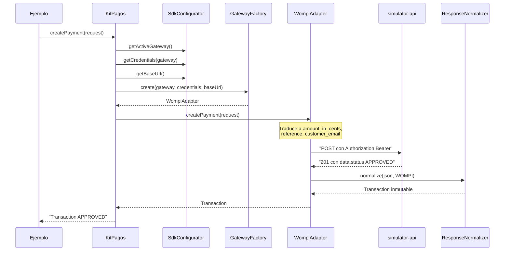

# Ejemplo end-to-end: un pago simulado con Wompi

Este documento explica el ejemplo ejecutable que vive en [`examples/simulate-wompi-payment.ts`](../../examples/simulate-wompi-payment.ts): qué demuestra, cómo correrlo, qué ocurre por dentro y qué queda deliberadamente fuera de su alcance. Corresponde al issue #31, el primero en el que las piezas del SDK y de la API de Simulación se ejercitan juntas.

## Qué demuestra

El objetivo no es probar código, para eso están las pruebas unitarias. El objetivo es responder una pregunta concreta: cómo se ve, desde el teclado de un desarrollador colombiano, integrar un pago con este framework.

De ahí sale la decisión más importante del ejemplo. Vive en un paquete npm independiente, fuera de `sdk/`, y declara `kit-pagos-colombia` como dependencia mediante `file:../sdk`. Importa el SDK por su nombre público, nunca por rutas relativas hacia `sdk/src`. Esa distinción no es cosmética: si el ejemplo importara por ruta relativa, compilaría contra el código fuente interno y no demostraría nada sobre lo que el paquete publicado realmente expone. Al consumirlo como dependencia, cualquier tipo o clase que falte en `sdk/src/index.ts` rompe la compilación del ejemplo de inmediato. De hecho fue así como se descubrió que faltaban `SdkError`, `SDKOptions`, `Credentials` y `CreatePaymentRequest` en la superficie pública (ver `architecture-log.md`, punto 21).

## Cómo correrlo

```bash
# 1. Compilar el SDK, porque el paquete apunta a dist/
cd sdk && npm install && npm run build

# 2. Levantar la API de Simulación y dejarla corriendo
cd simulator-api && npm install && npm run dev

# 3. En otra terminal, instalar y correr el ejemplo
cd examples && npm install && npm start
```

## Lo que el desarrollador escribe

Toda la integración cabe en dos bloques. El primero configura el SDK una sola vez:

```ts
const kitPagos = new KitPagos({
  gateway: Gateway.WOMPI,
  credentials: { [Gateway.WOMPI]: { publicKey: "pub_test_...", privateKey: "prv_test_..." } },
  baseUrl: "http://localhost:3000/v1/sim/wompi/transactions",
});
```

El segundo describe y ejecuta el pago:

```ts
const transaction = await kitPagos.createPayment({
  amount: new Amount(150000),
  currency: new Currency("COP"),
  orderReference: new OrderReference("ORDER-1042"),
  payer: new Payer({ email: "ana.gomez@example.com", fullName: "Ana Gomez" }),
});
```

No aparece ninguna URL de Wompi, ningún `amount_in_cents`, ningún `fetch`, ningún parseo de JSON y ningún código de estado HTTP. El campo `baseUrl` existe precisamente para apuntar al simulador; en producción se omite y cada Adapter usa el endpoint real de su pasarela.

Vale la pena notar que el pago se describe con objetos de valor y no con datos primitivos. Un monto con más de dos decimales, una divisa que no cumpla ISO 4217 o un pagador sin correo fallan en el constructor del objeto de valor, antes de que exista cualquier petición de red.

## Qué ocurre por dentro



La fachada no conoce a `WompiAdapter`: le pide a la Factory una implementación de `PaymentGatewayPort` y delega en ella. Es lo que permite que migrar de pasarela sea cambiar `Gateway.WOMPI` por otro valor, sin tocar el resto del bloque. Las credenciales viajan resueltas desde el `SdkConfigurator` hasta el Adapter, que las usa como Bearer token porque así identifica Wompi al comercio; el Adapter nunca las lee del entorno por su cuenta.

## Lo que el ejemplo muestra que todavía no funciona

Después de crear el pago, el ejemplo llama a `getPaymentStatus()` dentro de un `try/catch`. Esa llamada falla, y está ahí a propósito:

```
No disponible todavia. Codigo de error: UNSUPPORTED_OPERATION
Detalle: WompiAdapter.getStatus: status query is not supported by the Wompi mock endpoint
```

La API de Simulación solo implementa creación de pagos, no consulta de estado. El valor de dejarlo visible es doble: es honesto sobre el estado del proyecto, y demuestra el diseño de errores del SDK. El comercio no recibe un mensaje de texto que tendría que interpretar, sino un `SdkError` con un `code` del enum `SdkErrorCode`, comparable por código. El ejemplo también captura `CONNECTION_FAILED` para el caso de que el simulador no esté arriba, y en vez de una traza cruda imprime el comando que hay que correr.

Fuera de alcance en este ejemplo: la validación de webhooks, que sigue como esqueleto en la fachada aunque `WebhookVerifier` ya esté implementado y probado para las cuatro pasarelas; el reintento automático, que se integra en la Iteración 2 junto con las pasarelas reales; y las otras tres pasarelas, de las cuales solo Wompi tiene Adapter en esta iteración.

## Sobre la fidelidad del mock

Durante este trabajo se ajustó la respuesta del mock para que devuelva `customer_email`, como hace la API real de Wompi. Antes no lo hacía, y el `ResponseNormalizer` caía a un correo de relleno, así que la `Transaction` normalizada mostraba un pagador que nunca existió. Con un solo campo faltante el ejemplo habría sido engañoso justo en el dato más visible de la demo.
